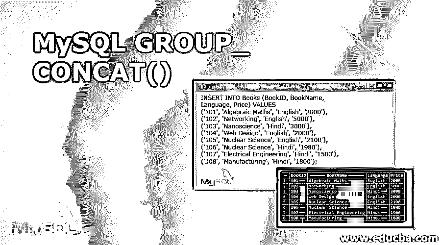
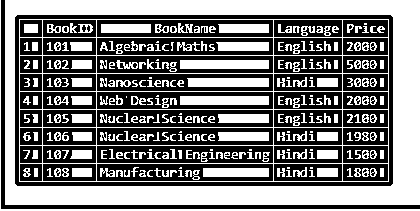

# MySQL GROUP_CONCAT()

> 原文：<https://www.educba.com/mysql-group_concat/>

## MySQL GROUP_CONCAT()简介

MySQL GROUP_CONCAT()函数是一个聚合 GROUP BY 函数，它负责在一些 MySQL 子句的帮助下，将几行中的数据列值连接成一个具有字符串值的字段。如果 rows 组至少包含一个列值或非 NULL 列值，那么 GROUP_CONCAT 函数将返回一个序列值，否则结果将为 NULL。我们使用一些 MySQL 约束和子句来提供 GROUP_CONCAT()函数的选项，这些选项定义如下:

**Distinct** :用于在函数连接值之前返回组中唯一的字符串值。它从结果行中删除重复的值。

<small>Hadoop、数据科学、统计学&其他</small>

**Order By** :默认情况下，函数结果的排序顺序是升序，但是我们可以使用这个子句对分组数据进行升序或降序分类。

**分隔符**:为了分隔字符串值，我们可以使用默认的操作符逗号(，)或者寻找不同的文字值。

**语法**

GROUP_CONCAT()函数的语法是用下面的语句定义的:

`SELECT Column1,Column2, …,ColumnNGROUP_CONCAT([DISTINCT] ColumnName1 [ORDER BY {ASC or, DESC}] [SEPARATOR {comma or any literal value}]) FROM TableName GROUP BY ColumnName2;`

让我们讨论在上述上下文中使用的术语:

*   **Column1，…CoulmnN** :表示我们在表格中应用函数的列的名称。
*   **ColumnName1** :定义列值，该列值将为每个组连接成一行。
*   **ColumnName2** :定义使用 GROUP BY 子句对要获取的结果进行分组的列。
*   **TableName** :我们使用 GROUP_CONCAT()函数的数据库表的名称。

### MySQL GROUP_CONCAT()函数是如何工作的？

*   MySQL GROUP_CONCAT()函数提供来自一个表的结果，该表包含一个行，该行包括一组由逗号或其他给定值分隔的字符串值，这有助于根据分组过程提取记录并收集用于评估的数据。
*   在 MySQL 中，MySQL CONCAT()函数生成的结果的最大长度限制为 1024，这是由名为 group_concat_max_len 的系统变量定义的。但是这个变量值可以在运行时使用后续的 SET 命令来更改:

`SET [GLOBAL | SESSION] group_concat_max_len = LengthValue ;`

LengthValue 表示超出 CONCATE()函数产生的结果长度的变量值。

我们可以对 MySQL CONCAT()函数进行各种应用，下面提到一些:

*   我们可以创建逗号分隔的用户角色，如管理员、编辑、作者或订户等。
*   可以显示由逗号分隔的不同用户的爱好列表，如设计师、画家等。
*   它还主要用于为文章、博客文章、客座文章或产品等生成标签。如 MySQL 编码，学习 MySQL，MySQL 子句等。

### MySQL GROUP_CONCAT()的示例

让我们尝试一些例子来理解 MySQL CONCATE()函数的概念。为此，我们首先创建一个表作为样本表，并在其中插入一些记录。

**创建表格:**

`CREATE TABLE Books (BookID int NOT NULL, BookName varchar(255) NOT NULL, Language varchar(255), Price int, PRIMARY KEY (BookID) );`

**使用以下语句将记录输入到表中:**

`INSERT INTO Books (BookID, BookName, Language, Price) VALUES
('101', 'Algebraic Maths', 'English', '2000'),
('102', 'Networking', 'English', '5000'),
('103', 'Nanoscience', 'Hindi', '3000'),
('104', 'Web Design', 'English', '2000'),
('105', 'Nuclear Science', 'English', '2100'),
('106', 'Nuclear Science', 'Hindi', '1980'),
('107', 'Electrical Engineering', 'Hindi', '1500'),
('108', 'Manufacturing', 'Hindi', '1800');`

**显示表格:**

`SELECT * FROM Books;`

**输出:**

现在让我们从这些例子开始:

#### 示例 1–简单的 MySQL_CONCAT()函数

让我们创建一个语句，返回每组语言中用逗号分隔的书籍列表。

`SELECT Language, GROUP_CONCAT(BookName) FROM Books GROUP BY Language;`

**输出:**

#### 示例 2–带有 DISTINCT 子句的 MySQL CONCAT()函数

这里，MySQL 查询返回按语言分组的唯一字符串值，使用 GROUP_CONCAT()函数删除列值中每个组的重复值。

`SELECT Language, GROUP_CONCAT(DISTINCT BookName) FROM Books GROUP BY Language;`

**输出:**

#### 示例 3–带有 ORDER BY 子句的 MySQL CONCAT()函数

在此图中，我们将从 MySQL 语句中获得由逗号分隔的不同 BookName 值的列表。正如您在结果中看到的，使用 ORDER BY 子句对提取的行进行升序排序，您也可以使用 DESC 排序。

`SELECT Language, GROUP_CONCAT(DISTINCT BookName) FROM Books GROUP BY Language ORDER BY  GROUP_CONCAT(DISTINCT BookName) ASC;`

**输出:**

#### 示例 4–带分隔符的 MySQL CONCAT()函数

在本例中，MySQL CONCAT()函数将返回按语言分组的 BookName 列表系列，这些列表系列具有不同的字符串值，但通过添加特定的分隔符(“”)进行分隔。我们也可以使用其他文字值，如分号(；)、冒号(:)等。结果行将按降序显示，因为它被添加到选项中下面的 SELECT MySQL 查询的末尾。

`SELECT Language, GROUP_CONCAT(DISTINCT BookName ORDER BY BookName DESC SEPARATOR ' ') FROM Books GROUP BY Language;`

**输出:**

#### 示例 5–MySQL CONCAT()函数:一些错误

因为，GROUP_CONCAT 函数返回的结果是单个字符串，而不是值的列表；它将一个列表中的所有值连接起来，表示为一个字符串。建议不要对 MySQL 中的运算符应用 GROUP_CONCAT()函数，即在内部查询中。

例如，当应用 GROUP_CONCAT()函数时，值 21，2 和 23 的结果将是一个字符串:“21，22，23”。

IN 运算符接收一系列值，但不接收包含列值列表的字符串。因此，如果您在 MySQL 中使用 IN 操作符提供这种类型的结果，那么您不会得到预期的结果，并且下面的查询将不会像输出中所示的那样工作。

`SELECT BookID, BookName FROM Books WHEREBookID IN GROUP_CONCAT(BookID);`

**输出:**

甚至我们还需要在 GROUP_CONCAT()函数查询语句中正确使用 ORDER BY 子句，以便获得所需的输出。我们知道这是一个聚合函数，所以我们应该在函数内部使用 ORDER BY，而不是在 SELECT 语句部分。

下面的查询代表了这种错误的不正确用法:

`SELECT GROUP_CONCATE(DISTINCT BookName SEPARATOR ' ; ') FROM Books ORDER BY BookName;`

**输出:**

### 结论

*   MySQL CONCAT()函数在执行时总是会产生二进制或非二进制字符串值，这取决于在代码定义期间函数中提供的特定参数。
*   该函数有利于分别使用 ORDER BY 和 GROUP BY 子句返回显示在单个字段中的列值，以便从列表值中获得所需的结果。

### 推荐文章

这是 MySQL GROUP_CONCAT()的指南。这里我们讨论 MySQL GROUP_CONCAT()函数如何与相应的例子一起工作，以便更好地理解。您也可以阅读以下文章，了解更多信息——

1.  [MySQL 中的唯一键](https://www.educba.com/unique-key-in-mysql/)
2.  [MySQL 自我加入](https://www.educba.com/mysql-self-join/)
3.  [不在 MySQL 中](https://www.educba.com/not-in-mysql/)
4.  [卡珊德拉 vs MySQL](https://www.educba.com/cassandra-vs-mysql/)

