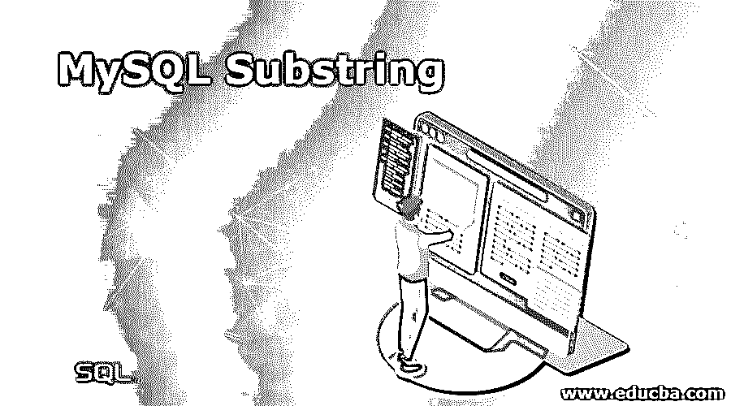
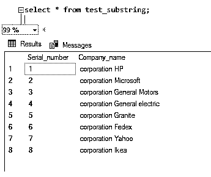
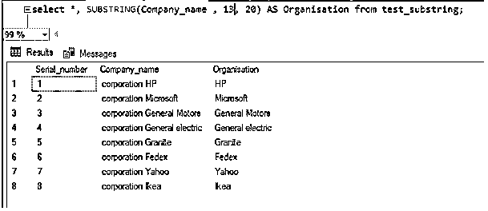
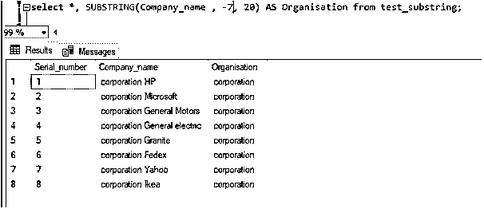
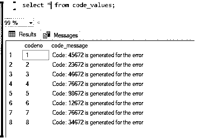
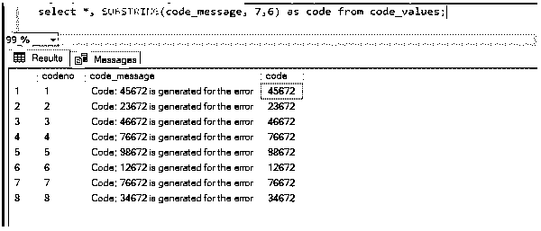

# MySQL Substring

> 原文：<https://www.educba.com/mysql-substring/>

## MySQL 子串简介

MySQL 的 Substring()函数用于提取给定字符串中的子串。我们通过指定字符串的位置从给定的字符串中提取子字符串。需要由我们在函数中传递的参数提取的子字符串的规范。

MySQL Substring()函数通常由三个参数组成，第一部分是字符串，第二部分是指定你希望从哪里开始修剪数据。第三部分是子字符串的长度，这意味着我们试图从字符串中提取的字符数。

<small>Hadoop、数据科学、统计学&其他</small>

在本节课中，我们将学习更多有关子字符串用法、语法和示例的信息:

### 句法

substring()函数的语法如下:–

`substring(String_value, starting_position, length_of_characters);`

**String_value:** 指定要从中提取的实际字符串。

**starting_position:** 必选项。在这里，我们指定了字符串的位置，我们计划从这里提取。它可以是正值，也可以是负值。正值从开始提取。字符串末尾的负摘录。

**字符长度:**可选。我们可以指定想要提取的子串的长度，也可以保留它。如果我们不指定长度，整个字符串将从“starting_position”值中提取。

### MySQL Substring()是如何工作的？

现在让我们看看 substring 函数是如何工作的。

**只有两个参数:**

`SELECT SUBSTRING('MySQL SUBSTRING',-10) AS OUTPUT;`

**输出:**

`SELECT SUBSTRING('MySQL SUBSTRING',10) AS OUTPUT;`

**输出:**

`SELECT SUBSTRING('MySQL SUBSTRING TEST FUNCTION',10) AS OUTPUT;`

**输出:**

**三个论点:**

**举例:**

`SELECT SUBSTRING('MySQL SUBSTRING TEST FUNCTION',10,6) AS OUTPUT;`

**输出:**

**举例:**

`SELECT SUBSTRING('MySQL SUBSTRING TEST FUNCTION',-1,10)AS OUTPUT;`

**输出:**

如果我们检查上面的例子，我们可以看到我们在位置中使用了负值。这里意味着字符串的最后一个 1 字符串被排除。

**举例:**

`SELECT SUBSTRING('MySQL SUBSTRING TEST FUNCTION',1,10) AS OUTPUT;`

**输出:**

### MySQL 子串示例

如果我们检查上面的例子，我们可以看到我们在位置中使用了正值。在这里，它从起始位置 1 到 10 进行子串。

#### 示例#1

让我们创建一个表，并在其上应用 substring 函数:–

`Create table test_substring
(
Serial_number int,
Company_name VARCHAR(50)
);`

将数据插入表格:-

`insert into test_substring values (1,'corporation HP');
insert into test_substring values (2,'corporation Microsoft');
insert into test_substring values (3,'corporation General Motors');
insert into test_substring values (4,'corporation General electric');
insert into test_substring values (5,'corporation Granite');
insert into test_substring values (6,'corporation Fedex');
insert into test_substring values (7,'corporation Yahoo');
insert into test_substring values (8,'corporation Ikea');`

从上表中选择值:–

`select * from test_substring;`

**输出:**

现在，让我们从上面的“公司名称”列中提取公司名称。这意味着在整个列中排除字符串“corporation”。

`select *,SUBSTRING(Company_name , 13, 20)AS Organisation from test_substring;`

**输出:**

`select *,SUBSTRING(Company_name ,-7, 20)AS Organisation from test_substring;`

**输出:**

#### 实施例 2

让我们创建另一个表，从表中提取代码:–

`create table code_values
(
codeno int,
code_message VARCHAR(5)
);`

将值插入表格:–

`insert into code_values values (1,'Code: 45672 is generated for the error');
insert into code_values values (2,'Code: 23672 is generated for the error');
insert into code_values values (3,'Code: 46672 is generated for the error');
insert into code_values values (4,'Code: 76672 is generated for the error');
insert into code_values values (5,'Code: 98672 is generated for the error');
insert into code_values values (6,'Code: 12672 is generated for the error');
insert into code_values values (7,'Code: 76672 is generated for the error');
insert into code_values values (8,'Code: 34672 is generated for the error');`

现在让我们选择数据:—

`select * from code_values;`

**输出:**

现在让我们只从“code_message”列中提取代码值。

`select *,SUBSTRING(code_message, 7,6)as code from code_values;`

**输出:**

### 结论

MySQL 的 Substring()函数用于提取给定字符串中的子串。我们通过指定字符串的位置从给定的字符串中提取子字符串。需要由我们在函数中传递的参数提取的子字符串的规范。

MySQL Substring()函数通常由三个参数组成，第一部分是字符串，第二部分是指定你希望从哪里开始修剪数据。第三部分是子字符串的长度，这意味着我们试图从字符串中提取的字符数。

### 推荐文章

这是一个 MySQL 子串的指南。这里我们讨论 MySQL Substring()是如何工作的，并举例说明代码和输出。您也可以阅读以下文章，了解更多信息——

1.  [MySQL 中的运算符](https://www.educba.com/mysql-in-operator/)
2.  [MySQL 子查询](https://www.educba.com/mysql-subquery/)
3.  [MySQL 约束](https://www.educba.com/mysql-constraints/)
4.  [MySQL WHILE 循环](https://www.educba.com/mysql-while-loop/)

