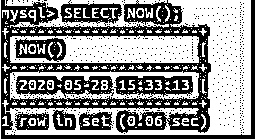
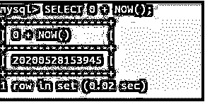
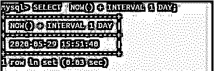
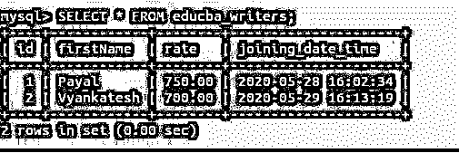
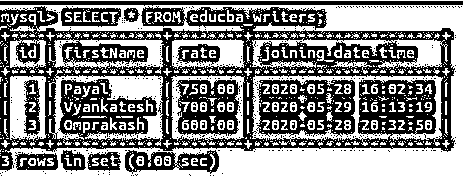
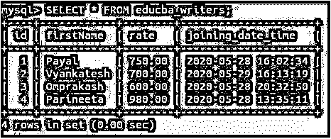

# MySQL NOW

> 原文：<https://www.educba.com/mysql-now/>

## MySQL 简介

处理 MySQL 中的日期和时间存储非常重要，因为大多数时候我们在没有考虑该列的用途和目的的情况下给列分配了错误的数据类型。当我们必须只存储日期时，应该使用日期类型，在时间的情况下，应该使用时间类型，当日期和时间都需要存储时，可以使用日期时间数据类型。除此之外，还提供了存储完整时间戳的功能，并且可以通过使用时间戳和时间戳等数据类型来考虑区域时区。

当我们使用 DATETIME 数据类型时，我们可以使用 NOW()函数将列初始化为默认值，即插入记录的当前日期和时间。除此之外，NOW()函数通常还可以用于获取当前日期和当前时间。在本文中，我们将借助一些例子来了解 NOW()函数、它的语法和用法。

<small>Hadoop、数据科学、统计学&其他</small>

### 句法

下面是 MySQL NOW 的语法:

`string/numeric NOW();`

**解释:T** 语法只考虑对函数 NOW()的调用，函数的返回类型要么是字符串，要么是数字。日期时间的格式取决于调用函数的上下文。例如，当使用字符串上下文时，则检索的日期格式为“YYYY-MM-DD HH:MM:DD”格式，而在数字上下文的情况下，提取的日期格式更改为“YYYYMMDDHHMMSS”格式。

### MySQL 现在是如何工作的？

让我们使用简单的 SELECT 语句检索 NOW()函数的值，如下所示:

**代码:**

`SELECT NOW();`

**输出:**

这是以“YYYY-MM-DD HH:MM: DD”格式撰写文章时的日期和当前时间。正如我们所看到的，使用的默认格式是“YYYY-MM-DD HH:MM: DD ”,返回类型是一个字符串。

让我们通过在数值上下文值中添加 0 或 1 值或其他数字来转换检索到的值，从而将返回值隐式转换为数值。我们将使用以下查询语句:

**代码:**

`SELECT 0 + NOW();`

**输出:**

执行上述查询语句会产生以下输出，其中包含“YYYYMMDDHHMMSS”格式的今天日期和当前时间值，如下图所示:

**代码:**

`SELECT  NOW() + INTERVAL 1 DAY;`

**输出:**

执行上述查询语句会产生以下输出，其中包含明天的日期和当前时间值，因为它相当于今天的日期加上一天，格式为“YYYY-MM-DD HH:MM: DD”。正如我们所看到的，NOW 函数可以用在字符串和数字上下文中。我们可以通过加减所需的时间段间隔(如日、小时等)来获得与之相关的日期时间。

### 现在实现 MySQL 的例子

下面是提到的例子:

#### 示例#1

让我们看看如何在表中使用它来指定当前日期和时间的默认值，该值被插入到列中。我们将借助以下查询语句创建一个名为 educba_writers 的表，其中 joining_date|_time 列的数据类型为 DATETIME:

**代码:**

`CREATE TABLE `educba_writers` (
`id` int(11) NOT NULL,
`firstName` varchar(10) COLLATE latin1_danish_ci NOT NULL,
`rate` decimal(5,2) DEFAULT NULL,
`joining_date_time` DATETIME DEFAULT NOW()
) ENGINE=InnoDB DEFAULT CHARSET=latin1 COLLATE=latin1_danish_ci;`

**输出:**

#### 实施例 2

让我们首先使用以下语句插入空值记录作为 joining_date_time 列值:

**代码:**

`INSERT INTO `educba_writers` (`id`, `firstName`, `rate`) VALUES (1, 'Payal', 750);`

**输出:**

#### 实施例 3

让我们使用以下查询语句检索记录并查看 educba_writers 表中插入的值:

**代码:**

`SELECT * FROM educba_writers;`

**输出:**

#### 实施例 4

现在，我们将使用 Now()函数和 interval 将明天的日期和当前时间作为 joining_date_time 值插入 educba_writers 表中。为此，我们将使用以下插入查询语句。让我们插入更多具有非空费率和加入日期值的行:

**代码:**

`INSERT INTO `educba_writers` (`id`, `firstName`, `rate`, `joining_date_time`) VALUES
(2, 'Vyankatesh', 700,  NOW() + INTERVAL 1 DAY);`

**输出:**

#### 实施例 5

让我们使用以下查询语句检索记录并查看 educba_writers 表中插入的值:

**代码:**

`SELECT * FROM educba_writers;`

**输出:**

**解释:**我们可以看到 joining_date_time 列中插入了' YYYY-MM-DD HH:MM: DD '格式的明天日期 2020-05-27 和当前时间的值。我们甚至可以使用 NOW()函数插入关于今天的日期和当前时间的日期时间。例如，我们可以通过添加 NOW()函数减少的天数，将加入日期添加为比今天早两天或晚三天。我们甚至可以通过使用间隔小时来设置当前日期时间之前或之后的任意小时数来更改时间。

#### 实施例 6

让我们考虑另一个使用以下查询语句将 4 小时后的 joining_date_time 设置为当前时间和日期的示例:

**代码:**

`INSERT INTO `educba_writers` (`id`, `firstName`, `rate`, `joining_date_time`) VALUES
(3, 'Omprakash', 600, NOW() + INTERVAL 4 HOUR);`

**输出:**

#### 实施例 7

让我们使用以下查询语句检索记录并查看 educba_writers 表中插入的值:

**代码:**

`SELECT * FROM educba_writers;`

**输出:**

#### 实施例 8

再考虑一个使用以下查询语句将 joining_date_time 设置为当前时间和日期前 3 小时的示例:

**代码:**

`INSERT INTO `educba_writers` (`id`, `firstName`, `rate`, `joining_date_time`) VALUES
(4, 'Parineeta', 980, NOW() - INTERVAL 3 HOUR);`

**输出:**

#### 实施例 9

让我们使用以下查询语句检索记录并查看 educba_writers 表中插入的值:

**代码:**

`SELECT * FROM educba_writers;`

**输出:**

### 结论

我们可以使用 NOW()函数在插入值时将 DATETIME 列的默认值设置为当前日期和时间，甚至可以通过增加和减少间隔来操作从 NOW()函数中检索的值。

### 推荐文章

这是 MySQL 现在的指南。在这里，我们现在讨论 MySQL 的介绍，语法，它是如何工作的，以及查询示例。您也可以浏览我们的其他相关文章，了解更多信息——

1.  [MySQL REGEXP](https://www.educba.com/mysql-regexp/)
2.  [MySQL 图层()](https://www.educba.com/mysql-lag/)
3.  [MySQL CTE](https://www.educba.com/mysql-cte/)
4.  [MySQL 限制](https://www.educba.com/mysql-limit/)

