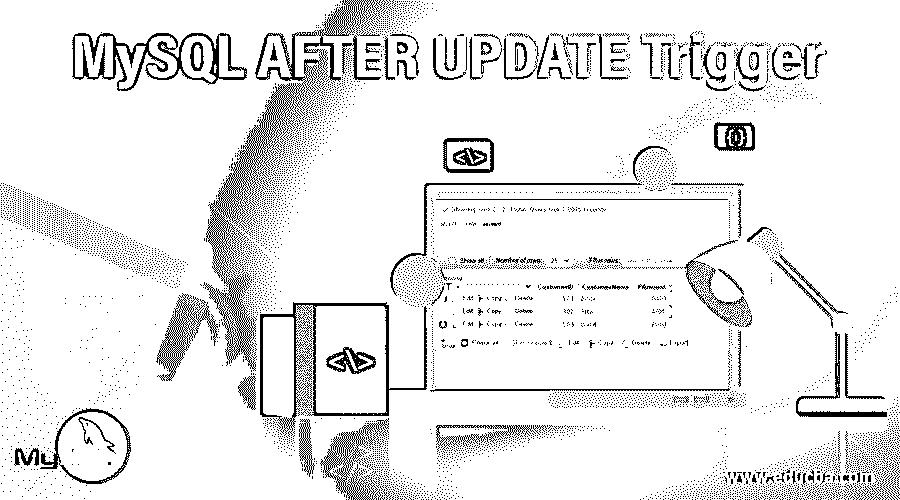
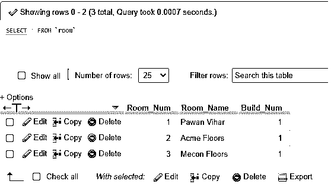
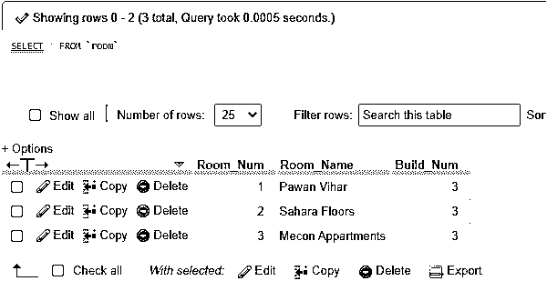
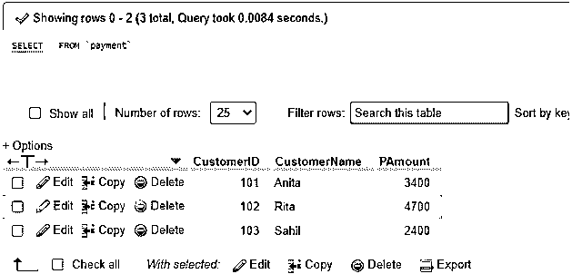
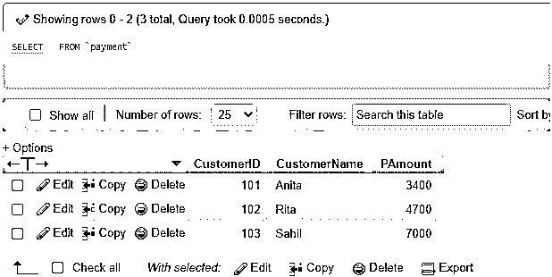
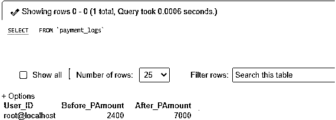

# MySQL 更新后触发器

> 原文：<https://www.educba.com/mysql-after-update-trigger/>

## 更新触发器后的 MySQL 介绍

MySQL AFTER UPDATE Trigger 是一个 MySQL 触发器，它负责在与触发器相关的数据库表上发生更新后自动调用。我们需要了解如何在更新触发器后构建 MySQL，以便 MySQL 可以记录对数据库中相关触发器表所做的任何更改。众所周知，MySQL 中的触发器是一组动作，当在与之链接的特定表中执行特定的修改操作时，这些动作会自动执行。这些操作可以是 MySQL INSERT、UPDATE、DELETE 或 ALTER query 语句中的任何一种。

### 句法

下面的语法结构显示了更新触发 MySQL 数据库表后创建 MySQL 的方法:

<small>Hadoop、数据科学、统计学&其他</small>

`CREATE TRIGGER TriggerName AFTER UPDATE
ON TABLE TableName FOR EACH ROW TriggerBody`

这里，我们将详细说明上面的语法:

*   最初，我们需要为要在子句中创建的触发器指定一个特定的名称:CREATE TRIGGER。
*   然后，我们将通过应用 AFTER UPDATE trigger 子句来包含调用 MySQL 触发器所需的时间。
*   在此之后，使用 ON 关键字，我们还将声明数据库中可用的表的名称，我们希望在该表上添加触发器来处理事件。
*   术语“每行”表示如果更新查询有效进行，触发器将应用于每一行。
*   最后，我们将实现 AFTER UPDATE 触发器的程序代码，该触发器包含一个或多个由上面语法中的触发器主体指定的查询语句。

需要注意的是，如果你声明了不止一条语句，你需要应用 BEGIN END 代码块。

此外，为此您需要更改下面代码结构中给出的默认分隔符:

`DELIMITER $$
CREATE TRIGGER TriggerName AFTER UPDATE
ON TABLE TableName FOR EACH ROW
BEGIN
--TriggerBody statements
END$$
DELIMITER;`

在 MySQL 的这个 AFTER UPDATE 触发器中，用户可以访问新的或旧的行，但是不能修改它们。

### MySQL 中的 AFTER UPDATE 触发器是如何工作的？

*   MySQL AFTER UPDATE Trigger 是一个存储的代码程序，在发生 MySQL 事件时会被立即触发以作出响应，例如在与所应用的触发器相链接的表上发生的 CRUD 操作。
*   当在 MySQL 数据库中执行更新命令时，这个 MySQL AFTER UPDATE 触发器提供了修改的记录，这些修改经过一个表。
*   此外，创建 MySQL AFTER UPDATE 触发器是为了在将行更新到所提供的表之前验证或确认数据记录。

对此有一些限制，解释如下:

*   在 MySQL 视图上，不能创建 AFTER 触发器程序。
*   使用 AFTER 触发器，我们无法修改新的数据值。
*   此外，使用 AFTER 触发器，我们无法修改旧的数据值。

### 更新触发器后实现 MySQL 的示例

让我们考虑并演示下面的例子来解释 MySQL 中这个 AFTER UPDATE 触发器的用法和工作原理。首先，我们将在数据库中建立演示数据表。假设，我们已经创建了示例中所示的下表，以便在更新触发器后使用 MySQL:

#### 1.使用更新后触发器查询

我们将创建一个名为 Room 的示例表，在该表中，我们可以使用 AFTER UPDATE 触发器来查看相关表中作为日志的结果。SQL 语句如下所示:

**代码:**

`DROP TABLE IF EXISTS Room;
CREATE TABLE Room( Room_Num INT PRIMARY KEY AUTO_INCREMENT,Room_Name VARCHAR(255) NOT NULL, Build_Num INT NOT NULL);`

此外，我们将使用插入查询输入一些记录，如下所示:

`INSERT INTO Room(Room_Num, Room_Name, Build_Num) VALUES('1','pawan Vihar','1');`

从房间表中查询数据以查看其内容:

`SELECT * FROM Room;`

**输出:**

同样，创建下一个表来存储在任何更新命令之后在父表空间上发生的修改，如下所示:

`CREATE TABLE Room_logs( User_ID VARCHAR(255), Update_Info VARCHAR(255));`

查看当前表格:

`SELECT * FROM Room_logs;`

**输出:**

现在，我们将创建语句，在房间表上构建 AFTER UPDATE 触发器:

`DELIMITER $$
CREATE TRIGGER room_update
AFTER UPDATE ON Room FOR EACH ROW
BEGIN
INSERT into Room_logs(User_ID,Update_Info) VALUES (user(), CONCAT('Updated Room  Record (',OLD.Room_Num,' ',OLD.Room_Name,' ',OLD.Build_Num,') to (',NEW.Room_Num,' ',NEW.Room_Name,' ',NEW.Build_Num,')'));
END$$
DELIMITER ;`

创建 room_updatetrigger 后，在房间表中的每一行发生更新事件之前，将重复触发该事件。

为了详细检查，当您更新 amount 列中的任何值时，一个新行将被插入到 room_logs 表中，以记录所做的更改。

`UPDATE Room SETBuild_Num=Build_Num+ 2;`

**输出:**

再次转到 Room_logs 表，使用以下查询查看 AFTER UPDATE 触发器的差异和结果:

`SELECT * FROM Room_logs;`

**输出:**

#### 2.使用带有比较运算符和 WHERE 子句语句的 AFTER UPDATE 触发器查询

我们将创建另一个名为 Payment 的示例表，如下所示:

`DROP TABLE IF EXISTS Payment;
CREATE TABLE Payment (CustomerID INT PRIMARY KEY, CustomerNameVARCHAR(255) NOT NULL, PAmount INT NOT NULL);`

此外，我们将在上表中插入一些记录:

`INSERT INTO Payement(CustomerID, CustomerName, PAmount) VALUES(‘101’,’Anita’, ‘3400’);`

显示支付内容:

`SELECT * from Payment;`

**输出:**

同样，创建名为 Payment_logs 的日志表，以便在更新和触发触发器时保存对表 Payment 所做的更改:

`CREATE TABLE Payment_logs(User_ID VARCHAR(255), Before_PAmount INT NOT NULL, After_PAmount INT NOT NULL);`

查看付款日志:

`SELECT * FROM Payment_logs;`

**输出:**

现在，建立下面的触发器:

`DELIMITER $$
CREATE TRIGGER `payment_update`
AFTER UPDATE ON `payment` FOR EACH ROW
BEGIN
IF OLD.PAmount<>new.PAmount THEN
INSERT INTO Payment_logs(User_ID,Before_PAmount, After_PAmount)
VALUES(user(), old.PAmount, new.PAmount);
END IF;
END$$
DELIMITER ;`

为了测试 AFTER UPDATE 触发器，让我们执行一个更新命令:

`UPDATE Payment SET PAmount = 7000 WHERE CustomerName = 'Sahil';`

**输出:**

现在，显示 Payment_logs 中的更改:

`SELECT * FROM Payment_logs;`

**输出:**

### 结论

*   在 MySQL 中，触发器对于工作非常重要，并且在一些情况下很有帮助，比如实施业务准则、拥有审计跟踪和授权输入信息。
*   因此，MySQL AFTER UPDATE Trigger 每次都会发出警报，提供在特定数据库表中执行了更新命令的信息。

### 推荐文章

这是一个 MySQL 更新触发器后的指南。在这里，我们讨论一个 MySQL 的介绍后，更新触发器与适当的语法，它如何与查询的例子。您也可以浏览我们的其他相关文章，了解更多信息——

1.  [MySQL REGEXP_REPLACE()](https://www.educba.com/mysql-regexp_replace/)
2.  [MySQL TRUNCATE()](https://www.educba.com/mysql-truncate/)
3.  [MySQL DECODE()](https://www.educba.com/mysql-decode/)
4.  [MySQL count()](https://www.educba.com/mysql-count/)

