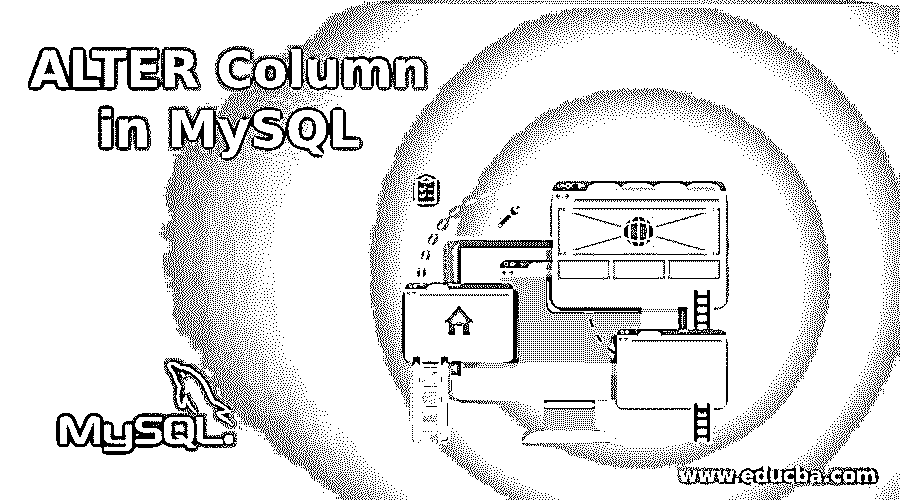
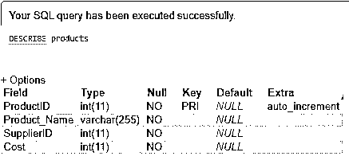
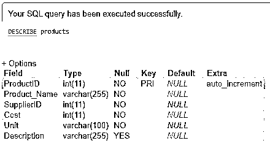
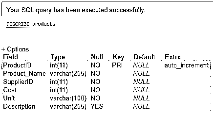
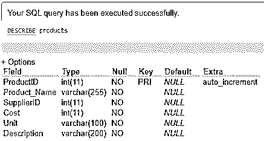
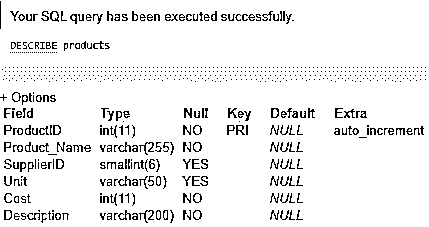
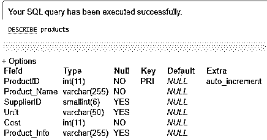
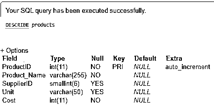

# 在 MySQL 中更改列

> 原文：<https://www.educba.com/alter-column-in-mysql/>

## MySQL 中的 ALTER Column 简介

*   MySQL ALTER COLUMN 查询是一个 MySQL 语句，负责更改表的结构，可以添加表列、更改列、重命名列、删除列或重命名表本身。
*   基本上，MySQL ALTER COLUMN 命令允许管理员通过添加一个或多个列来修改现有的表。此外，ALTER COLUMN 可用于删除表中的列。这对于通过使用重命名查询为当前表列提供新名称非常有用。
*   要更改数据库中可用表的名称，我们需要在 MySQL 服务器中使用 ALTER TABLE 语句执行查询。

### 如何在 MySQL 中修改一个列？

让我们用语法和例子解释一下 MySQL 中 ALTER COLUMN 的工作原理。假设，我们将使用下面的 CREATE query 语句在数据库中设置一个演示表进行演示:

`CREATE TABLE Products (ProductID INT PRIMARY KEY AUTO_INCREMENT, Product_Name VARCHAR (255) NOT NULL,SupplierID INT NOT NULL);`

<small>Hadoop、数据科学、统计学&其他</small>

**输出:**

#### 1.MySQL ALTER ADD 列查询。

我们将使用 ALTER TABLE ADD 命令向上面刚刚创建的演示表中添加一个或多个表列。

*   **向表中添加单个列。**

让我们使用 ALTER TABLE ADD Query 的后续语法向 Products 表中添加一列。

**查询:**

`ALTER TABLE TableName
ADD NewColumnNameCol_Definition[ FIRST | AFTER ColumnName]`

这里，上述术语解释如下:

*   **TableName:** 我们将在关键字后提供具体的表名，ALTER TABLE 在我们想要的地方补充一个或多个新列。
*   **NewColumnName:** 提及要添加的新表格列的名称。
*   **Col_Definition:** 它包括添加的新列的数据类型、最大大小以及该列的有效**约束**。
*   **FIRST | AFTER ColumnName:** 确定要添加的新表格列的位置。有两种选择，您可以使用 AFTER ColumnNameKeyword 在表中现有的最后一列之后添加表列，或者使用 FIRST ColumnNamekeyword 作为第一列。但是如果 ALTER ADD COLUMN 查询中没有提供这些选项，那么新的表列将被附加在表中列列表的末尾。

现在，我们将应用 ALTER TABLE ADD COLUMN 语句在数据库的 Products 表中的列末尾添加一个新列:

`ALTER TABLE Products ADD Cost INT NOT NULL;`

您可以使用数据库中的以下查询来查看 Products 表的列列表:

**查询:**

`DESCRIBE Products;`

**输出:**

正如您在上面的输出中所看到的，一个新的列 Price 现在被添加到列表末尾的 Products 表中。

*   **向表格中添加多列。**

让我们使用 ALTER TABLE ADD Query 的以下语法向 Products 表中添加多个列:

**查询:**

`ALTER TABLE TableName
ADD NewColumnNameCol_Definition[ FIRST | AFTER ColumnName],
ADD NewColumnNameCol_Definition[ FIRST | AFTER ColumnName],
…………..;`

假设我们要在 Products 表中再添加两列，在 ALTER query 的帮助下如下所示:

`ALTER TABLE Products
ADD Unit VARCHAR(100) NOT NULL,
ADD DescriptionVARCHAR(255) ;`

您可以使用数据库中的以下查询来查看 Products 表的列列表:

**查询:**

`DESCRIBE Products;`

**输出:**

您可以看到使用 ALTER TABLE ADD COLUMN 语句形成的新表结构。

#### 2.MySQL 修改列查询。

我们将使用 ALTER TABLE MODIFY 命令对 Products 表中现有列的结构进行一些更改。

*   **修改单个表格列。**

这里，我们有描述 ALTER TABLE MODIFY 语句的基本语法，并相应地显示了示例:

`ALTER TABLE TableName
MODIFY ColumnNameCol_Definition[FIRST | AFTER ColumnName];`

在使用 ALTER query 执行任何修改之前，研究或查看与表中的列相关联的属性是一种有益的做法。

例如，我们希望修改列描述，使列定义为 NOT NULL，VARCHAR 长度为 200 个字符。

**表的结构前:**

**修改列后:**

`ALTER TABLE Products
MODIFY Description VARCHAR(200) NOT NULL;`

#### 3.查看更改后的最大尺寸和约束:

**查询:**

`DESCRIBE Products;`

**输出:**

*   **修改多个表格列**

我们有一个描述 ALTER TABLE MODIFY 语句的类似语法:

**语法:**

`ALTER TABLE TableName
MODIFY ColumnNameCol_Definition [FIRST | AFTER ColumnName],
MODIFY ColumnNameCol_Definition [FIRST | AFTER ColumnName], …..;`

让我们首先将 SupplierID 的数据类型从 INT 更改为 SMALLINT，然后在一个单元列中，将它的最大大小更改为 50，并通过将它的位置更改为出现在 SupplierID 之后来删除 NOT NULL 约束:

**查询:**

`ALTER TABLE Products
MODIFY SupplierIDSMALLINT,
MODIFY Unit VARCHAR(50) NULL AFTER SupplierID;`

**查看应用的更改:**

**查询:**

`DESCRIBE Products;`

**输出:**

#### 3.MySQL 更改重命名列查询。

我们将使用以下语句来重命名表列:

**语法:**

`ALTER TABLE TableName
CHANGE COLUMN OriginalNameNewColumnNameCol_Definition[FIRST | AFTER ColumnName];`

在上面的语法中，原始名称定义表中存在的列名，而 new column name 定义要给定的新名称。

为此，让我们举例说明以下例子:

**查询:**

`ALTER TABLE Products
CHANGE COLUMN DescriptionProduct_InfoVARCHAR(255) NULL;`

这里，我们已经将描述列名称更改为 Product_Info 名称。

**查询:**

`DESCRIBE Products;`

**输出:**

#### 4.MySQL ALTER DROP COLUMN 查询。

如果我们想要删除数据库表中存在的任何表列，那么我们将使用 ALTER 语句实现 DROP COLUMN 命令。让我们回顾一下删除列的基本语法:

**语法:**

`ALTER TABLE TableName
DROP COLUMN ColumnName;`

假设，我们将其作为查询应用于上面创建的 products 表。下面给出了一个示例，显示了如何删除 products 表中存在的列:

`ALTER TABLE Products DROP COLUMN Product_Info;`

**查看产品表中的变更:**

**查询:**

`DESCRIBE Products;`

**输出:**

### 结论

*   因此，MySQL ALTER COLUMN 执行查询来添加、修改、删除或重命名数据库服务器的表中存在的任何列。
*   ALTER 列还有助于删除或添加与当前表相关联的各种 MySQL 约束。我们还可以使用 ALTER TABLE 命令重命名表。

### 推荐文章

这是一个在 MySQL 中改变列的指南。这里我们讨论 MySQL 中 ALTER Column 的引入以及实际例子和不同的子查询表达式。您也可以浏览我们推荐的文章，了解更多信息——

1.  [MySQL 操作符介绍](https://www.educba.com/mysql-operators/)
2.  [前 23 个 MySQL 字符串函数](https://www.educba.com/mysql-string-functions/)
3.  [MySQL 与 SQLite | 14 大对比](https://www.educba.com/mysql-vs-sqlite/)
4.  [MySQL 时间戳指南](https://www.educba.com/mysql-timestamp/)

