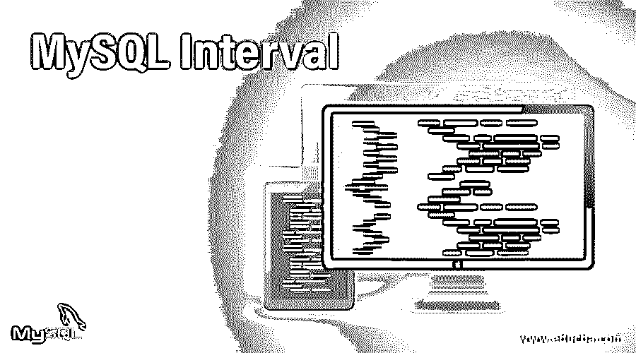
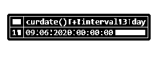

# MySQL 区间

> 原文：<https://www.educba.com/mysql-interval/>

## MySQL Interval 简介

MySQL Interval 操作符使用二分搜索法算法从列表中查找条目，并返回 0 到 n 范围内的值。也可以说，它返回的参数索引大于 Interval 函数中传递的第一个参数。

如果第一个数字小于第二个数字，它输出 0(第零个索引),如果第一个数字小于第三个数字，它输出 1(索引 1 ),就像这样，它继续检查函数中的最后一个元素，如果第一个元素为空，它将返回-1 作为输出。

<small>Hadoop、数据科学、统计学&其他</small>

函数中传递的所有元素或参数都是一个整数。

**语法**

下面是 MySQL 区间函数的语法

`select interval(n1,n2, n3…..nn)`

如果 n <n>1 那么它返回 0。如果 n < n 2 那么它将返回 1，n < n3 它将返回 2 等等。所有参数必须按升序排列，使它们的功能类似于 n1T14】n2T15】n3……nn。否则无法正常工作。</n>

### 区间函数

下表描述了与区间函数表达式相关的单位。

| **单位** | **表情** |
| --- | --- |
| 天 | 天 |
| 日时 | '天数小时数' |
| 日微秒 | 天小时分钟秒。微秒 |
| 日分钟 | '天小时:分钟' |
| 天 _ 秒 | '天小时分钟秒' |
| 小时 | 小时 |
| 小时微秒 | 小时:分钟:秒。微秒 |
| 小时分钟 | '小时:分钟' |
| 小时 _ 秒 | '小时:分钟:秒' |
| 微秒 | 微秒 |
| 分钟 | 分钟 |
| 分钟微秒 | 分钟:秒。微秒 |
| 分钟秒 | '分:秒' |
| 月 | 月份 |
| 四分之一 | 四分之一 |
| 第二 | 秒 |
| 秒微秒 | 秒。微秒 |
| 周 | 周；星期 |
| 年 | 年 |
| 年 _ 月 | “年-月” |

### 实现 MySQL Interval 的例子

下面是实现 MySQL Interval 的例子:

#### 示例#1

**代码:**

`select interval(45,10,20,30,40,50,60,70);`

**输出:**

#### 实施例 2

**代码:**

`select interval(12,10,20,30,40,50,60,70);`

**输出:**

#### 实施例 3

**代码:**

`select interval(67,10,20,30,40,50,60,70);`

**输出:**

#### 实施例 4

**代码:**

`select interval(6,10,20,30,40,50,60,70);`

**输出:**

#### 实施例 5

**代码:**

`select interval(100,10,20,30,40,50,60,70);`

**输出:**

#### 实施例 6

**代码:**

`select interval(null,10,20,30,40,50,60,70);`

**Output:** 在上面的查询中，由于第一个参数为 null，所以它在输出控制台中返回-1 作为输出。

MySQL interval 运算符主要用于日期和时间计算。下面的表达式用于创建一个间隔:

**语法:**

`INTERVAL expression unit`

表达式定义间隔值，单位决定间隔的单位。

**示例:**间隔 5 天

上面的例子解释了如何创建 5 天的时间间隔。

*   日期+间隔表达式单元
*   日期+间隔表达式单元

通常，间隔值是通过日期、时间、日期添加、日期子功能等计算的。

以下语句将 2020 年 6 月 4 日增加 4 天，返回 2020 年 6 月 8 日:

#### 实施例 7

**代码:**

`select '2020-06-04' + interval 4 day;`

**输出:**

当在日期和日期时间表达式中使用间隔值时，涉及的值和间隔值将在表达式的右侧，我们可以在表达式中使用负的日期和日期时间值，如下例所示:

#### 实施例 8

**代码:**

`select '2020-06-04' + interval -5 day;`

**输出:**

#### 实施例 9

**代码:**

`select date_add('2020-06-04' , interval 2 month), date_sub('2020-06-04' , interval 2 month);`

在上面的查询中，使用 date_add()函数在 2020-06-04 中添加 2 个月，然后使用 date_sub()函数从 2020-06-04 中减去 2 个月。

**输出:**

#### 实施例#10

**代码:**

`select timestampadd(minute,45,'2020-06-04');`

在上面的查询中，timestampadd 函数使用三个参数 unit、interval 和 expression，在给定日期 2020-06-04 中增加 45 分钟

**输出:**

Mysql interval 关键字也与 now()和 curdate()一起使用

下面的查询解释了如何将间隔用于 now()和 curdate()函数

#### 实施例 11

**代码:**

`select now() + interval 3 day;`

在上面的查询中，now 函数中添加了 3 天。现在函数给我们日期加上系统的当前时间。

**输出:**

#### 实施例#12

**代码:**

`select now() - interval 3 day;`

在上面的查询中，现在减去了 3 天。

**输出:**

#### 实施例#13

**代码:**

`select now() - interval 4 hour;`

在上面的查询中，从当前日期和时间中减去 4 小时。因此，输出将采用日期和时间格式。

**输出:**

#### 实施例#14

**代码:**

`select curdate()-interval 3 day;`

在上面的查询中，从当前日期中减去 3 天。因此，输出将只比当前日期少 3 天。

**输出:**

#### 实施例#15

**代码:**

`select curdate() + interval 3 day;`

**输出:**

### 结论

在这篇文章中，我们学习了区间函数。我们还学习了它如何与不同的 MySQL 函数一起使用，如 date()、time()、date_add()、date_sub()、now()、curdate()等。在这篇文章中，我们试图以一种简单的方式涵盖每一个音程的概念。在本文中，所有间隔的概念都用 MySQL query 和输出控制台的屏幕截图来解释，以便读者更好地理解。

### 推荐文章

这是一个 MySQL 区间的指南。这里我们讨论一个介绍，语法，区间函数表，以及实现 MySQL 区间的例子。您也可以浏览我们的其他相关文章，了解更多信息——

1.  [什么是 MySQL 模式？](https://www.educba.com/what-is-a-mysql-schema/)
2.  [MySQL 中的通配符](https://www.educba.com/wildcards-in-mysql/)
3.  [MySQL 约束](https://www.educba.com/mysql-constraints/)
4.  [备忘单 MySQL](https://www.educba.com/cheat-sheet-mysql/)

