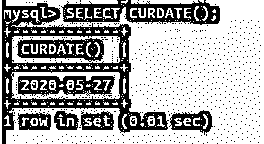
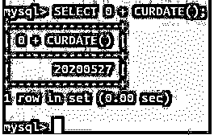
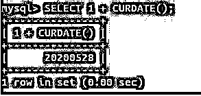
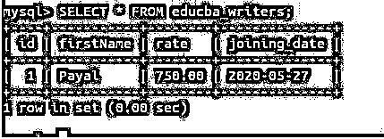
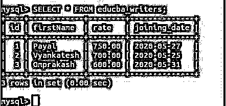

# MySQL 库尔德人

> 原文：<https://www.educba.com/mysql-curdate/>

## MySQL CURDATE 简介

在 MySQL 表中插入带有日期列的值时，我们必须将值插入到日期列中，即插入时的日期，或者甚至将日期列的默认值设置为记录 id 插入的日期。在所有这些情况下，我们都需要在执行操作时检索特定实例的日期值。为此，Mysql 提供了使用 CURDATE 函数来检索当前日期的功能。

在本文中，我们将了解如何使用 CURDATE 函数，它的语法和示例，MySQL 中 CURDATE 函数的替代方法，以及 NOW()功能和 CURDATE()功能之间的区别。

<small>Hadoop、数据科学、统计学&其他</small>

### 句法

`string/number CURDATE();`

**解释:**CURDATE()函数返回当前日期的值，或者在调用该函数的特定时刻的日期。日期的格式取决于调用该函数的上下文。例如，当使用字符串上下文时，则检索数据的格式为“YYYY-MM-DD”格式，而在数字上下文的情况下，提取日期的格式会更改为 YYYY-MM-DD 格式。

### MySQL CURDATE 是如何工作的？

让我们使用简单的 SELECT 语句检索 CURDATE()函数的值，如下所示:

**代码:**

`SELECT CURDATE();`

**输出:**

**解释:**这是以‘YYYY-MM-DD’格式撰写文章的日期。正如我们所看到的，使用的默认格式是“YYYY-MM-DD ”,返回类型是一个字符串。让我们通过在数值上下文值中添加 0 或 1 值或其他数字来转换检索到的值，从而将返回值隐式转换为数值。我们将使用以下查询语句。

**代码:**

`SELECT 0 + CURDATE();`

**输出:**

**解释:**上述查询语句的执行给出以下输出，其中今天的日期值采用 YYYY-MM-DD 格式。

**代码:**

`SELECT 1 + CURDATE();`

**输出:**

**解释:**上述查询语句的执行给出了以下输出，其中包含明天的日期值，因为它相当于今天的日期加上 YYYY-MM-DD 格式的一天。

### 实现 MySQL CURDATE 的示例

下面是提到的一些例子:

#### 示例#1

让我们看看如何在表中使用它将日期列插入到今天的日期。我们将借助以下查询语句创建一个名为 educba_writers 的表，其中 joining_date 列的数据类型为 date:

**代码:**

`CREATE TABLE `educba_writers` (
`id` int(11) NOT NULL,
`firstName` varchar(10) COLLATE latin1_danish_ci NOT NULL,
`rate` decimal(5,2) DEFAULT NULL,
`joining_date` date DEFAULT NULL
) ENGINE=InnoDB DEFAULT CHARSET=latin1 COLLATE=latin1_danish_ci;`

**输出:**

#### 实施例 2

现在，我们将使用 CURDATE 函数将今天的日期作为 joining_date 值插入 educba_writers 表中。为此，我们将使用下面的 insert query 语句。让我们插入更多具有非空费率和加入日期值的行:

**代码:**

`INSERT INTO `educba_writers` (`id`, `firstName`, `rate`, `joining_date`) VALUES
(1, 'Payal', 750, CURDATE());`

**输出:**

#### 实施例 3

让我们使用以下查询语句检索记录并查看 educba_writers 表中插入的值:

**代码:**

`SELECT * FROM educba_writers;`

**输出:**

#### 实施例 4

我们可以看到，joining_date 列中插入了“YYYY-MM-DD”格式的今天日期 2020-05-27 的值。我们甚至可以使用 CURDATE()函数插入今天的日期。例如，我们可以通过添加 CURDATE()函数来减少天数，从而将加入日期添加为比今天早两天或晚三天。现在，假设我们必须插入一个名为 Vyankatesh 的作家记录，他的加入是在今天之前两天，那么我们可以使用下面的查询语句来插入这个记录:

**代码:**

`INSERT INTO `educba_writers` (`id`, `firstName`, `rate`, `joining_date`) VALUES
(2, 'Vyankatesh', 700, CURDATE()-2);`

**输出:**

#### 实施例 5

让我们使用以下查询语句检索记录并查看 educba_writers 表中插入的值:

**代码:**

`SELECT * FROM educba_writers;`

**输出:**

#### 实施例 6

现在，假设我们必须插入一个名为 Omprakash 的 writer 记录，其加入是在四天后，那么我们可以使用如下查询语句:

**代码:**

`INSERT INTO `educba_writers` (`id`, `firstName`, `rate`, `joining_date`) VALUES
(3, 'Omprakash', 600, DATE_FORMAT((CURDATE() + 4), "%Y-%m-%d"));`

**输出:**

#### 实施例 7

让我们使用以下查询语句检索记录并查看 educba_writers 表中插入的值:

**代码:**

`SELECT * FROM educba_writers;`

**输出:**

### CURDATE()函数的替代

我们可以使用 CURRENT_DATE 和 CURRENT_DATE()函数来代替 CURDATE()函数，因为它们以相同的方式工作，并且返回与 CURDATE()函数相同的值。让我们通过执行一个简单的 SELECT 查询来确认所有三个函数的工作情况，该查询将检索所有三个函数的值，如下所示:

**代码:**

`SELECT CURDATE(), CURRENT_DATE, CURRENT_DATE();`

**输出:**

**解释:**正如我们所看到的，所有三个函数和语句都检索了同一个值 2020-05-27，即今天的日期。

#### NOW()函数和 CURDATE()函数的区别

Now()函数检索包含当前日期和时间的整个时间戳，而 CURDATE()函数只检索当前日期。NOW()函数的日期部分相当于 CURDATE()函数的输出。让我们通过使用以下查询语句来查看结果:

**代码:**

`SELECT CURDATE(), DATE(NOW()), NOW();`

**输出:**

**解释:**我们可以观察到 CURDATE()和 DATE(NOW())表达式的值是等价的。

### 结论

我们可以使用 MySQL 中的 CURDATE()函数来检索当前日期，并根据需要对其进行操作。

### 推荐文章

这是一个 MySQL CURDATE 的指南。在这里，我们讨论 MySQL CURDATE 的介绍，语法，它是如何工作的，替代品和查询示例。您也可以浏览我们的其他相关文章，了解更多信息——

1.  [SQL 数据类型](https://www.educba.com/sql-data-types/)
2.  [SQL 日期函数](https://www.educba.com/sql-date-function/)
3.  [MySQL BIN()](https://www.educba.com/mysql-bin/)
4.  [MySQL INSTR()](https://www.educba.com/mysql-instr/)

