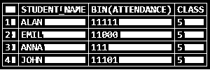

# MySQL 位

> 原文：<https://www.educba.com/mysql-bit/>

## MySQL BIT 简介

BIT 是 MySQL 中使用的一种数据类型。这种类型存储 1-64 范围内的位值。它通常在 create table 或 defining 语句中定义，并表示为“BIT(n)”，其中“n”是可以存储的位值的数量。这个“n”值保持 1-64 的范围，如果没有在语句中定义，则默认为 1 位值。该位值将存储二进制值。我们知道在 MySQL 中，我们需要调用一个二进制值作为‘BIN()’来显示为二进制值。我们将在下面进一步讨论这种数据类型。

**语法:**

<small>Hadoop、数据科学、统计学&其他</small>

位数据类型定义如下:

`BIT (n);`

这里，关键字 BIT 将其定义为将二进制值存储为位，位值在变量‘n’中提及。当被调用时，要显示为二进制值，BIT 数据类型将具有如下语法。否则，将返回相应的十进制值。

`BIN ( BIT (n))`

让我们看看位数据类型的用法和例子。

### 比特数据类型在 MySQL 中是如何工作的？

位(n)由定义语句定义，如“创建表”等。请注意，如果未指定值“n ”,则位值默认为“1”位。我们可以创建一个表来理解位数据类型。我们的表是存储一个班学生 5 个工作日的出勤情况。该表以二进制位值的形式保存学生姓名、出勤数据，其中“1”表示出勤,“0”表示缺勤，以及学生所属的班级。create table 语句如下所示:

**查询:**

`CREATE TABLE attendance (
STUDENT_NAME CHAR(50),
ATTENDANCE BIT(5),
CLASS INT
);`

因此，该表的名称是有三列的 attendance。学生姓名存储为 char 数据类型，班级存储为 INT 数据类型，出勤存储为 BIT 数据类型。出勤字段将有 5 个值，代表 5 个工作日。

让我们在这些字段中插入值。

**查询:**

`INSERT INTO attendance (STUDENT_NAME, ATTENDANCE, CLASS)
VALUES ('ALAN',b'11111',5),
('EMIL',b'11000',5),
('ANNA',b'00111',5),
('JOHN',b'11101',5);`

一个位值作为一个位文字插入。使用 b“val”或“0bval”符号定义位值文字。

该表现在有四行，包含 4 个不同学生的出勤数据。

我们将使用 SELECT 查询检索数据。

**查询:**

`select * from attendance;`

从出勤表中检索完整数据的简单选择查询。

**输出:**

检索到的输出没有显示正确的数据或以我们期望的方式显示数据。我们已经输入了每个学生从周一到周五 5 天的出勤情况。但是在检索时，在 SELECT 查询中，我们没有指定如何显示位值。因此，该值显示为对应于共享二进制输入的十进制值。

现在，让我们尝试检索二进制值本身的数据。为此，我们需要专门将列 attendance 称为 BIN()。

**查询:**

`SELECT STUDENT_NAME, BIN(ATTENDANCE), CLASS FROM attendance;`

BIN()函数将以二进制格式本身将二进制值显示为位值文字。

**输出:**

我们现在将每个学生的出勤率记为“1”和“0”，这样就更容易确定他们每一个人的出勤或缺勤日期。但是安娜的出席有点小问题。她星期一和星期二没来。所以这两天都被标记为 0。因为位值文字以零开始，所以在显示输出时省略了前面的零。这可能会造成混乱，因为总共 5 天中只有 3 天的数据可用。

为了避免这种情况，我们可以结合使用 LPAD 函数和 BIN 函数。

**查询:**

`SELECT STUDENT_NAME, LPAD(BIN(ATTENDANCE),5,'0') as ATTENDANCE, CLASS FROM attendance;`

**输出:**

现在所有的出勤率看起来都差不多，因为天数一直是 5 天。

这是在 MySQL 中检索位数据类型的几种方法。在我们的变量定义语句中，我们通过查询的一部分——attendance BIT(5)将变量 attendance 中的位数指定为 5。如前所述，这个计数的范围是 1-64，当()中没有指定数字时，默认计数是 1。

我们可以看到一些位值长度不同的例子。

**查询:**

`CREATE TABLE sampleBITs (
sample1 BIT(10),
sample2 BIT,
sample3 BIT(50));`

创建具有 3 个变量样本 1、样本 2 和样本 3 的表格。Sample2 没有指定长度，这意味着长度为 1。我们可以将这些值插入到这个表中。

**查询:**

`INSERT INTO sampleBITs (sample1, sample2, sample3)
VALUES (b'1010101010', 0b1, B'10001100011000110001111111000110001100011100110001');
select * from sampleBITs;`

**输出:**

注意，这里我们使用所有 3 个有效位值侧边插入值。

现在，可以按如下方式检索该表。

**查询:**

`SELECT
LPAD(BIN(sample1),10,'0') as sample1,
LPAD(BIN(sample2),1,'0') as sample2,
LPAD(BIN(sample3),50,'0') as sample3
FROM sampleBITs;`

**输出:**

我们使用了 LPAD 和 BIN 函数来以适当的格式检索数据。

**NOTE:** Bit literals can be specified as b’val’ or 0bval. The b’val’ can also be denoted as B’val’, as the literal is not case sensitive in this format. But the leading 0b is case sensitive and cannot be replaced with 0B. A bit-value literal is always binary value by default, in both notations.

### 结论

正如我们所讨论的，位数据类型用于存储位值，并被定义为 BIT(n ),其中“n”指定变量中的位数。“n”的值可以在“1”到“64”之间。要将数据输入到位变量中，我们可以使用位值文字，同样可以作为十进制、二进制或任何其他数据转换函数进行检索。

### 推荐文章

这是一个 MySQL BIT 的指南。这里我们讨论 MySQL BIT 的介绍和实际例子以及不同的子查询表达式。您也可以浏览我们推荐的文章，了解更多信息——

1.  [MySQL 操作符介绍](https://www.educba.com/mysql-operators/)
2.  [前 23 个 MySQL 字符串函数](https://www.educba.com/mysql-string-functions/)
3.  [MySQL 与 SQLite | 14 大对比](https://www.educba.com/mysql-vs-sqlite/)
4.  [MySQL 时间戳指南](https://www.educba.com/mysql-timestamp/)

