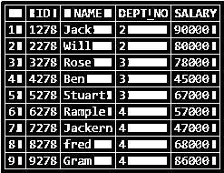

# MySQL 平均值

> 原文：<https://www.educba.com/mysql-average/>

## MySQL 平均值介绍

为了找到一个字段在不同记录中的平均值，我们使用 MySQL Average。通过使用“Group by”子句，我们可以求出一列记录的平均值。MySQL AVG()函数是一个聚合函数，允许您计算列值的平均值。要计算一列中不同值的平均值，我们可以使用“distinct”运算符。AVG 函数将忽略“空”值。

AVG 函数可以用在子查询中。它也可以和控制流函数一起使用，比如 IF、IFNULL、NULLIF 和 CASE。

<small>Hadoop、数据科学、统计学&其他</small>

**语法:**

`SELECT AVG(EXPRESSION) FROM <TABLE_NAME>;`

上面是平均函数的语法。average 函数返回 INT 数据类型的数据。

### MySQL 平均如何工作？

现在让我们创建一个表，对该列执行 average 函数并检索数据。

**查询:**

`create table Freelancer_data
(
Freelancer_id INT,
Freelancer_Name VARCHAR(20),
Type_of_work VARCHAR(30),
No_of_submission INT,
No_of_pages_submitted INT,
EMAIL varchar(30)
);`

#### 1.将数据插入表格

**查询:**

`insert into freelancer_data values (1278,'Jack','Typist', 2, 300,'jack12@gmail.com');
insert into freelancer_data values (2278,'Will','Artical Writer', 3, 450,'will@gmail.com');
insert into freelancer_data values (3278,'Rose','Artical Writer', 3, 540,'rose34@gmail.com');
insert into freelancer_data values (4278,'Ben','Typist', 3, 860,'ben@gmail.com');
insert into freelancer_data values (5278,'Stuart','Typist', 5, 600,'stuart12@gmail.com');
insert into freelancer_data values (6278,'Rample','Artical Writer', 6, 900,'rample12@gmail.com');
insert into freelancer_data values (7278,'Jackern','Typist', 3, 700,'jackern12@gmail.com');
insert into freelancer_data values (8278,'fred','Artical Writer', 2, 300,'fred12@gmail.com');
insert into freelancer_data values (9278,'Gram','Artical Writer', 9, 400,'gram12@gmail.com');`

#### 2.从表中选择数据

**查询:**

`select * from freelancer_data;`

**输出:**

#### 3.现在让我们来看看自由职业者提交的平均页数

**查询:**

`select AVG(No_of_pages_submitted) as "Average papers submitted" from freelancer_data;`

**输出:**

现在让我们使用“GROUP BY”子句，根据工作类型找到自由职业者提交的平均页数:

**查询:**

`select AVG(No_of_pages_submitted) as "Average papers submitted", Type_of_work from freelancer_data group by 2;`

**输出:**

或者

**查询:**

`select AVG(No_of_pages_submitted) as "Average papers submitted", Type_of_work from freelancer_data group by Type_of_work;`

**输出:**

#### 4.将 AVG()与“HAVING”从句一起使用

为了给平均值的输出设置条件，我们使用了“HAVING”子句。

**查询:**

`select AVG(No_of_pages_submitted) as "Average papers submitted", Type_of_work
from freelancer_data
group by 2
having AVG(No_of_pages_submitted) > 600;`

或者

**查询:**

`select AVG(No_of_pages_submitted) as "Average papers submitted", Type_of_work
from freelancer_data
group by Type_of_work
having AVG(No_of_pages_submitted) > 600;`

**输出:**

#### 5.将 AVG()用于子查询

在这个子查询中，我们基于“工作类型”来查找平均值。外部查询获取内部查询输出的平均值。

**查询:**

`SELECT
AVG(AVG_PAGES) as "average pages"/* Outer query*/
FROM
(select
AVG(NO_OF_PAGES_SUBMITTED) AS "AVG_PAGES" /* -- inner query --*/
from
freelancer_data
GROUP BY TYPE_OF_WORK) AVG;`

**输出:**

#### 6.将 AVG()用于控制功能

在这里，如果“提交次数”为 3，我们就可以找到提交页面的平均值，否则就认为是“空”。因为，AVG 忽略了空值。下面的输出是平均值，仅当提交次数=3 时。

**查询:**

`SELECT
AVG(IF(No_of_submission= 3,
No_of_pages_submitted,
NULL))/No_of_submission 'Avg pages'
FROM
freelancer_data;`

**输出:**

### 实现 MySQL 平均值的示例

现在让我们考虑下面的其他简单例子:

**查询:**

`create table sample_AVG
(
ID INT,
NAME VARCHAR(30),
DEPT_NO INT,
SALARY FLOAT(10,2)
);`

#### 1.将数据插入表格

**查询:**

`insert into SAMPLE_AVG values (1278,'Jack', 2, 90000);
insert into SAMPLE_AVG values (2278,'Will', 2, 80000);
insert into SAMPLE_AVG values (3278,'Rose', 3, 78000);
insert into SAMPLE_AVG values (4278,'Ben', 3, 45000);
insert into SAMPLE_AVG values (5278,'Stuart', 3, 67000);
insert into SAMPLE_AVG values (6278,'Rample', 4, 57000);
insert into SAMPLE_AVG values (7278,'Jackern', 4, 47000);
insert into SAMPLE_AVG values (8278,'fred', 4, 68000);
insert into SAMPLE_AVG values (9278,'Gram', 4,86000);`

**查询:**

`select * from SAMPLE_AVG;`

**输出:**

#### 2.现在让我们从表格中找出工资的平均值

**查询:**

`select AVG(salary) as "Average salary" from sample_avg;`

**输出:**

#### 3.现在让我们使用“GROUP BY”子句根据 DEPT_NO 找到平均工资

**查询:**

`select AVG(salary) as "Average salary", Dept_no from sample_avg group by 2; /* - - Position of the column - -*/`

**输出:**

或者

**查询:**

`select AVG(salary) as "Average salary", Dept_no from sample_avg group by dept_no;`

**输出:**

#### 4.将 AVG()与“HAVING”从句一起使用

为了给平均值的输出设置条件，我们使用了“HAVING”子句。

**查询:**

`select
AVG(salary) as "Average salary",
Dept_no from sample_avg
group by 2
having AVG(salary) > '65000'`

或者

**输出:**

**查询:**

`select
AVG(salary) as "Average salary",
Dept_no from sample_avg
group by dept_no
having AVG(salary) > '65000'`

**输出:**

#### 5.将 AVG()用于子查询

在这个子查询中，我们找到了基于“dept_no”的平均值。外部查询获取内部查询输出的平均值。

**查询:**

`SELECT
AVG(AVG_SAL) as "average salary"
FROM
(select
AVG(salary) as "Avg_sal",
Dept_no from sample_avg
group by 2
)AVG;`

**输出:**

#### 6.将 AVG()用于控制功能

在这里，如果“部门编号”为 3，则让我们找出工资的平均值，否则认为 4 为“空”。因为，AVG 忽略了空值，所以下面的输出是平均值，只有提交的计数是 3 和 4。

**查询:**

`SELECT
AVG(IF(DEPT_NO IN (3,4),
SALARY,
NULL))/COUNT(DEPT_NO) 'AVGSALARY'
FROM
SAMPLE_AVG;`

**输出:**

### 结论

*   为了找到一个字段在不同记录中的平均值，我们使用 MySQL Average。通过使用“Group by”子句，我们可以求出一列记录的平均值。
*   MySQL AVG()函数是一个聚合函数，允许您计算列值的平均值。
*   要计算一列中不同值的平均值，我们可以使用“distinct”运算符。AVG 函数将忽略“空”值。
*   AVG 函数可以用在子查询中。它也可以和控制流函数一起使用，比如 IF、IFNULL、NULLIF 和 CASE。

### 推荐文章

这是一个 MySQL 平均指南。这里我们讨论 MySQL Average 的介绍和实际例子以及不同的子查询表达式。您也可以浏览我们推荐的文章，了解更多信息——

1.  [MySQL 操作符介绍](https://www.educba.com/mysql-operators/)
2.  [前 23 个 MySQL 字符串函数](https://www.educba.com/mysql-string-functions/)
3.  [MySQL 与 SQLite | 14 大对比](https://www.educba.com/mysql-vs-sqlite/)
4.  [MySQL 时间戳指南](https://www.educba.com/mysql-timestamp/)

