# MySQL 秀

> 原文：<https://www.educba.com/mysql-show/>

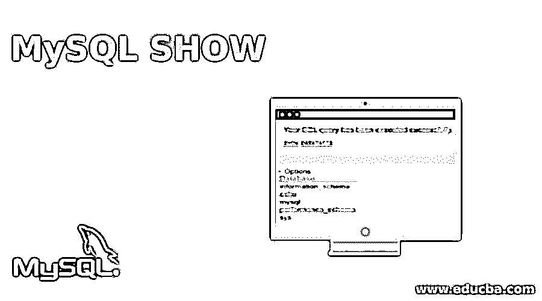

## MySQL 秀简介

MySQL SHOW 命令是 MySQL 中的一个特殊查询，用于查看数据库中存储的任何记录的信息模式。我们可以用几种形式的命令来定义 MySQL SHOW，这些命令有助于传递重要的数据记录或信息，如日志、创建的事件、触发器、数据库、表、列、命令的状态信息，以及更多管理级别的命令。这个 MySQL SHOW 命令对于提供 MySQL 服务器上所有 MySQL 语句查询的各种事务、日期时间和输出状态非常有用，我们需要保留这些记录。

MySQL SHOW 命令允许显示 MySQL 服务器的结构、字段、索引和创建的函数或存储过程，这对于用户来说可能是必要的。

<small>Hadoop、数据科学、统计学&其他</small>

**语法:**

您可以找到一个简单的基本语法来表示 MySQL 中的 SHOW 命令，例如:

`SHOW DATABASES;`

`SHOW ERRORS;`

`SHOW TABLES;`

`SHOW COLUMNS FROM TableName;`

`SHOW [FULL] PROCESSLIST;`

`SHOW EVENTS;`

`SHOW TABLE STATUS;`

`SHOW PRIVILEGES;`

`SHOW WARNINGS;`

`SHOW CREATE VIEW;`

`SHOW VARIABLES;`

`SHOW ENGINE;`

`SHOW INDEX;`

`SHOW GRANTS;`

`SHOW STATUS;`

`SHOW PLUGINS;`

`SHOW CREATE FUNCTION;`

### MySQL 中的 SHOW 命令是如何工作的？

*   此外，MySQL SHOW 命令(如 SHOW CREATE VIEW query)允许显示 create view MySQL 语句，SHOW DATABASES query 有助于列出 MySQL 服务器上的所有数据库，我们还可以使用 SHOW SCHEMAS 作为同义词来应用于 SHOW DATABASES 等。甚至，我们可以实现一个 MySQL LIKE 子句以及 SHOW DATABASES，该子句指示匹配特定模式类型的数据库列表。要查看服务器状态，我们可以应用 SHOW STATUS 命令。
*   对于一些关键情况，MySQL 中的 SHOW 命令提供 SHOW ERRORS 查询来显示服务器上的任何错误、警告或注释。我们还可以使用该 MySQL 服务器版本支持的 SHOW PRIVILEGES 命令来查找权限。
*   像这样，MySQL SHOW 命令在 MySQL 数据库服务器上工作，执行负责不同任务的不同活动。

### 实现 MySQL 的例子展示

让我们看一些关于 MySQL SHOW 命令的例子来更好地理解这个功能。

#### 示例# 1–使用显示数据库命令

这个 MySQL 命令负责使用以下语句显示服务器上的所有数据库:

**查询:**

`SHOW DATABASES;`

**输出:**

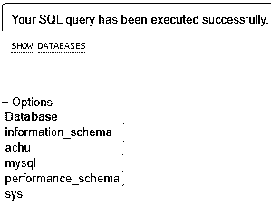

我们也可以使用 SHOW SCHEMAS 命令，但它也会产生与上述输出相同的值。

**查询:**

`SHOW SCHEMAS;`

**输出:**

如果我们想通过应用某种模式来获取数据库的信息，那么我们应该在前面的查询中使用 LIKE 子句。

**查询:**

`SHOW DATABASES LIKE '%hu%';`

**输出:**

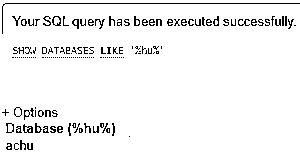

#### 示例 2–使用显示表格命令

我们将应用这个 MySQL SHOW 命令来查询和检索服务器上特定数据库中的表。为此，当我们登录到 MySQL 服务器或 phpMyAdmin 时，我们需要选择一个特定的数据库，使用下面的查询列出那里可用的表:

**查询:**

`SHOW TABLES;`

**输出:**

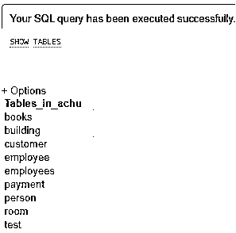

下面的 SHOW 命令显示在获取的结果中现有的表是基表还是视图表。

**查询:**

`SHOW FULL TABLES;`

**输出:**

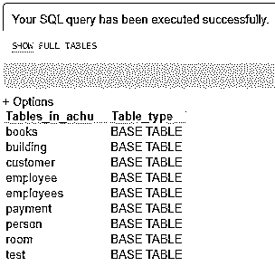

如果我们进一步想要获取指定某个名称的表的结果，比如假设以特定字母开头或结尾，那么我们在这里使用查询:

**查询:**

`SHOW TABLES LIKE 'b%';`

**输出:**

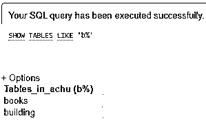

#### 示例# 3–使用显示列命令

这个 MySQL 命令用于查询特定数据库中特定表中的表列列表。我们将执行以下语句:

**查询:**

`SHOW COLUMNS FROM TableName;`

假设，我们在数据库中有一个名为“Books”的样本表。

**查询:**

`SHOW COLUMNS FROM Books;`

**输出:**

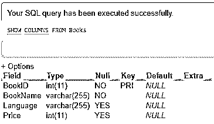

#### 示例# 4–使用显示字符集命令

我们可以检查 MySQL 服务器上现有的所有字符集。为此，我们使用以下 MySQL 语句:

**查询:**

`SHOW CHARACTER SET;`

**输出:**

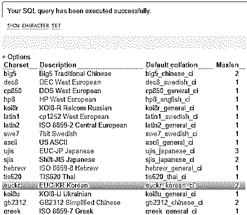

为了从数据库中找到匹配的字符集，我们可以应用 LIKE 子句这样的选项来指定特定的模式表达式，以产生匹配的结果。我们运行下面的代码:

**查询:**

`SHOW CHARACTER SET LIKE 'asc%';`

**输出:**

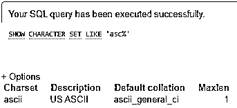

#### 示例# 5–使用 SHOW COLLATION 命令

在 MySQL 中，校对被定义为一组用于关联字符集中字母的过程。通过使用这个 SHOW COLLATION 查询语句，我们将获得 MySQL 服务器支持的排序规则列表。下面是这个命令的语法。

**查询:**

`SHOW COLLATION SET [LIKE ‘Specified_pattern’ | WHERE expression];`

此外，我们使用 LIKE 子句选项来显示 MySQL 服务器上匹配的排序规则，在 WHERE 子句的帮助下，我们可以将一个条件表达式与 show 查询连接起来。

**查询:**

`SHOW COLLATION;`

**输出:**

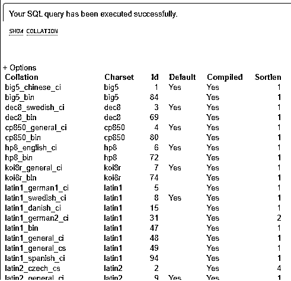

**查询:**

`SHOW COLLATION LIKE '%bin';`

**输出:**

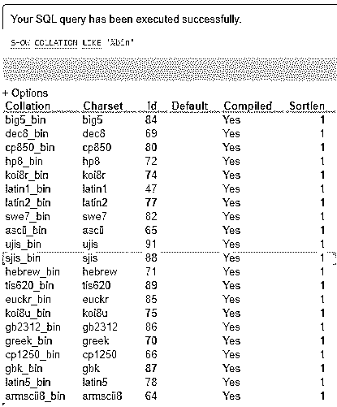

#### 示例# 6–使用显示引擎命令

此 MySQL SHOW 查询用于显示 MySQL 数据库引擎状态报告，该报告为我们提供了有关 MySQL 服务器上存储引擎的运行信息。

**查询:**

`SHOW ENGINE INNODB STATUS;`

**输出:**

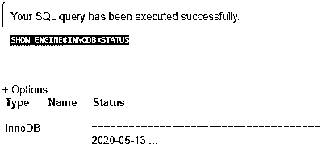

我们还可以执行以下 SHOW 命令:

**查询:**

`SHOW ENGINE PERFORMANCE_SCHEMA STATUS;`

**输出:**

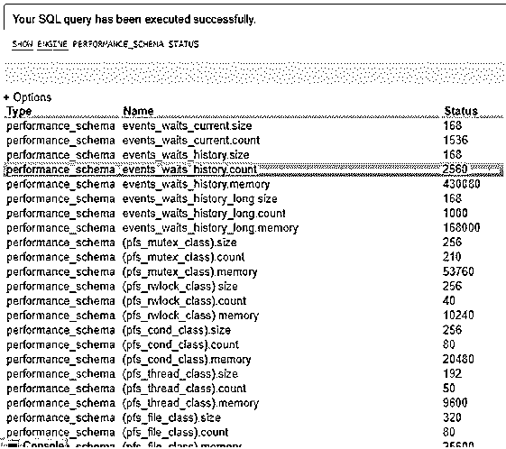

#### 示例# 7–使用显示错误命令

在 MySQL 中，实现了 SHOW 命令来显示任何类型的错误、注释、警告和通知。此 SHOW 命令的作用相当于显示警告，但它是显示错误的例外情况。

**查询:**

`SHOW ERRORS;`

**输出:**

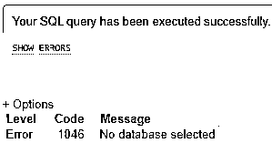

**查询:**

`SHOW WARNINGS;`

**输出:**

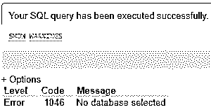

此外，下面的显示代码显示了在服务器上发现的错误数量。

**查询:**

`SHOW COUNT(*) ERRORS;`

**输出:**

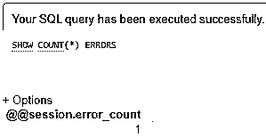

我们还可以在 SHOW ERRORS 命令中使用 LIMIT 子句，以提供执行后要显示的特定行数，语法如下:

**查询:**

`SHOW ERRORS [LIMIT clause];`

#### 示例 8–使用显示功能状态命令

如果我们想查看存储在数据库中的函数的状态或特征，包括数据库、类型、名称、创建、创建者、字符集和修订日期，则使用如下显示函数命令:

**查询:**

`SHOW FUNCTION STATUS;`

**输出:**

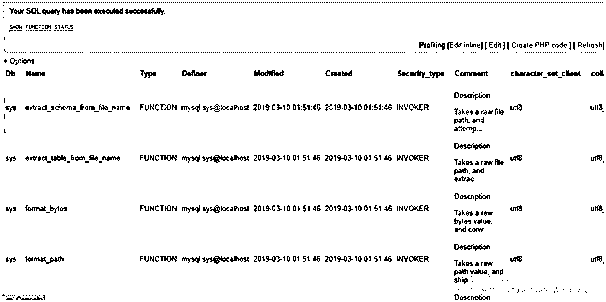

在不同的条件下，可以使用更多的 SHOW 命令。

### 结论

*   在本文中，我们学习了 MySQL 中不同 SHOW 命令的一些重要用法，这些命令可以用于不同的操作。
*   使用上面提到的 SHOW 语法，我们可以查询查看数据库信息的不同部分，从表、列到事件、错误和函数，以及服务器状态和日志。

### 推荐文章

这是一个 MySQL 的展示指南。这里我们讨论 MySQL SHOW 的介绍和实际例子以及不同的子查询表达式。您也可以浏览我们推荐的文章，了解更多信息——

1.  [MySQL 操作符介绍](https://www.educba.com/mysql-operators/)
2.  [前 23 个 MySQL 字符串函数](https://www.educba.com/mysql-string-functions/)
3.  [MySQL 与 SQLite | 14 大对比](https://www.educba.com/mysql-vs-sqlite/)
4.  [MySQL 时间戳指南](https://www.educba.com/mysql-timestamp/)

