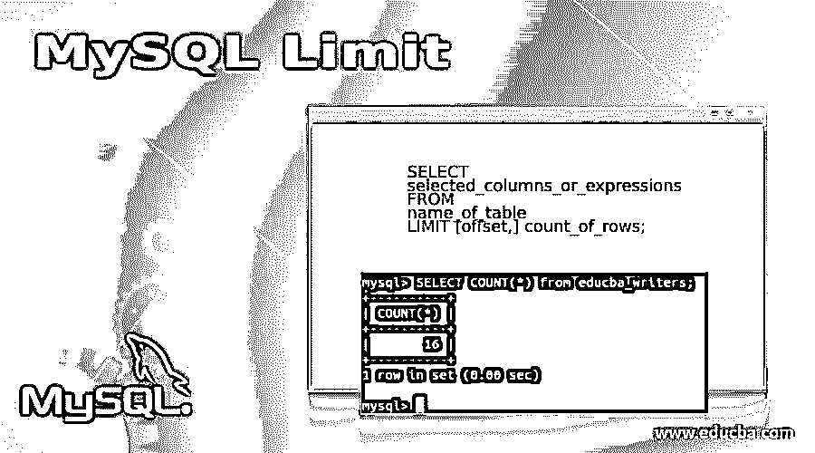
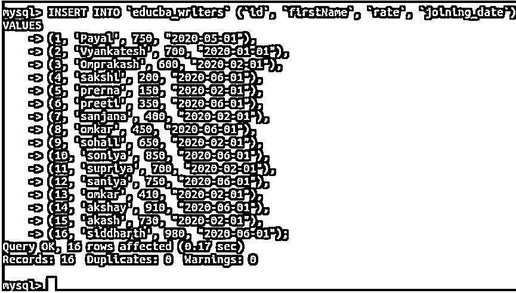
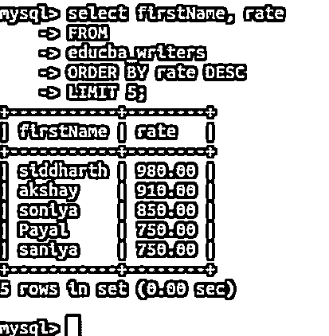
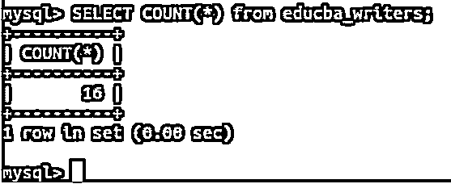

# MySQL 限制

> 原文：<https://www.educba.com/mysql-limit/>

## MySQL 限制简介

Mysql 中的 limit 子句用于将查询结果集中检索到的行数限制在一定的数量。它还帮助我们从 MySQL 表中检索从特定偏移量开始的特定数量的记录。每当表中包含大量记录时，检索所有这些记录并显示它们就变成了一项繁重的操作，甚至非常耗时。这会影响应用程序的性能。

因此，我们可以利用分页技术，以小块的形式检索查询结果，并在每页上显示一定数量的记录。这可以通过使用 limit 子句来实现。在本文中，我们将学习 limit 子句的语法和用法，以及 Mysql 中的例子。

<small>Hadoop、数据科学、统计学&其他</small>

### MySQL 限制的语法

limit 子句接受两个参数。其中 count_of_rows 是必需的，而另一个名为 offset 的是可选的。LIMIT 子句的语法及其使用位置如下所示:

`SELECT
selected_columns_or_expressions
FROM
name_of_table
LIMIT [offset,] count_of_rows;`

count_of_rows 是一个整数值，它帮助我们指定从 name_of_table 表中检索记录的行数。偏移量是可选的整数值，默认值为 0。偏移量用于指定从名为 name_of_table 的表中获取结果集的记录位置。下图将帮助您清楚地理解 offset 和 row_count 的概念

![LIMIT [offset,] count](img/cde0d70b58f46cab8e03128cbdcbaa88.png)

请考虑上图显示了表中的记录，其中的数字代表该记录的行号。如果偏移量被指定为 3，那么将开始的行数将从第四行开始，因为偏移量默认从 0 开始。当 row_count 被提到为 4 时，则从定义的偏移开始，即在这种情况下从第四行开始，当 row_count 为 4 时，将检索四个记录。如果 row_count 为 5，则从第四条记录开始，将检索到行号为 4、5、6、7 和 8 的 5 行。

每当我们不指定偏移值时，默认值就被认为是 0，行计数从第 1 行开始。在这种情况下，以下两个限制条款的工作方式相同-

`LIMIT 5;`

和

`LIMIT 0,5;`

两者都将从选择查询的结果集中检索前 5 条记录。

**替代语法:**

为了保持与 PostgreSQL 语法的兼容性，LIMIT 子句还提供了一个可选语法，如下所示

`LIMIT count_of_rows OFFSET offset;`

**使用 LIMIT 子句和 ORDER BY 子句:**

每当我们在不使用 ORDER BY 子句的情况下检索记录时，就会以任何顺序检索结果，当 LIMIT 子句应用于这种查询时，就会需要行数有限的随机行，这通常不是我们想要的。检索行的顺序在指定要检索哪些记录时起着重要作用。将 LIMIT 子句与 ORDER BY 子句一起使用是一种很好的做法。

因此，我们可以指定 ORDER BY 子句和检索记录时要对其进行排序的字段，并使用 LIMIT 子句限制要从有序数据中检索的行。下图显示了 SELECT 语句中子句的执行顺序

我们可以观察到，所有的子句都在 LIMIT 子句之前执行，最后在检索结果集时，执行的最后一件事是考虑需要检索的结果集的行数和偏移量。

### MySQL 限制的例子

以下是 MySQL 限制的示例:

#### 示例#1

让我们使用以下查询语句创建一个名为 educba_writers 的表:

**代码:**

`CREATE TABLE `educba_writers` (
`id` int(11) NOT NULL,
`firstName` varchar(10) COLLATE latin1_danish_ci NOT NULL,
`rate` decimal(5,2) DEFAULT NULL,
`joining_date` date DEFAULT NULL
) ENGINE=InnoDB DEFAULT CHARSET=latin1 COLLATE=latin1_danish_ci;`

**输出:**

#### 实施例 2

让我们插入更多具有非空费率和加入日期值的行–

**代码:**

`INSERT INTO `educba_writers` (`id`, `firstName`, `rate`, `joining_date`) VALUES
(1, 'Payal', 750, "2020-05-01"),
(2, 'Vyankatesh', 700, "2020-01-01"),
(3, 'Omprakash', 600, "2020-02-01"),
(4, 'sakshi', 200, "2020-06-01"),
(5, 'prerna', 150, "2020-02-01"),
(6, 'preeti', 350, "2020-06-01"),
(7, 'sanjana', 400, "2020-02-01"),
(8, 'omkar', 450, "2020-06-01"),
(9, 'sohail', 650, "2020-02-01"),
(10, 'soniya', 850, "2020-06-01"),
(11, 'supriya', 700, "2020-02-01"),
(12, 'saniya', 750, "2020-06-01"),
(13, 'omkar', 410, "2020-02-01"),
(14, 'akshay', 910, "2020-06-01"),
(15, 'akash', 730, "2020-02-01"),
(16, 'siddharth', 980, "2020-06-01");`

**输出:**

#### 实施例 3

现在，假设我们想从 educba_writers 表中检索评分最高的 5 位作家的列表。为此，有必要首先根据 rate 列按降序对结果集进行排序，以便它们中报酬最高的将位于第一个被检索的位置。此外，由于我们必须只检索前 5 名作者，因此我们将使用 limit 子句来指定相同的内容。我们的问题如下

**代码:**

`select firstName, rate
FROM
educba_writers
ORDER BY rate DESC
LIMIT 5;`

**输出:**

#### 实施例 4

我们甚至可以使用 limit 子句实现分页。为此，我们首先必须找出表中记录的数量。这可以通过以下方式使用 COUNT()函数来确定

**代码:**

`SELECT COUNT(*) from educba_writers;`

**输出:**

此外，我们需要考虑页面的大小，即单个页面上显示的记录数量。假设，在我的例子中，页面大小是 5。总页数将是总记录数或页面大小。在我们的例子中，16/5 是 3.2，这意味着需要 4 页，第四页只包含一条记录。之后，我们可以将前 5 个的 limit 子句指定为 LIMIT 5；对于下一个 5 作为极限 5，5；对于下一个 as 极限 10，5，以此类推。

### 结论

我们可以通过使用 MySQL 中的 LIMIT 子句来限制从结果集中检索的记录数量。这个子句还帮助我们指定检索时行计数应该开始的偏移量，并指定行计数，它告诉我们要检索多少行。

### 推荐文章

这是一个 MySQL 极限指南。这里我们还讨论了 MySQL limit 的介绍和语法，以及不同的例子和代码实现。您也可以看看以下文章，了解更多信息–

1.  MySQL 中的 IF 语句
2.  [MySQL 时间戳](https://www.educba.com/mysql-timestamp/)
3.  [MySQL 中的运算符](https://www.educba.com/mysql-in-operator/)
4.  [MySQL 中的汇总](https://www.educba.com/rollup-in-mysql/)

