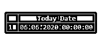

# 今日 MySQL()

> 原文：<https://www.educba.com/mysql-today/>

## MySQL 今日简介()

*   在 MySQL 中，Today()函数是一个内置的 MySQL 日期函数，它提供今天的日期值，我们将在这里使用 MySQL 存储过程和函数。
*   通过这个 MySQL Today()函数，我们将学习通过实现 CREATE FUNCTION query 语句来创建一个特殊类型的 MySQL 存储程序。
*   在 MySQL Today()函数中，我们将使用一些 MySQL 日期函数构建一个日期函数，并使用它来访问单个日期值，因此称为内置日期实用程序代码。
*   一般来说，MySQL 中的存储函数用于汇总公式或某些规则，这些公式或规则可以在几个 SQL 语句或存储程序之间重复处理。

### 句法

为了让 MySQL Today()函数产生今天的日期，我们将使用 date 数据类型的内置函数。为此，我们需要创建自己的 MySQL Today()函数作为存储程序。正如我们所知，MySQL 中的 CURDATE()函数或 CURRENT_DATE()函数提供了当前日期，我们也经常使用它来检索 MySQL 查询中的当前日期或时间。

现在，我们可以用 MySQL Today()函数替换这个 MySQL CURDATE()函数或 CURRENT_DATE()函数，使查询语句更容易理解。这可以通过以下 SQL 命令代码结构实现:

<small>Hadoop、数据科学、统计学&其他</small>

`DELIMITER $$     // creating stored function program
CREATE FUNCTION FunctionName(
Parameter1,
Parameter2,….
)
RETURNS Data_Type   // Declare the datatype
[NOT] DETERMINISTIC
BEGIN
RETURN  Replaceable_Stored_FunctionName;   // statements
END$$
DELIMITER ;    // end of the procedure`

下面解释上述语法的术语:

*   FunctionName 指定给存储函数的名称，该存储函数将在我们要命名和创建它的 CREATE FUNCTION 关键字之后使用。
*   在存储函数名之后，我们需要把所有需要的参数列表放入括号中。默认情况下，所有这些参数都是 MySQL IN 参数，因此，我们不能对这些参数声明 OUT、INOUT 或 IN 修饰符。
*   使用 RETURNS 语句，我们将指定为其创建存储程序函数的有效 MySQL 数据类型。
*   然后，我们必须声明确定性关键字，使函数要么确定，要么不确定。在确定性函数中，它也将相似参数的相同结果作为输入返回，而在非确定性函数中，它将相似参数的不同值作为输入输出。但是如果我们不设置任何人，MySQL 默认使用 NOT DETERMINISTICkeyword 选项。
*   在 BEGIN 和 END 关键字块之间，我们可以在这个主体中为存储函数编写代码。在 body 块部分，至少应该提到一个返回查询语句，它将结果值返回给调用函数。在执行时，如果返回查询被访问，存储函数立即终止。

运行上述正确的存储程序语法后，使用有效的函数名、参数和数据类型，将在 MySQL 数据库上创建存储函数。我们可以使用以下 MySQL 查询调用新构建的存储程序，并根据需要执行输出:

`SELECT FunctionName();`

这里，FunctionName 是上述存储程序函数语法中提到的术语。

### MySQL Today()函数是如何工作的？

让我们考虑通过实现内置的日期函数来访问今天的日期，以便在 MySQL 数据库中提供当前日期。

有时，我们希望从数据库表的行中获取包含日期列的数据，日期数据类型为今天，然后查询将被写成:

`SELECT ColumnName FROM TableName WHERE ExpiredDate = Today;`

要获取今天的日期，我们可以使用 CURRENT_DATE()或 CURDATE()函数，查询如下:

`SELECT CURRENT_DATE() Today;`

**输出:**

此外，您可以使用 NOW()函数或 SYSDATE()函数从函数产生的当前日期时间中选择日期部分，如下所示:

`SELECT DATE(SYSDATE()) Today;`

**输出:**

现在，我们可以用下面的一个来改变查询:

`SELECT ColumnName FROM TableName WHERE ExpiredDate = CURRENT_DATE();`

但是假设如果 ExpiredDate 列包含日期和时间类型，那么您可以在 MySQL 中应用 Date()来获取它们的日期值，并将其等同于 date 的当前值:

`SELECT ColumnName FROM TableName WHERE DATE(ExpiredDate) = CURRENT_DATE();`

### MySQL 中实现 Today()函数的例子

为了理解 MySQL Today()，我们可以在查询中多次使用 CURRENT_DATE()函数时替换它。

为此，让我们在 MySQL 中创建一个名为 Today()的存储函数，语法如下:

`DELIMITER $$
CREATE FUNCTION Today()
RETURNS DATE
BEGIN
RETURN  CURRENT_DATE();
END$$
DELIMITER ;`

您需要在 MySQL 数据库中执行上述命令，然后，您会发现 Today()函数被创建为一个存储程序，我们现在可以调用它并在查询语句中使用它。

为了实现创建的程序，让我们运行随后的查询 having Today()函数和 MySQL SELECT 关键字，并获取日期的当前值:

`SELECT Today()Today_Date;`

**输出:**

现在，有了这个 MySQL Today()函数，它是一个内置的日期函数，带有输出当前日期的存储程序，我们可以使用它来获取第二天的日期，即明天或未来几天的日期。该查询可以像下面的代码一样简单，以获取明天或后天的日期:

`SELECT Today() + interval 2 day Day_after_tomorrow_date;`

**输出:**

这里，interval 关键字用于确定间隔值和单位。

同样，让我们考虑使用 MySQL Today()函数获取前几天或昨天的数据，如下所示:

`SELECT Today() -interval 2 day Day_before_yesterday_date;`

**输出:**

### 结论

同样，我们也可以通过申请存储程序并执行它和在我们的 MySQL 查询中使用它来学习和开发 MySQL 中期望的日期函数或其他有效数据类型。因此，MySQL Today()函数是一个异常的存储程序，创建和查询它是为了获取当前日期值，并在 MySQL 语句中使用它来提供输出。

### 推荐文章

这是 MySQL 今日指南()。在这里我们讨论一个关于 MySQL today()的介绍，语法，它是如何与查询例子一起工作的。您也可以浏览我们的其他相关文章，了解更多信息——

1.  [MySQL 时间戳](https://www.educba.com/mysql-timestamp/)
2.  [MySQL Avg()](https://www.educba.com/mysql-avg/?source=leftnav)
3.  [MySQL MAX()函数](https://www.educba.com/mysql-max-function/?source=leftnav)
4.  [不在 MySQL 中](https://www.educba.com/not-in-mysql/?source=leftnav)

