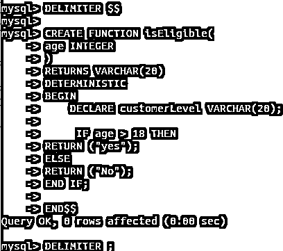
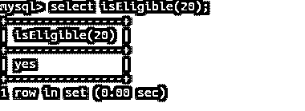
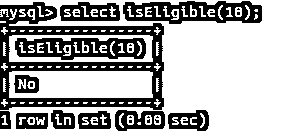
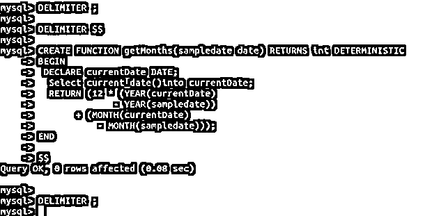
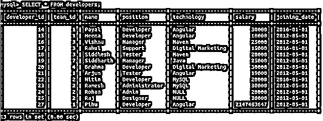
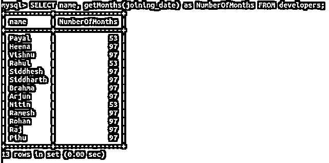

# MySQL 创建函数

> 原文：<https://www.educba.com/mysql-create-function/>

## MySQL 创建函数介绍

每当我们想要重复执行某些业务逻辑，并且从涉及单个或多个数据库操作的编写的业务逻辑中检索的值是在许多不同的地方以相同的方式完成的，那么创建一个 MySQL 函数并通过简单地调用该函数来调用该函数以从业务逻辑和数据库操作执行中检索值是很方便的。在 MYSQL 中，我们使用 CREATE FUNCTION 语句创建一个新的函数，这个函数将被存储，并且可以通过提供任意数量的参数并返回所需的值来进一步调用这个函数。

**语法:**

<small>Hadoop、数据科学、统计学&其他</small>

以下是 CREATE FUNCTION 语句的语法–

`DELIMITER $$
CREATE FUNCTION name_of_function(
parameter1,
parameter2,…
)
RETURNS datatype
[NOT] DETERMINISTIC
BEGIN
-- code of statements to be executed
END $$
DELIMITER ;`

*   **name _ of _ function—**是需要在 MySQL 中创建的函数的名称。
*   **parameter1、parameter2、…–**我们可以将可选参数传递给需要在()括号中创建时声明的函数。一个函数可以不包含参数，包含一个或多个参数。这些参数可以属于以下三种类型之一
*   **IN-**这些类型的参数在调用函数时被赋值，该值不能在函数内修改或覆盖，只能由函数引用和使用。
*   **OUT–**这些参数可以在函数中赋值和覆盖，但不能被函数引用。
*   **IN OUT–**这些类型的参数在调用函数时被赋值，该值可以在函数内修改或覆盖，也可以被函数引用和使用。
*   **BEGIN 和 END-**BEGIN 关键字标志着函数的开始，而 END 标志着 MYSQL 中函数的完成。
*   **返回数据类型**–我们可以从函数的执行中返回任何类型的值。需要在 RETURN 子句后指定将要返回的值类型。一旦 MySQL 在执行函数时找到了 RETURN 语句，函数的执行就被终止，值被返回。
*   **确定性**–函数可以是确定性的，也可以是不确定性的，这需要在这里指定。当函数为相同的参数值返回相同的值时，称为确定性函数。然而，如果函数对于相同的函数值返回不同的值，那么我们可以称这个函数为不确定的。当没有提到任何一种类型的函数时，MySQL 将默认认为函数是不确定的。

要执行的语句代码——我们可以在函数的这一部分编写程序或代码，其中可以包含条件语句、循环语句、初始化和赋变量值，以及准备和执行数据库查询。对其他函数的调用也可以包含在这部分函数中。

### MySQL 创建函数示例

让我们编写一个函数，尝试绕过年龄变量调用它们，而不是在上面的例子中静态声明和初始化

`DELIMITER $$
CREATE FUNCTION isEligible(
age INTEGER
)
RETURNS VARCHAR(20)
DETERMINISTIC
BEGIN
IF age > 18 THEN
RETURN ("yes");
ELSE
RETURN ("No");
END IF;
END$$
DELIMITER ;`

这将创建一个名为"合格"的函数。每当我们想要传递您想要检查资格的年龄值时，我们都可以调用这个函数。在 MySQL 命令提示符终端上复制并粘贴上述语句后的输出如下——

现在，我们想检查一个 20 岁小伙子的资格，然后我们可以按以下方式调用我们的函数

`SELECT isEligible(20);`

这会产生以下输出–

我们可以看到 isEligible(20)函数执行的输出返回“Yes”作为输出，因为它有资格投票。

让我们通过执行以下命令来检查一个 10 岁男孩的资格

`SELECT is eligible(10);`

这会产生以下输出–

因此，我们的 if 块没有执行，执行转到 else 块，返回值“No ”,因为这个人没有资格投票。

让我们考虑其他一些例子，包括返回当前日期和提供日期之间的月数。我们的职能如下

`DELIMITER $$
CREATE FUNCTION getMonths(sampledate date) RETURNS int DETERMINISTIC
BEGIN
DECLARE currentDate DATE;
Select current_date()into currentDate;
RETURN (12 * (YEAR(currentDate)
- YEAR(sampledate))
+ (MONTH(currentDate)
- MONTH(sampledate)));
END
$$
DELIMITER ;`

上述函数的执行会产生以下输出–

现在，我们可以通过简单地调用 MySQL 中的函数 getMonths()来计算从任何给定日期到今天的月份。让我们修改 developers 表，添加 joining_date 列，并将 joining_date 列的值更新为公司成立日期，比如“2012-05-01”。

`ALTER TABLE developers ADD COLUMN joining_date DATE DEFAULT "2012-05-01";`

执行上述查询会得到以下输出–

让我们使用下面的查询从 developers 表中检索所有记录

`SELECT * FROM developers;`

这在执行后给出了以下输出–

现在，假设 Rahul、Payal 和 Nitin 已于“2016-01-01”加入公司。我们将更新开发人员表中的记录

`UPDATE developers SET joining_date="2016-01-01" WHERE name in ("Payal","Rahul","Nitin");`

这在执行后给出了以下输出–

让我们通过触发上面的 select 查询语句来选择记录，该语句给出了以下输出

`select * from developers;`

现在，我们将通过使用下面的查询语句来检索开发人员的姓名以及他/她在公司工作的总月数，在该查询语句中，我们必须调用 getMonths()函数

`SELECT name, getMonths(joining_date) as NumberOfMonths FROM developers;`

这在执行后给出了以下输出–

我们可以看到，Payal、Nitin 和 Rahul 在公司工作了 53 个月，而所有其他人都工作了 97 个月。

### 结论

可以使用 CREATE FUNCTION 语句创建 MySQL 函数。我们可以调用查询中的函数，或者简单地选择函数值。

### 推荐文章

这是一个 MySQL 创建函数的指南。这里我们分别讨论介绍，语法，代码实现的例子。您也可以看看以下文章，了解更多信息–

1.  [MySQL 拆分](https://www.educba.com/mysql-split/)
2.  [MySQL 锁表](https://www.educba.com/mysql-lock-table/)
3.  [MySQL 主键](https://www.educba.com/mysql-primary-key/)
4.  [MySQL 查询缓存](https://www.educba.com/mysql-query-cache/)

