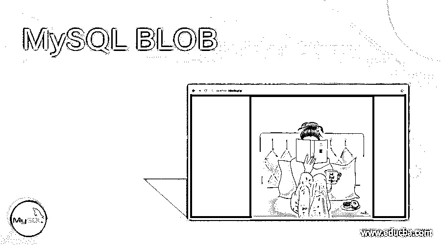
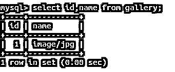

# MySQL BLOB

> 原文：<https://www.educba.com/mysql-blob/>

## MySQL BLOB 简介

Blob 是 MySQL 中帮助我们以二进制格式存储对象的数据类型。出于安全原因或 MySQL 中的其他目的，它通常用于存储文件、图像等媒体文件。它可以存储和保存可变数量的数据，MySQL 中可以使用四种类型的 blob，即 LONGBLOB、MEDIUMBLOB、BLOB 和 TINYBLOB。所有这些类型在所需的存储空间和可存储的最大长度上是不同的。这些数据类型值通常被视为字节字符串或二进制字符串。

BLOB 值包含二进制字符集和排序规则。存储在这种列值中的字节具有数值，每当在 MySQL 中执行排序和比较时，都基于这些数值。在本文中，我们将了解 BLOB 数据类型，以及如何将表中的列声明为 BLOB，此外，我们将讨论不同严格模式设置下 BLOB 值的行为，并查看与 BLOB 值相关的示例。

<small>Hadoop、数据科学、统计学&其他</small>

**BLOB Datatype**

MySQL 中表的最大行大小是 65535，这表示行的内部容量，尽管存储引擎对行的支持更大。该行的最大大小不包括 BLOB 或文本数据类型的列。除了用于行缓冲区之外，BLOB 值数据存储在内存的不同区域中，对于不同的存储引擎，分配给这种类型的值的内存是不同的。每个存储引擎使用不同的方法来处理这种数据类型的数据。

**所有 blob 数据类型的存储要求如下—**

*   tiny blob–长度+ 1 字节，其中长度< 2^8
*   blob–长度+ 2 字节，其中长度< 2^16
*   medium blob–长度+ 3 个字节，其中长度< 2^24
*   long blob–长度+ 4 个字节，其中长度< 2^32

其中长度代表 blob 数据类型列包含的字符串的原始长度。

关于 BLOB 数据类型，您应该知道一些事情，如下所列

*   BLOB 数据类型是可变长度列，因此被视为 VARBINARY 列。但是，它在某些方面不同于 VARBINARY。每当 BLOB 列用于索引时，都有必要提及将用于索引的前缀的长度，并且不能将默认值分配给 BLOB 列。
*   每当 MySQL 中的严格模式被禁用，并且我们试图在 BLOB 列中插入超过列的最大长度的值时，可以适合该列的值将从插入的原始值中被截断，并且只有截断的值被插入，同时生成警告。
*   如果在 Mysql 中启用了 strict 模式，则会阻止超出列最大长度的值的截断，并引发一个错误，指出插入的值超出了定义的列长度。
*   每当我们对 BLOB 列执行排序时，只有第一个 max_sort_length 字节被考虑进行排序。max_sort_length 变量的默认值为 1024。但是，我们可以进一步更改 max_sort_length 的值，并在根据 BLOB 列对数据进行排序和分组时增加该值的字节数。
*   BLOB 的类型决定了列可以具有的最大大小，但是可以在客户端和服务器之间传输的值的实际最大可能大小取决于通信中使用的缓冲区的大小和可用的内存。可以通过简单地改变 max_allowed_packet 变量的值来改变缓冲区大小的最大容量。该变量的值需要在服务器和客户机上进行更改，才能正常工作。

### MySQL BLOB 示例

我们将创建一个名为 gallery 的表，其中包含 id、name 和 image 列。图像列将是 BLOB 数据类型。我们可以使用下面的查询来创建我们的表

**代码:**

`CREATE TABLE gallery (
id INT AUTO_INCREMENT PRIMARY KEY,
name VARCHAR (255) NOT NULL,
image BLOB NOT NULL
);`

**输出:**

在 PHP 中，我们可以使用 PDO 将值插入带有 blob 数据类型列的表中。我们将看到一个 PHP 程序，它将展示我们如何将 blob 值插入数据库以及从数据库中检索 blob 值，如下所示

**代码:**

`<?php
class galleryBlob {
const DB_HOST = 'localhost';
const DB_NAME = 'educba';
const DB_USER = 'username';
const DB_PASSWORD = 'password';
public function __construct() {
$conStr = sprintf("mysql:host=%s;dbname=%s;charset=utf8", self::DB_HOST, self::DB_NAME);
try {
$this->pdo = new PDO($conStr, self::DB_USER, self::DB_PASSWORD);
} catch (PDOException $e) {
echo $e->getMessage();
}
}
public function insertImage($filePath, $name) {
$blob = fopen($filePath, 'rb');
$sql = "INSERT INTO gallery(name,image) VALUES(:name,:image)";
$stmt = $this->pdo->prepare($sql);
$stmt->bindParam(':name', $name);
$stmt->bindParam(':image', $blob, PDO::PARAM_LOB);
return $stmt->execute();
}
public function selectImage($id) {
$sql = "SELECT name,
image
FROM gallery
WHERE id = :id;";
$stmt = $this->pdo->prepare($sql);
$stmt->execute(array(":id" => $id));
$stmt->bindColumn(1, $name);
$stmt->bindColumn(2, $image, PDO::PARAM_LOB);
$stmt->fetch(PDO::FETCH_BOUND);
return array("name" => $name,
"image" => $image);
}
public function __destruct() {
$this->pdo = null;
}
}
$sampleImage = new galleryBlob();
$sampleImage->insertImage('sample.jpg',"image/jpg");
$a = $sampleImage->selectImage(1);
header("Content-Type:" . $a['name']);
echo $a['image'];
?>`

当文件以 educba.php 的名字保存并在浏览器上运行时，上面代码的输出如下，因为这个图片是我插入的，并且名为 sample.jpg-

它显示了我们存储在 SQL 表库中的图像。让我们在 MySQL 中检索记录，并检查 gallery 表的内容

`select id, name from gallery;`

**输出:**

当我们尝试使用以下查询语句检索 blob 值时，由于 jpg 文件存储在 blob 类型的 image 列中，因此输出太大，这使得结果集很大，在终端上不可读，因为 jpg 文件在终端上不可解析。

`select * from gallery;`

**输出:**

### 结论

blob 类型在 MySQL 中用于存储媒体文件，如图像、pdf 文件、视频、报告等。如上所述，使用这种类型时应采取的预防措施。

### 推荐文章

这是一个 MySQL BLOB 的指南。这里我们分别讨论简介、BLOB 数据类型、示例以及代码实现。您也可以看看以下文章，了解更多信息–

1.  [MySQL today()](https://www.educba.com/mysql-today/)
2.  [MySQL 插入忽略](https://www.educba.com/mysql-insert-ignore/)
3.  [MySQL 创建函数](https://www.educba.com/mysql-create-function/)
4.  [MySQL 拆分](https://www.educba.com/mysql-split/)

