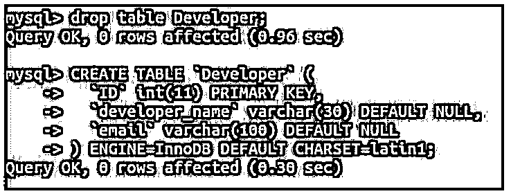
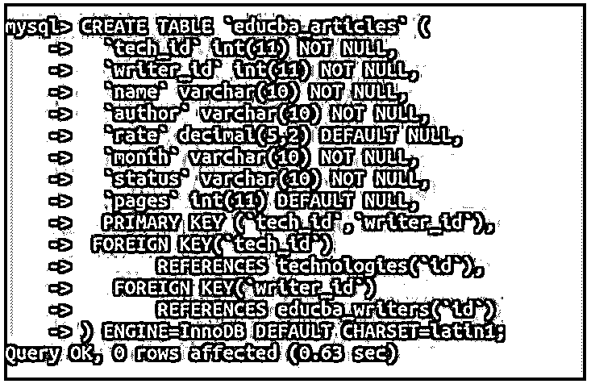
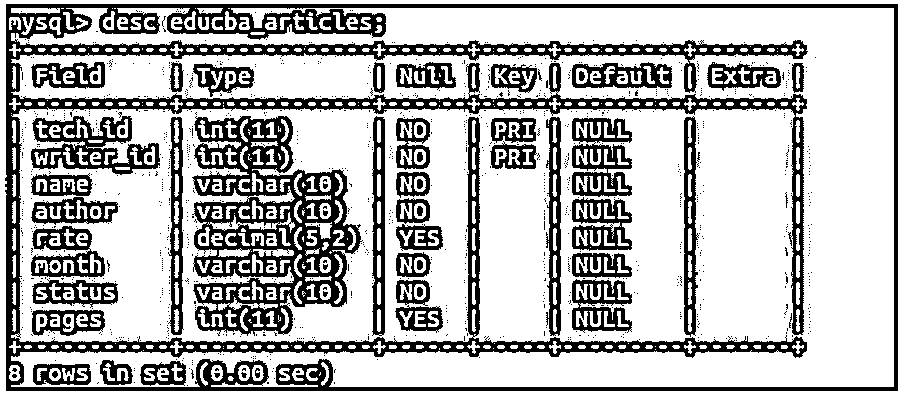

# MySQL 主键

> 原文：<https://www.educba.com/mysql-primary-key/>

## MySQL 主键介绍

以下文章提供了 MySQL 主键的概述。当我们创建表来存储数据库中的数据时，为了识别行并标识存储在表中的每个记录，我们使用索引。主索引是通过应用 primary key 约束在表上定义的。我们只能在一个表上定义一个主键。主键可以由一列或多列组成，这些列共同为行提供唯一性，该行可进一步用于其标识。

### 主键概念和规则

一组列或单个列，有助于唯一地标识表中的每一行。

<small>Hadoop、数据科学、统计学&其他</small>

主键遵循的规则如下所示:

*   当单个列用于定义主键时，它必须包含存储在表的每一行中的唯一值，而在多个列上定义主键的情况下，定义主键的所有列的值的组合应该具有唯一值。
*   当在列上定义了主键时，将对定义了主键约束的一列或多列隐式应用 NOT NULL 约束。因此，NULL 值不能存储在定义主键的列中。如果我们试图插入或更新这样的空值列，那么 MySQL 将发出一个错误。
*   MySQL 中的任何表只能定义一个主键，或者不定义主键。
*   大多数情况下，用于定义主键的列的数据类型保持为整数，因为 MySQL 处理整数的速度非常快。这将导致对结果集的检索越来越快。
*   一个表只能有一列可以分配 AUTO_INCREMENT 属性。最常见的情况是，定义主键的列保持整数类型，并为其分配 AUTO_INCREMENT 属性，因为这将导致以唯一和顺序的方式生成列的值。
*   每当在表上定义主键时，MySQL 会自动在定义主键的列上内部创建一个名为 primary 的索引。
*   在将数据类型分配给主键列时，我们需要小心，因为它应该包含我们希望插入的所有行，因此应该有足够数量的键可用，并且需要相应地定义列的数据类型范围。大多数情况下，INT 数据类型就足够了，但是当需要大规模存储太多记录时，主键列应该定义为 BIGINT 数据类型。

### MySQL 主键的语法

当主键只需要在单个列上定义时，我们可以在列前面分配主键属性，并将其数据类型作为其属性。

在单个列上定义主键的语法如下所示:

`CREATE TABLE name_of_table(
primary_col datatype PRIMARY KEY,
...
);`

其中 primary_col 是定义主键的列的名称。

当我们必须在多个列上定义主键时，我们可以在以逗号分隔格式指定的表的列列表的末尾使用主键表约束。下面是相同的语法。请注意，当键定义在单个列上时，也可以使用此语法。

`CREATE TABLE name_of_table(
primary_col1 datatype,
primary_col2 datatype,
...,
other_columns datatype,
...,
PRIMARY KEY(list_of_columns)
);`

其中 primary_col1、primary_col2 等是要定义主键的列，并且在表约束主键的 list_of_columns 参数中再次指定。

### MySQL 主键示例

下面是提到的例子:

#### 示例#1

让我们创建名为 Developer 的表，并在创建该表时使用以下查询语句将列 ID 定义为其主键。

**代码:**

`CREATE TABLE `Developer` (
`ID` int(11) PRIMARY KEY,
`developer_name` varchar(30) DEFAULT NULL,
`email` varchar(100) DEFAULT NULL
) ENGINE=InnoDB DEFAULT CHARSET=latin1;`

**输出:**

并在描述了显示 ID 列上主键约束的表后给出了以下输出。

**代码:**

`desc Developer;`

**输出:**

#### 实施例 2

现在让我们创建一个名为 educba_articles 的表，我们将在该表上定义包含两列 tech_id 和 writer_id 的主键，我们将使用下面的查询语句来完成此操作。

**代码:**

`CREATE TABLE `educba_articles` (
` tech_id` int(11) NOT NULL,
` writer_id` int(11) NOT NULL,
` name` varchar(10) NOT NULL,
` author` varchar(10) NOT NULL,
` rate` decimal(5,2) DEFAULT NULL,
` month` varchar(10) NOT NULL,
` status` varchar(10) NOT NULL,
` pages` int(11) DEFAULT NULL,
PRIMARY KEY (` tech_id,writer_id`)
) ENGINE=InnoDB DEFAULT CHARSET=latin1;`

**输出:**

在描述了显示 tech_id 和 writer_id 列的主键约束的表后，给出了以下输出。

**代码:**

`desc educba_articles;`

**输出:**

### 添加主键的 ALTER TABLE 命令

当需要修改现有的表以在某一列或某些列上添加主键时，我们可以使用 ALTER TABLE 命令。

**语法:**

`ALTER TABLE name_of_table
ADD PRIMARY KEY(list_of_columns);`

**举例:**

让我们考虑一个例子，我们将使用下面的语句创建一个名为 customer 的表，其中没有任何主索引。

**代码:**

`CREATE TABLE `customers` (
`id` int(11) NOT NULL,
`name` varchar(255) NOT NULL,
`address` text
) ENGINE=InnoDB DEFAULT CHARSET=latin1;`

**输出:**

现在，我们将使用下面的查询语句在 id 列上添加一个主键。

**代码:**

`ALTER TABLE `customers`
ADD PRIMARY KEY (`id`);`

**输出:**

让我们来描述和看看表的结构。

**代码:**

`DESC customers;`

**输出:**

### 结论

我们需要一个 MySQL 表上的主索引来惟一地识别表中的行和记录，并定义进一步标识行的索引。当查询的 where 子句中提到主键列的值时，这使得对这些列的数据检索的查询执行得更快。

### 推荐文章

这是一个 MySQL 主键的指南。这里我们讨论主键的概念、规则和 ALTER TABLE 命令，用查询例子来添加主键。您也可以看看以下文章，了解更多信息–

1.  [MySQL 检查约束](https://www.educba.com/mysql-check-constraint/)
2.  [MySQL ROW_NUMBER()](https://www.educba.com/mysql-row_number/)
3.  [MySQL 日期函数](https://www.educba.com/mysql-date-functions/)
4.  [MySQL BIN()](https://www.educba.com/mysql-bin/)

