# MySQL 外键

> 原文：<https://www.educba.com/mysql-foreign-key/>

## MySQL 外键介绍

外键是表中一列或一组列的组合，它链接到另一个表中的一列或一组列。外键对相关表中的数据提供约束，这允许维护参照完整性。

让我们看一个同样的例子。

<small>Hadoop、数据科学、统计学&其他</small>

*   这是我们定义的，可以看到在上面的图表中，我们可以说“贷款”表与“借款”表有一对一的关系。这里“Loan”表中的“Loan_No”列充当该表中的主键。而是充当“外键”。
*   一个表可以有多个外键，这些外键是不同表的主键的引用。
*   这里“贷款”表是父表(被引用表)，而“借款”表是子表(引用表)。

### 语法和参数

下面是语法和参数:

**语法:**

`create table<Table_name>
(
column1 <data_type>,
column2 <data_type,
.
.
[CONSTRAINT <constraint_name>] FOREIGN KEY(column_name,...) / * - - Foreign Key Declaration --*/
REFERENCES parent_table(colunm_name,...)
[ON DELETE reference_option] [ON UPDATE reference_option] ) ENGINE=INNODB;`

这里 reference_option 什么都不是，但是我们指定了当父键中的值被删除或更新时应该发生的动作。

MySQL 有五个参考选项:

*   **Cascade:** Cascade 就是无论父表中发生了什么动作，它都应该在子表中反映出来。例如，如果父表中的某一行被更新或删除，则子表中相同匹配行的值应该用相同的。
*   **Set NULL:** 与 Cascade 不同，如果您不想删除子表中的相应值，而是愿意将值设置为 NULL，那么我们使用“Set NULL”。例如，如果在父表中进行了更改，子表中的匹配行将被设置为“NULL”。
*   **无操作:**无操作根据名称本身表示，如果子表中存在匹配的行，则父表中不会采取任何更新或删除行的操作。
*   **限制:**限制和“不动作”一样。
*   **设置默认值:**这是由 MySQL 解析器识别的。然而，InnoDB 和 NDB 表都拒绝了该操作。

### MySQL 外键是如何工作的？

现在让我们创建一个带有外键表，看看它是如何工作的

#### 1.带有“无操作”和“限制”

**代码:**

`LOAN_DETAILS:
CREATE TABLE LOAN_DETAILS
(
LOAN_NO INT PRIMARY KEY,
LOAN_STATUS VARCHAR(20),
STATE VARCHAR(20),
LOAN_AMOUNT INT,
AP_DATE DATETIME
) ENIGINE = INNODB;
Insert data into the above table: -
INSERT INTO LOAN_DETAILS VALUES (12,'Open','Ranchi','30000','01-02-2015');
INSERT INTO LOAN_DETAILS VALUES (43,'Approval','Electronic city','54000','10-11-2019');
INSERT INTO LOAN_DETAILS VALUES (31,'Pending','Kolkata','80000','09-07-2018');
INSERT INTO LOAN_DETAILS VALUES (23,'Close','Patna','50000','03-04-2017');`

**输出:**

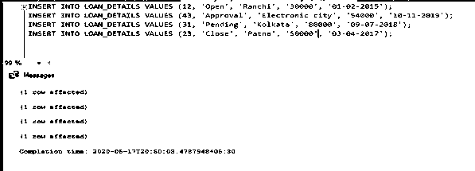

**借款人 _ 详细信息**

`CREATE TABLE BORROWER_DETAILS
(
BORROWER_ID INT PRIMARY KEY,
BORROWER_NAME VARCHAR(20),
BORROWER_DATE DATE,
BANK_ID VARCHAR(5),
LOAN_NO INT,
CONSTRAINT FK_BORROWER_DETAILS
FOREIGN KEY (LOAN_NO)
REFERENCES LOAN_DETAILS(LOAN_NO)
) ENGINE=INNODB;`

将数据插入上表:

这里，让我们尝试插入已经存在于“Loan_details”父表中的 loan_no 数据。

**代码:**

`INSERT INTO BORROWER_DETAILS VALUES (11,'Ram','09-07-2014','a1', 12);
INSERT INTO BORROWER_DETAILS VALUES (12,'Sundar','01-13-2019','a2', 43);
INSERT INTO BORROWER_DETAILS VALUES (13,'Will','09-01-2018','a1', 31);`

**输出:**

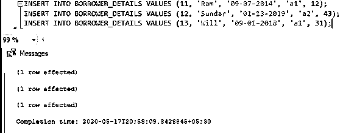

现在让我们尝试插入“loan_no”的行数据，该行数据在“loan_details”表中不存在。

`INSERT INTO BORROWER_DETAILS VALUES (15,'Raju','09-17-2014','a4', 67);`

这里，我们在父表中没有任何“loan _ no”67，因此它抛出错误:

**输出:**

现在让我们尝试从父表“LOAN_DETAILS”中更新 loan_no。

`update LOAN_DETAILS set LOAN_NO=87 where LOAN_NO=31;`

*   因为 loan_no= 31 出现在子表中，所以我们不能更新或删除该行。因此它会弹出一个错误。
*   由于此处的“无操作”和“限制”,如果子表中存在匹配行，则父表中不会采取更新或删除行的操作。

#### 2.串联

为了在表中创建 cascade 语句，我们删除了用下面的语句创建的表“借方详细信息”。

`DROP TABLE BORROWER_DETAILS;`

现在让我们用级联操作创建表“借款人详细信息”。

**代码:**

`CREATE TABLE BORROWER_DETAILS
(
BORROWER_ID INT PRIMARY KEY,
BORROWER_NAME VARCHAR(20),
BORROWER_DATE DATE,
BANK_ID VARCHAR(5),
LOAN_NO INT,
CONSTRAINT FK_BORROWER_DETAILS
FOREIGNKEY (LOAN_NO)
REFERENCES LOAN_DETAILS(LOAN_NO)
ON UPDATE CASCADE
ON DELETE CASCADE
) ENGINE=INNODB;`

**输出:**

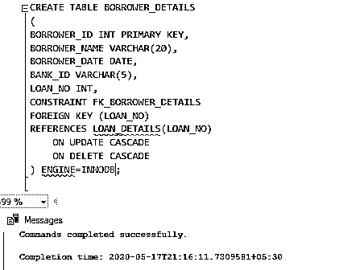

将数据插入表格:-

`INSERT INTO BORROWER_DETAILS VALUES (11,'Ram','09-07-2014','a1', 12);
INSERT INTO BORROWER_DETAILS VALUES (12,'Sundar','01-13-2019','a2', 43);
INSERT INTO BORROWER_DETAILS VALUES (13,'Will','09-01-2018','a1', 31);`

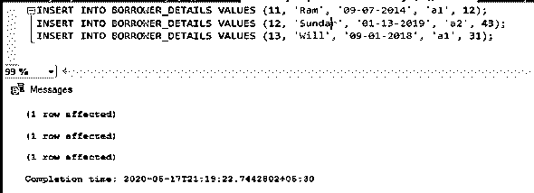

现在让我们尝试从父表“LOAN_DETAILS”中更新 loan_no。

`update LOAN_DETAILS set LOAN_NO=100 where LOAN_NO=31;`

因为当我们执行行的更新或删除时，loan_no= 31 出现在子表中。它也会在子表中更新。

现在让我们选择子表“借款人详细信息”来检查更新是否已经完成。它在子表中也已更新。

**代码:**

`select * from BORROWER_DETAILS;`

**输出:**

现在让我们尝试删除“Loan_no=100”的行，并检查输出。

**代码:**

`delete from LOAN_DETAILS where LOAN_NO=100;`

**输出:**

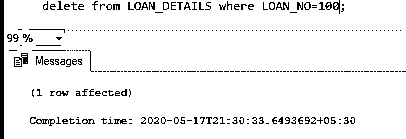

选择“借款人详细信息”表

**代码:**

`select * from BORROWER_DETAILS;`

**输出:**

#### 3.设置空操作

为了在表中创建 SET NULL 语句，我们删除了用下面的语句创建的表“借款人详细信息”。

`DROP TABLE BORROWER_DETAILS;`

现在让我们用级联操作创建表“借款人详细信息”。

`CREATE TABLE BORROWER_DETAILS
(
BORROWER_ID INT PRIMARY KEY,
BORROWER_NAME VARCHAR(20),
BORROWER_DATE DATE,
BANK_ID VARCHAR(5),
LOAN_NO INT,
CONSTRAINT FK_BORROWER_DETAILS
FOREIGNKEY (LOAN_NO)
REFERENCES LOAN_DETAILS(LOAN_NO)
ON UPDATE SET NULL
ON DELETE SET NULL
) ENGINE=INNODB;`

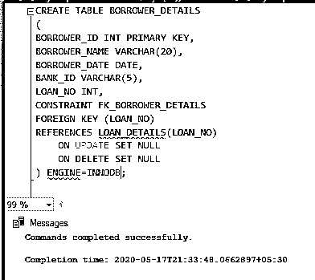

这里，让我们尝试插入已经存在于“Loan_details”父表中的 loan_no 数据。

`INSERT INTO BORROWER_DETAILS VALUES (11,'Ram','09-07-2014','a1', 12);
INSERT INTO BORROWER_DETAILS VALUES (12,'Sundar','01-13-2019','a2', 43);
INSERT INTO BORROWER_DETAILS VALUES (13,'Will','09-01-2018','a1', 23);`

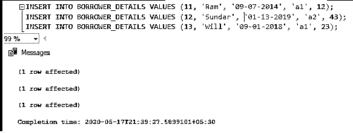

以下是表“loan _ details:–”中的行

**代码:**

`select * from LOAN_DETAILS;`

**输出:**

现在让我们执行更新和删除选项。

让我们将贷款编号=12 更新为贷款编号=1000。

`update LOAN_DETAILS set LOAN_NO=1000 where LOAN_NO=12;`

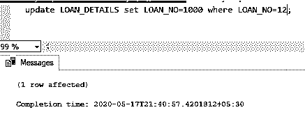

现在让我们选择“借款人详细信息”表:

**代码:**

`select * from BORROWER_DETAILS;`

**输出:**

SET NULL 将在删除或更新父表中的匹配列时将外键的值设置为 NULL。

现在让我们从 loan_no=43 的父表中执行删除操作。

**代码:**

`delete from LOAN_DETAILS where LOAN_NO=43;`

**输出:**

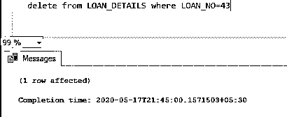

让我们选择子表“借款人详细信息”

**代码:**

`select * from BORROWER_DETAILS;`

**输出:**

### 实现 MySQL 外键的示例

现在让我们创建一个表，看看外键是如何工作的:

`CREATE TABLE TEACHER_D
(
T_ID INT PRIMARY KEY,
T_NAME VARCHAR(20),
T_SUBJECT VARCHAR(20)
) ENGINE =INNODB;`

教师科目详细信息:

`CREATE TABLE TEACHER_SUBJECT_DETAILS
(
Sub_ID INT PRIMARY KEY,
No_of_students INT,
T_ID INT,
CONSTRAINT FK_TEACHER_DETAILS
FOREIGN KEY (T_ID)
REFERENCES TEACHER_D(T_ID)
ON UPDATE SET NULL
ON DELETE CASCADE
) ENGINE =INNODB;`

这里我们用两个动作创建了子表。比如，如果我们对父表执行更新，那么子表将把值设置为“NULL”。如果我们对父表执行删除操作，那么同样的操作也会在子表中执行。

将数据插入表格:-

`insert into teacher_d values ( 1,'Swathi','Physics');
insert into teacher_d values ( 2,'Preethi','Chemistry');
insert into teacher_d values ( 3,'Prem','Mathematics');
insert into teacher_subject_details values (214, 56, 1);
insert into teacher_subject_details values (215, 89, 2);
insert into teacher_subject_details values (216, 100, 3);`

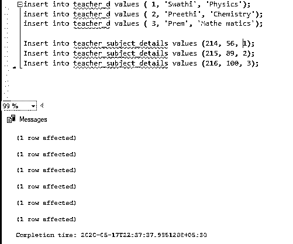

如果我们对父表执行更新，那么子表将把值设置为“NULL”。让我们将值 T_ID = 1 的行更新为 T _ ID = 1000 它更新父表“Teacher_D ”,并将子表“teacher_subject_details”中的值设置为 NULL

**代码:**

`UPDATE TEACHER_D SET T_ID=1000 WHERE T_ID=1;`

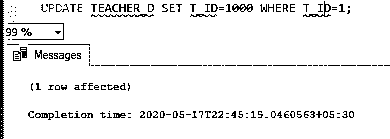

**更新前语句输出:**

`SELECT * FROM TEACHER_D;
SELECT * FROM TEACHER_SUBJECT_DETAILS;`

**更新语句输出后:**

`SELECT * FROM TEACHER_D;
SELECT * FROM TEACHER_SUBJECT_DETAILS;`

如果我们对父表执行删除，那么子表也将被删除，因为我们已经提到了删除时的级联动作。让我们从父表“Teacher_D”中删除值为 T_ID = 2 的行，我们可以看到该行将在子表“teacher_subject_details”中被删除。

**删除语句执行前输出:**

`SELECT * FROM TEACHER_D;
SELECT * FROM TEACHER_SUBJECT_DETAILS;`

现在让我们执行如下删除操作:–

`delete from teacher_d where t_id= 2;.`

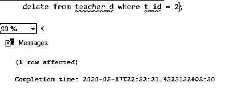

**删除语句后执行输出:**

我们可以在输出中看到，T_ID=2 的行也从父表和子表中删除了。

`SELECT * FROM TEACHER_D;
SELECT * FROM TEACHER_SUBJECT_DETAILS;`

截图同为:

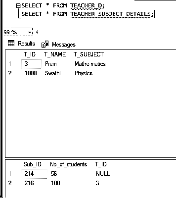

### 结论

需要注意的事情:-

外键是表中一列或一组列的组合，它链接到另一个表中的一列或一组列。外键对相关表中的数据提供约束，这允许维护参照完整性。一个表可以有多个外键，这些外键是对不同表的主键的引用。

### 推荐文章

这是一个 MySQL 外键的指南。这里我们讨论 MySQL 外键的介绍，包括语法、工作原理和示例，以便更好地理解。您也可以浏览我们的其他相关文章，了解更多信息——

1.  [MySQL 自我加入](https://www.educba.com/mysql-self-join/)
2.  [MySQL 约束](https://www.educba.com/mysql-constraints/)
3.  [MySQL 中的唯一键](https://www.educba.com/unique-key-in-mysql/)
4.  [MySQL 中的任何一个](https://www.educba.com/any-in-mysql/)

