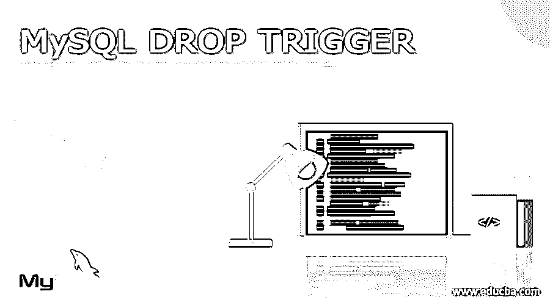
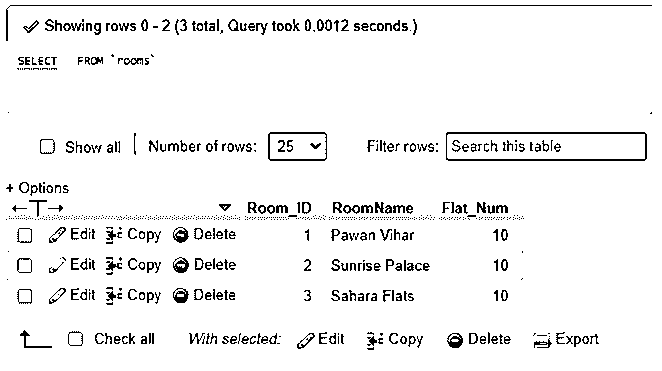
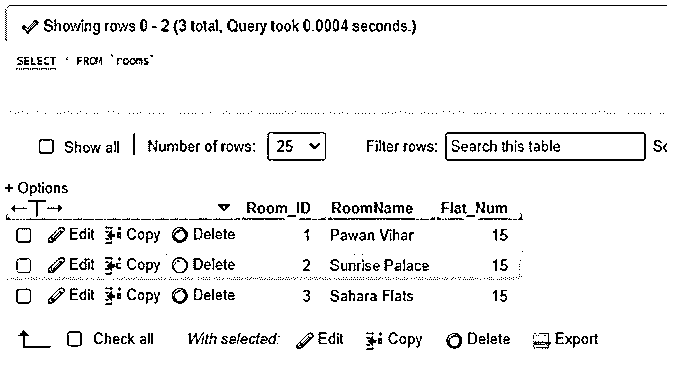
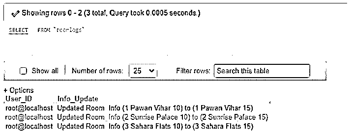
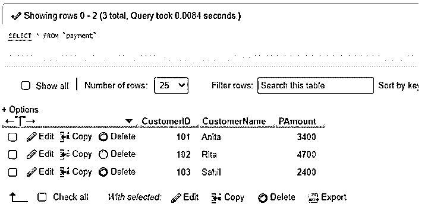
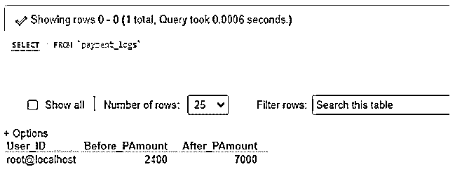
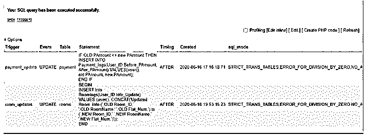

# MySQL DROP 触发器

> 原文：<https://www.educba.com/mysql-drop-trigger/>

## MySQL Drop 触发器的定义

MySQL DROP Trigger 是一个 MySQL 语句命令，负责从数据库中删除一个现有的触发器。像其他 MySQL 触发器一样，这个 DROP 触发器也被定义为一个存储的代码程序，当需要一个与之相关联的表时就调用这个程序。在我们执行 MYSQL DROP 触发器之前，用户应该获得管理权限来应用对数据库表的更改，以生成所需的结果。我们应该记住，当从 MySQL 数据库中删除任何表时，所有创建的和与该表链接的触发器也将被自动删除。

**语法:**

<small>Hadoop、数据科学、统计学&其他</small>

MySQL DROP Trigger 具有以下基本语法来删除与特定数据库表相关联的存储触发器程序:

`DROP TRIGGER [IF EXISTS] [SchemaName.] TriggerName;`

从上面的结构我们知道:

*   最初，您需要为触发器提供一个特定的名称，该名称需要在关键字 DROP TRIGGER 之后被删除或丢弃。
*   在下一步中，您必须给出先前存储或创建触发器的模式的名称。如果 SchemaName 丢失或没有被提及，查询语句将删除当前 MySQL 数据库中的触发器。
*   IF EXISTS 被添加到语法中，以临时提供一个选项来检查我们需要删除的触发器在特定的模式/表上是否可用。

### DROP TRIGGER 语句在 MySQL 中是如何工作的？

*   MySQL 数据库表中可以实现各种触发器。您只需要处理那些与您想要删除的触发器相关联的表。
*   由于某种原因或为了避免事件发生，我们可以移除触发器。使用 DROP Trigger 的这个操作也不会显示存储在与触发器相关的表中的日志。所以，我们需要确认和确定我们是否要删除触发器。
*   按照上面的语法，我们需要在 DROP Trigger 语句中提到模式名和触发器名。同时，我们还必须包括 IF EXISTS 选项。
*   假设如果您试图删除一个不在表中的触发器，而没有应用 IF EXISTS 选项，那么 MySQL 服务器将产生一个错误。另一个选项是如果查询中添加了 EXISTS，那么服务器将只生成一个注释，而不是您可以通过 SHOW WARNINGS 查询命令进一步查看的注释。
*   您需要管理级别的访问权限才能对链接表执行 DROP TRIGGER 语句。此外，删除该表将导致删除其中的所有触发器。

### MySQL DROP 触发器示例

让我们通过下面的例子来演示更多关于 DROP Trigger 及其在 MySQL 中的工作和使用:

一开始，我们将首先在数据库中创建一个表来执行查询。将其命名为存储记录的房间，并为其创建触发器。

用于创建表的 SQL 查询如下:

如果存在房间，则删除表格；

`CREATE TABLE Rooms ( Room_ID INT PRIMARY KEY AUTO_INCREMENT, RoomName VARCHAR(255) NOT NULL, Flat_Num INT NOT NULL);`

同样，让我们使用插入查询输入几条记录，如下所示:

`INSERT INTO Rooms(Room_ID, RoomName, Flat_Num) VALUES('1','pawan Vihar','10');`

查询 Rooms 表中的数据行以查看其内部:

`SELECT * FROM Rooms;`

**输出:**

同样，如果我们使用如下的更新后触发器，则形成后续表以保存在任何更新命令之后在父表室上发生的变化:

`CREATE TABLE Roomlogs ( User_ID VARCHAR(255), Info_Update VARCHAR(255));`

查看当前表格:

`SELECT * FROM Roomlogs;`

**输出:**

现在，我们正准备在 Rooms 表上实现 AFTER UPDATE 触发器:

`DELIMITER $$
CREATE TRIGGER room_updates
AFTER UPDATE ON Rooms FOR EACH ROW
BEGIN
INSERT into Roomlogs(User_ID,Info_Update) VALUES (user(), CONCAT('Updated Room Info (',OLD.Room_ID,' ',OLD.RoomName,' ',OLD.Flat_Num,') to (',NEW.Room_ID,' ',NEW.RoomName,' ',NEW.Flat_Num,')'));
END$$
DELIMITER ;`

生成 room_updates 触发器后，在触发 rooms 表中每一行的更新事件之前，会经常触发该触发器。

为了详细观察，当您更新 Flat_Num 列中的任何值时，一个新行将被插入到 roomlogs 表中，以记录所做的更改。

`UPDATE Rooms SET Flat_Num = Flat_Num + 5 WHERE Room_ID <10;`

**输出:**

再次查看您的 Roomlogs 表，并使用以下查询理解 AFTER UPDATE 触发器的转换和效果:

`SELECT * FROM Roomlogs;`

**输出:**

正如您在上面的屏幕截图中所看到的，在创建了 AFTER UPDATE 触发器并使用 UPDATE query 对表行进行了某些修改之后，Roomlogs 表记录了用户 id 和与触发器相关的表 Rooms 中所做更改的相关信息。假设，我们将在付款表中创建另一个触发器，如下所示:

**付款表**

Payment_logs 表记录更新查询后的日志:

**触发码:**

`DELIMITER $$
CREATE TRIGGER `payment_update`
AFTER UPDATE ON `payment`  FOR EACH ROW
BEGIN
IF OLD.PAmount <> new.PAmount THEN
INSERT INTO Payment_logs (User_ID,Before_PAmount, After_PAmount)
VALUES (user(), old.PAmount, new.PAmount);
END IF;
END$$
DELIMITER ;`

您甚至可以通过转到 phpMyAdmin 服务器中的触发器选项来查看 Rooms 表中的触发器，如下所示:

`SHOW TRIGGERS;`

**输出:**

最后，我们将在 MySQL 中使用 DROP Trigger 来显示桌子房间的结果。让我们使用下面的 SQL 命令删除名为 room_updates 的第二个触发器:

`DROP TRIGGER room_updates;`

再次查看桌子上的触发器，最后验证上述触发器的删除。

`SHOW TRIGGERS;`

**输出:**

查看触发器及其日志信息已从 Rooms 表中删除。

### 结论

*   通常，我们创建 MySQL 触发器来为用户提供数据库中任何更改的信息，如 MySQL 操作:插入、删除、更新、更改语句查询，并保存这些修改的日志。
*   当我们需要删除特定表的任何可用触发器时，我们将在该数据库表中使用 MySQL DROP Trigger 命令语句。

### 推荐文章

这是一个 MySQL DROP TRIGGER 的指南。这里我们还讨论了 drop trigger 语句在 MySQL 中的定义和工作原理。以及不同的示例及其代码实现。您也可以看看以下文章，了解更多信息–

1.  [MySQL IF 函数](https://www.educba.com/mysql-if-function/)
2.  [MySQL 新的](https://www.educba.com/mysql-uuid/)
3.  [MySQL sum()](https://www.educba.com/mysql-sum/)
4.  [MySQL 分区](https://www.educba.com/mysql-partition/)

