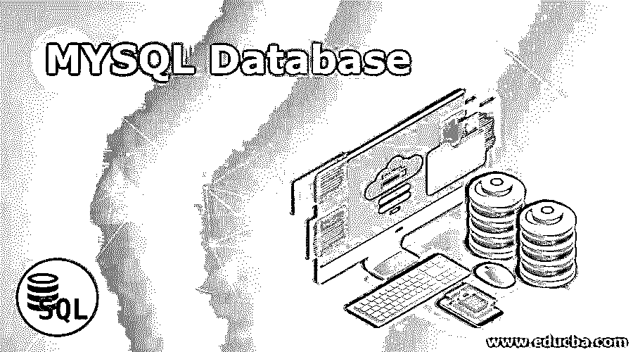
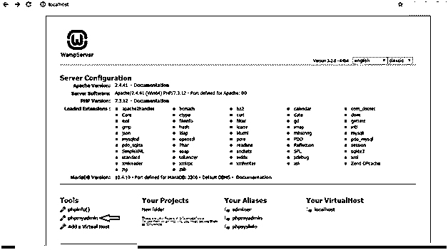
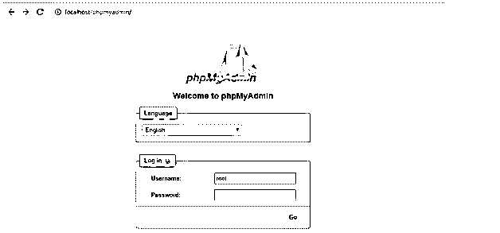
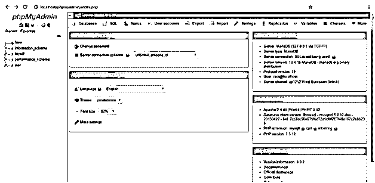
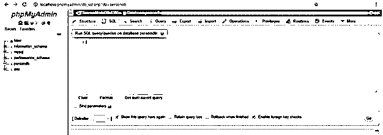
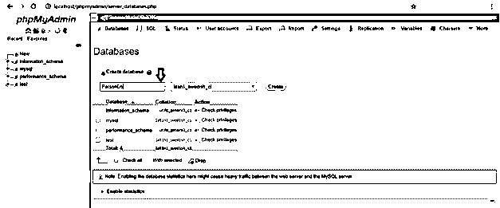
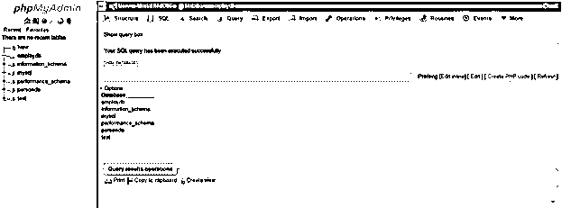

# MYSQL 数据库

> 原文：<https://www.educba.com/mysql-database/>

## MYSQL 数据库简介

MySQL 数据库是一个基于 SQL(结构化查询语言)语言的关系数据库管理系统，可以作为开源软件免费获得，用于数据访问和检索过程。MySQL 数据库软件是根据 GNU 通用公共许可证的条款以及其他专有许可证提供的。此外，数据库被定义为用于以有组织的方式在服务器上存储任何数据和信息的数据结构。数据库包含表，记录以列和行的形式插入或保存在这些表中，以便以简单的方式进行数据操作。

### 如何在 MySQL 中创建数据库？

我们可以使用不同的方法创建 MySQL 数据库，但是由于它是基于 SQL 的，所以让我们考虑以下内容。

<small>Hadoop、数据科学、统计学&其他</small>

**语法:**

`CREATE Database Database_name;`

您还可以使用桌面上的命令行界面创建 MySQL 数据库，并传递 SQL 查询来查看结果。

**Note:** that we need admin privilege to create or delete a database.

**1。**如果您使用的是 WAMP 服务器，也可以遵循 SQL 命令。你可以下载 WAMP 或者 XAMPP，这是开源的，安装在你的系统上；你必须运行 localhost 来打开 WAMP 的主页。

**2。**你会发现 PHPmyadmin 选项，这是 MySQL 服务器，使用 root 作为用户名和密码(空白，如果没有设置)，并帮助访问数据库和执行任何 SQL 查询命令。

**3。**您可以访问数据库和表格来操作任何字段的数据。

**4。**您可以通过查询编辑器区域执行 SQL 查询并管理 MySQL 服务器上的数据库，甚至可以编写 PHP 代码来连接数据库并对其进行更改。

**5。**例如，数据库选项中名为“PersonDb”的数据库使用 WAMP 服务器创建如下:

**代码:**

`CREATE Database PersonDb;`

**输出:**

**6。**使用 SQL 命令:

**代码:**

`CREATE DATABASE PERSONDB;`

**输出:**

**7。**创建数据库后，您可以使用以下查询在服务器上的数据库列表中查看它:

**代码:**

`SHOW DATABASES;`

**输出:**

**8。**您可以通过点击左侧菜单栏上的数据库来查看数据库，您可以在其中添加表格:

**9。**此外，您可以使用 PHP 脚本来集成 SQL 查询，并建立任何网页到数据库的连接，以便进行插入和其他操作来存储数据。

**代码:**

`<?php
$dbhost = “localhost”;            // Host/Server name
$dbuser = “root”;                     // Host user name
$dbpassword = “ ”;                 //use password if exists
$con = mysql_connect ($dbhost, $dbuser, $dbpassword);
if (! $con)
{
die (‘No Connection Established: ’ . mysql_error());
}
echo “Connection Established successfully”;
$sql = ‘CREATE DATABASE PersonDb’;
$query = mysql_query ($sql, $con);
if (! $query){
die (‘Could not create Database: ’ . mysql_error());
}
echo “Database created successfully\n”;
mysql_close ($con);
?>`

这里，mysql_connectparameter 用于打开与 mysql 服务器的连接，CREATEquery 创建了一个数据库，其中 as mysql_queryfunction 检查数据库是否是用连接创建的，如果成功则返回 TRUE，如果失败则返回 FALSE。

### 如何从多个数据库中选择一个数据库？

通常，我们使用 SQL SELECT 语句从多个数据库中选择一个特定的数据库，并显示其记录表。当 MySQL 服务器上存在许多数据库时，这是必需的，我们只需要处理其中的一个。

为此，我们使用 USE SQL 命令，如下所示:

**语法:**

`USE Database_name;`

**例子**

**代码:**

`USE PersonDb;`

**输出:**

### 如何删除数据库？

**1。**我们需要管理员权限从服务器上删除任何数据库。以下语法用于从 MySQL 服务器中删除任何数据库:

**语法:**

`DROP DATABASE Database_name;`

**例子**

**代码:**

`DROP DATABASE PersonDb;`

**输出:**

**2。**删除数据库可能并不简单；如果你删除了任何一个数据库，你就得丢失所有带有记录的表。所以对此要小心；DROP SQL 语句销毁该数据库中所有可用的数据。

**3。**当您继续或执行该查询时，会显示一条警告或消息，要求确认我们是否确定要删除该数据库。

**4。**在 PHP 脚本中删除数据库时，不会提示询问是否要删除数据库，所以在执行代码前要小心:

**代码:**

`<?php
$dbhost = “localhost”;// Host/Server name
$dbuser = “root”;// Host user name
$dbpassword = “ ”; //  Use password if exists
$con = mysql_connect ($dbhost, $dbuser, $dbpassword);
if (! $con)
{
die (‘No Connection Established: ’ . mysql_error());
}
echo “Connection Established successfully”;
$sql = ‘DROP DATABASE PersonDb’;
$query = mysql_query ($sql, $con);
if (! $query){
die (‘Could not drop the Database: ’ . mysql_error());
}
echo “Database deleted successfully\n”;
mysql_close ($con);
?>`

**Note:** Remember that the database, table, and field names are case sensitive, so we have to use accurate names while executing any SQL query.

### 结论

*   MySQL 数据库应用程序用于各种目的，如电子商务、数据仓库和日志应用程序来维护和存储记录。但是 MySQL 数据库最重要的用途是作为 Web 数据库。
*   MySQL 数据库的一些主要优点是数据安全性、按需可伸缩性、高表示性、全天候正常运行时间、广泛的事务供应、完整的工作流机制、集中的总拥有成本等。
*   例如，如果我们有一个公司的数据库，那么它包含不同领域的表，如员工信息、服务记录或财务交易等。
*   因此，MySQL 数据库是一个快速、可靠和稳定的 RDBMS，它也节省了我们的金钱和时间，其中 SQL 查询用于操作记录。

### 推荐文章

这是一个 MYSQL 数据库的指南。这里我们讨论 MYSQL 数据库的介绍和实际例子以及不同的子查询表达式。您也可以浏览我们推荐的文章，了解更多信息——

