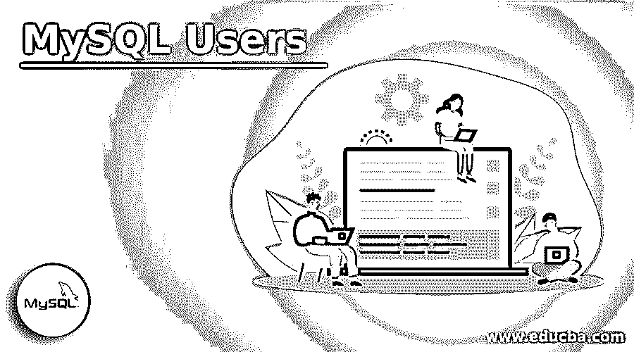
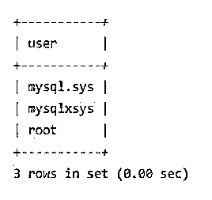
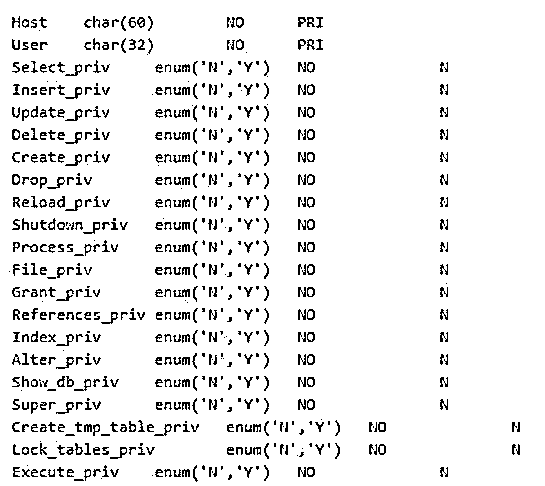
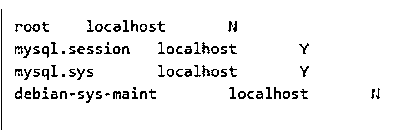
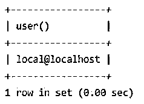
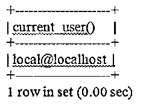
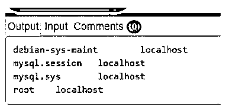
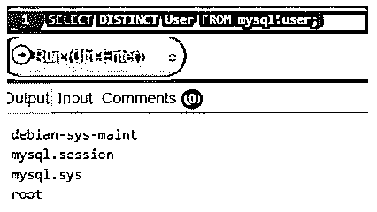
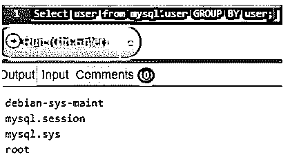
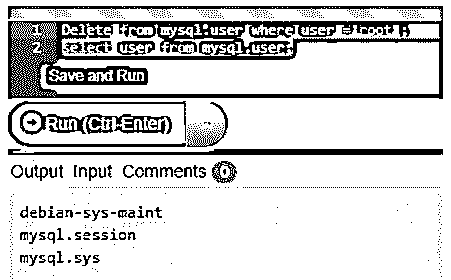

# MySQL 用户

> 原文：<https://www.educba.com/mysql-users/>

## MySQL 用户简介

以下文章为 MySQL 用户提供了一个概要。MySQL 用户是 MySQL 服务器数据库中名为 user 的表中的一行，它为我们提供了登录、帐户权限和 MySQL 用户帐户等属性的信息。为了各种目的，如访问和管理数据库，在表中创建用户是至关重要的。为了在数据库中创建新用户，我们使用 create user 语句。它用于提供验证以检查资源限制、用户角色，以及新用户的密码管理。

它还控制最初冻结或解冻的帐户。如果使用 create user 语句，则必须拥有在表中创建用户的总权限或对模式的插入权限。如果我们尝试创建一个已经存在于表中的用户，它会给出一条技术性错误消息。但是，如果我们在 create user 语句中添加 if not exists 子句，它会为每个现有用户给出一条警告消息，而不是一条错误消息。

<small>Hadoop、数据科学、统计学&其他</small>

**创建用户的语法:**

`Create user [if not exists] account_name identified by 'password';`

create 语句中的帐户名称 **_** 由两部分组成。这两部分都用@隔开。@前面的部分是给新用户的名称,@后面的部分是主机名，创建的用户将通过它与服务器连接，在我的例子中，服务器是我的本地主机。

`username@hostname`

account_name 中的主机名是可选的。这意味着用户可以通过服务器上的各种选项连接到任何主机。缺少主机名的帐户名也可以写成 username@%。

**Note:** A new user created has all access but if we want to give some specific privileges we have to specify grant statement in that.

### Create User 语句示例

下面是提到的例子:

**在 MySQL 服务器中创建用户的步骤:**

**第一步:**以 root 用户身份从命令行登录 MySQL 服务器。

`mysql -u root –p`

其中，“u”是 root 用户名，“p”是 root 密码。

**步骤 2:** 检查当前工作服务器中的所有现有用户。

`SELECT user from mysql.user;`

其中，MySQL 是数据库的名称，user 是表的名称。

我们也可以把上面的语句写成:

**第一步:**

`use mysql;`

**第二步:**

`select user from user;`

**用户列表输出:**

**第三步:**创建新用户。

`CREATE USER abc@localhost IDENTIFIED BY ‘abc123’;`

现在，我们将在 CREATE USER 语句中使用 IF NOT EXISTS 子句。

`CREATE USER IF NOT EXISTS abc@localhost IDENTIFIED BY ‘abc123’;`

### 服务器提供的权限列表

下面列出了服务器提供的权限:

*   **所有权限:**赋予新用户所有权限。
*   **CREATE:** 它赋予用户创建数据库和表格的权限。
*   **DROP:** 它赋予用户删除数据库和表的权限。
*   **DELETE:** 它赋予用户从特定表中删除行的权限。
*   **INSERT:** 它赋予用户向特定表中插入行的权限。
*   **选择:**赋予用户读取数据库的权限。
*   **UPDATE:** 它赋予用户更新表格行的权限。

### 向用户授予权限的语法

下面给出了向用户授予权限的语法:

`GRANT ALL PRIVILEGES ON *.* TO ‘newuser’@’localhost’;`

*   下面给出的是查询，如果我们想给一个用户所有的特权。

**代码:**

`GRANT ALL PRIVILEGES ON * . * TO abc@localhost;`

* '用于向用户提供读取、编辑、执行和实施所有数据库和表格中的所有任务的权限。

*   如果您想为新创建的用户授予特定的权限，请执行以下命令。

**代码:**

`GRANT CREATE, SELECT, INSERT ON * . * TO abc@localhost;`

*   下面给出了刷新用户所有权限的查询。

**代码:**

`FLUSH PRIVILEGES;`

*   如果我们想要查看用户的现有权限，请执行以下命令。

**代码:**

`SHOW GRANTS for username;`

*   下面给出了对用户表的列表字段的查询。

**代码:**

`desc mysql.user;`

**输出:**

**代码:**

`select user,host,account_locked from mysql.user;`

**输出:**

*   下面给出了查看当前用户的查询。

**代码:**

`SELECT user();`

**输出:**

或者

**代码:**

`SELECT current_user();`

**输出:**

**代码:**

`SELECT User, host FROM mysql.user;`

**输出:**

*   如果您只想显示唯一的用户名。

**代码:**

`SELECT DISTINCT User FROM mysql.user;`

**输出:**

*   下面给出了删除用户的查询。

**代码:**

`Drop user ‘user’@’localhost’;`

*   下面给出了撤销用户特权的查询。

**代码:**

`Revoke all privileges on database_name from ‘user’@’localhost’;`

*   下面给出了查看所有用户列表的查询。

**代码:**

`select user from mysql.user GROUP BY user;`

**输出:**

*   下面给出了删除特定用户的查询。

**代码:**

`Delete from mysql.user where user =’username’;`

其中，用户名是我们要删除的用户的名称。

**输出:**

因此，删除根用户后，我们只剩下 3 个用户。

### 结论——MySQL 用户

在本文中，我们看到了如何创建新用户和删除用户。我们还了解了如何在 MySQL 数据库中授予用户特权和撤销特权，以及授予用户的不同类型的特权。我们还看到了如何列出当前服务器中的用户。

### 推荐文章

这是 MySQL 用户指南。这里我们讨论 MySQL 用户介绍，创建用户语句的例子和服务器提供的权限列表。您也可以看看以下文章，了解更多信息–

1.  [MySQL 中的唯一键](https://www.educba.com/unique-key-in-mysql/)
2.  [MySQL 时间戳](https://www.educba.com/mysql-timestamp/)
3.  [MySQL 约束](https://www.educba.com/mysql-constraints/)
4.  [MySQL 外部连接](https://www.educba.com/mysql-outer-join/)

