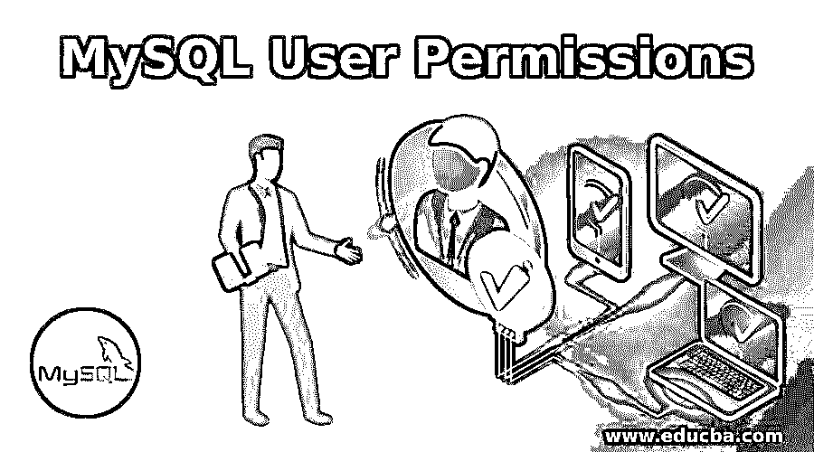
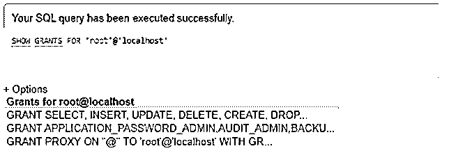

# MySQL 用户权限

> 原文：<https://www.educba.com/mysql-user-permissions/>

## MySQL 用户权限介绍

在 MySQL 中，用户权限被授予 MySQL 用户帐户，它决定了可以在服务器上执行的操作。这些用户权限可能在特权级别上有所不同，在这些级别上，它们被应用于多个查询执行。管理权限是全局权限，并未指定给特定的 MySQL 数据库，使帐户用户能够管理 MySQL 服务器中的管理操作。

数据库权限是全局授予的，适用于特定的 MySQL 数据库或所有 MySQL 数据库。这些特权被实现到可用的数据库和其中存在的所有其他数据库对象。用户权限还为特定数据库中的数据库对象提供权限，例如索引、表、存储例程和视图以及数据类型。此外，它通常可以应用于所有数据库中可用的所有数据对象。

<small>Hadoop、数据科学、统计学&其他</small>

### 如何在 MySQL 中应用用户权限？

*   在 MySQL 中，管理概念不仅仅是执行查询语句。为了安全和数据维护，我们使用用户对该数据的访问和权限来管理数据库记录。在较大的公司中，我们可能有几个用户有几个访问表数据的权限。但是应该给予每个用户 root 访问权限，因为 root 访问权限为用户提供了对服务器的完全控制权限。我们可以将一些管理员级别的访问权限限制在几个用户，并对每个用户实现唯一的权限。
*   当在 MySQL 中创建任何用户帐户时，我们必须为它分配一些权限，以便执行之前的任务。其他数据库平台和 MySQL 服务器的区别在于主机名和用户是决定用户权限的主要关键。这里，主机名在 MySQL 中负责识别持有对特定主机的访问权限的用户。为了进行演示，假设我们有一个名为“myadmin”的用户，但是我们只需要向 myadmin 提供本地数据库访问权限。因此，myadmin 用户只能访问本地主机，但不能访问远程主机服务器。主机名可以是 IP 地址、完全限定的名称，也可以是提供对不同数据库的访问的通配符主机名。
*   MySQL 数据库管理员可以为列、表或整个数据库分配权限。举例来说，假设我们有一个包含产品信息的表。为了了解产品价格的某些数据，我们只能为特定数量的用户提供对表列的访问。在这里，我们不会提供访问产品 id 或安全代码(如果存在)的权限，但例如，我们可以提供对产品名称、类别、单位和供应商等几列的访问，以便可以准备报告。数据库中这种类型的访问控制称为列级安全性。

### MySQL 用户权限示例

让我们详细说明一些示例和查询命令，以显示服务器中的 MySQL 用户权限:

当我们在像 localhost 这样的服务器上工作时，我们知道我们已经在系统上安装了 MariaDB 或 MySQL 服务器。我们必须以管理员或根用户的身份执行 MySQL shell 中的所有命令。我们需要使用 CREATE USER 和 GRANT privileges 命令来创建用户帐户权限。MySQL 中的这个用户帐户包括主机名和用户名两部分。现在，如果我们想在 MySQL 中创建一个新的用户帐户，我们需要查询以下命令:

`CREATE USER 'testuser'@'localhost' IDENTIFIED BY 'userpassword';`

**输出:**

这里，您需要使用实际的用户名来代替测试用户，并使用相关的密码作为用户密码。主机名被设置为 localhost，它定义了用户能够从运行 MySQL 的系统中的 localhost 连接到服务器。

假设我们想用任何其他的远程 IP 地址授权访问来替换或修改主机名，那么我们可以像这样使用命令:

`CREATE USER ‘testuser’@’10.2.0.8’ IDENTIFIED BY ‘userpassword’;`

来自 IP 为 10.2.0.8 的机器的远程访问被设置为带有相关密码的主机名，以创建新用户。

此外，可能有这样的情况，我们希望从任何主机或机器地址连接用户，在这种情况下，我们将应用表示通配符的符号“%”来定义主机名。查看下面的查询:

`CREATE USER ‘testuser’@’%’ IDENTIFIED BY ‘userpassword’;`

现在，让我们讨论用户帐户可以授予的更多类型的特权。以下是 MySQL 支持的用户帐户权限列表:

*   **所有权限**:允许一个用户账户的所有权限。
*   **CREATE:** 允许用户帐户在 MySQL 服务器上创建数据库和表。
*   **DROP** :允许用户帐户删除服务器中的表和数据库。
*   **DELETE** :允许用户从服务器的特定表中删除行。
*   **INSERT** :允许用户在数据库的特定表格中输入行。
*   **选择**:允许 MySQL 用户查看或读取服务器上的数据库。
*   **UPDATE** :允许用户修改数据库服务器中的表行。

如果我们想要显示为 MySQL 用户帐户提供的任何特定数据库的所有权限，那么我们将使用以下内容:

`SHOW GRANTS FOR ‘database_user’@’localhost’;`

**查询:**

`SHOW GRANTS FOR 'root'@'localhost';`

**输出:**

同样，要为一个 MySQL 用户帐户提供对特定数据库的多个权限:

`GRANT SELECT, INSERT, DELETE ON DatabaseName.* TO ‘Database_User’@’localhost’;`

类似地，如果我们需要取消或撤销 MySQL 用户帐户对特定 MySQL 数据库的所有权限，我们需要执行下面的查询:

`REVOKE ALL PRIVILEGES ON DatabaseName.* FROM ‘Database_User’@’localhost’;`

最后，如果我们想要删除任何现有的 MySQL 用户帐户，包括其权限，我们可以运行以下查询:

`DROP USER 'testuser'@'localhost';`

**输出:**

### 结论

众所周知，MySQL 是一个数据库存储和管理系统，作为开源软件提供，负责存储、组织和管理数据，并在需要时获取数据。但是用户需要被授予不同权限级别的特定用户权限，才能在服务器上执行操作。根用户可以访问整个数据库，并且可以管理所有相关的活动。用户权限也可以只指定给表或表列，而不是服务器中的整个数据库，这对数据记录的安全性和服务器维护很有用。

### 推荐 ed 文章

这是一个 MySQL 用户权限指南。这里我们也讨论一下定义以及如何在 MySQL 中申请用户权限？以及不同的示例及其代码实现。您也可以看看以下文章，了解更多信息–

1.  [MySQL UNION ALL](https://www.educba.com/mysql-union-all/)
2.  [MySQL 存储过程](https://www.educba.com/mysql-stored-procedure/)
3.  [MySQL 添加用户](https://www.educba.com/mysql-add-user/)
4.  [MySQL CURDATE](https://www.educba.com/mysql-curdate/)

