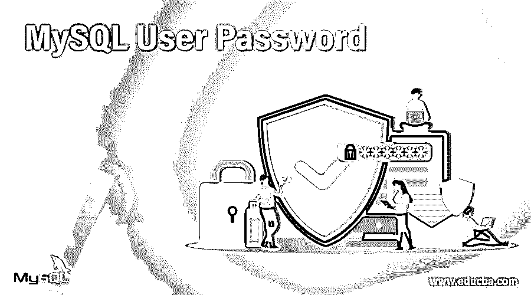

# MySQL 用户密码

> 原文：<https://www.educba.com/mysql-user-password/>

## MySQL 用户密码的定义

MySQL 中的 MySQL 用户密码命令负责通过应用几个查询语句(如 SET PASSWORD、ALTER USER、GRANT USAGE 和 UPDATE)来修改用户密码。但是在我们执行 MySQL 服务器中用户帐户的密码更改之前，我们需要考虑几个重要因素:您需要为哪个用户帐户更改 MySQL 中的密码？

用户帐户正在使用的哪个应用程序的密码将被更改？如果更改了密码而没有修改用于用户帐户的应用程序连接字符串，则应用程序可能无法建立到数据库服务器的连接。只有在确认所有这些因素后，您才能进一步更改 MySQL 中用户帐户的密码。

<small>Hadoop、数据科学、统计学&其他</small>

### MySQL 中的密码是如何工作的？

*   MySQL 数据库是作为开源服务器软件提供的，它对于管理表格形式的数据记录至关重要。用户可以方便地组织、插入、更新、删除、存储和检索数据。用户需要具有特定的访问权限和特权才能对数据库及其相关表进行任何更改。为了使我们的服务器对其他人受限，我们在登录模式下使用密码来保护数据记录。
*   每当我们忘记或想要更改以前的密码时，甚至当我们从未在数据库中为 root 用户设置密码时，我们都会使用该查询。在这种情况下，MySQL 将在数据中心的任何其他地方运行。我们可以遵循一些步骤，通过这些步骤，我们永远不会丢失数据库 root 用户使用的密码。
*   假设，当用户检查任何安全游戏时，我们不记得 root 的密码，因为原始密码可能很复杂或远不简单。
*   默认情况下，MySQL 中提供的用户名是 root，没有应用密码，它为空，用于访问数据库服务器。如果在安装过程中，您无意中添加了密码，现在无法找到，那么我们需要更改或重置密码。
*   基于您系统上运行的 MariaDB 或 MySQL 服务器版本，我们可以使用许多命令来修改用户密码。您可以通过以 root 用户身份登录 MySQL shell 命令控制台来做到这一点。如果您没有提供密码，则默认情况下将其留空，如果您有密码，则使用该密码登录。

### 如何在 MySQL 中为用户创建密码？

让我们用下面展示的一些例子来说明为用户帐户创建密码的一些方法:

#### 1.使用更新查询

我们将在这里讨论使用更新 MySQL 数据库用户表的 UPDATE 语句来更改用户密码的初始步骤。但是请记住，在我们执行了 UPDATE 命令之后，我们还需要运行 FLUSH PRIVILEGES 命令，这将需要从 MySQL 数据库表中重新加载被授予的特权。

假设对于一个从本地主机连接的名为 mysqladmin 的用户，您希望将密码更改为 MyAdmin，那么我们将使用以下查询:

`USE mysql;
UPDATE user
SET PASSWORD = PASSWORD(‘myadmin’)
WHERE user = ‘mysqladmin’ AND host = ‘localhost’;
FLUSH PRIVILEGES;`

我们应该注意，在 MySQL 5.7.6 中，用户表只使用 authentication_string 列来保存密码。此外，它还不涉及密码列。因此，如果使用 MySQL 5.7.6+,那么在 UPDATE 语句中，我们应该应用 authentication_stringcolumn，如下所示:

`USE mysql;
UPDATE user
SET authentication_string= PASSWORD(‘myadmin’)
WHERE user = ‘mysqladmin’ AND host = ‘localhost’;
FLUSH PRIVILEGES;`

我们需要知道函数 PASSWORD()从自然文本值中计算哈希值。

#### 2.带设置密码查询

其次，我们可以用设置密码的方法来修改 MySQL 中的用户密码。要修改密码，我们需要在 user@hostlayout 中实现一个用户帐户。如果我们要更改另一个帐户的密码，用户帐户至少应该拥有更新权限。使用 SET PASSWORD query 语句，我们不需要运行 FLUSH PRIVILEGES 命令来从授权表中重新加载权限。为此我们下面举一个例子来改变用户密码:

`SET PASSWORD FOR ‘mysqladmin’@’localhost’ = PASSWORD (‘myadmin’);`

但是从 MySQL 5.7.6 版本开始，MySQL 已经降低了这种语法的价值，它可能不会包含在未来的版本中。因此，它实现了明文密码，如下所示:

`SET PASSWORD FOR ‘mysqladmin’@’localhost’ = myadmin;`

#### 3.使用更改用户查询进行更改

这是在 MySQL 中使用语句 ALTER USER 修改用户密码的第三种方法。这里，我们将编写 ALTER USER 命令以及由。让我们查看使用 ALTER USER 将用户密码从旧密码更改为新密码的后续查询:

`ALTER USER mysqladmin@localhostIDENTIFIED BY ‘myadmin’;`

这里，用户 mysqladmin 在执行查询时将其密码更改为 myadmin。

### 如何删除用户的密码？

*   在这种情况下，如果用户需要重置或删除与 MYSQL 用户 root 帐户相关的密码，则用户需要强制数据库 MySQL 服务器停止运行，并且在不应用授权表身份验证的情况下，您需要重新启动 localhost。
*   这意味着如果您使用 SSH(命令提示符)登录到您的用户帐户，您需要使用正确的命令停止 MySQL，然后跳过授权表选项重新启动服务器。
*   之后，您可以使用 UPDATE 命令语句再次设置 MySQL 数据库主机的用户帐户密码。

### 结论

*   它支持各种查询命令，这些命令可以在服务器中实现，以执行用户密码更改，包括 MySQL 语句，如 SET PASSWORD、UPDATE 或 GRANT USAGE。
*   这有助于服务器安全实施和维护过程，以保持我们的数据库安全，更新和存储备份。此外，为了用户权限安全，可能有必要将此用户密码命令应用于应用程序中的用户帐户。

### 推荐文章

这是一个 MySQL 用户密码指南。在这里我们还讨论了 MySQL 用户密码的介绍，密码是如何工作的，如何为用户删除密码。您也可以看看以下文章，了解更多信息–

1.  [MySQL 偏移量](https://www.educba.com/mysql-offset/)
2.  [MySQL 平均值](https://www.educba.com/mysql-average/)
3.  [修改 MySQL 中的列](https://www.educba.com/alter-column-in-mysql/)
4.  [MySQL ALL](https://www.educba.com/mysql-all/)

