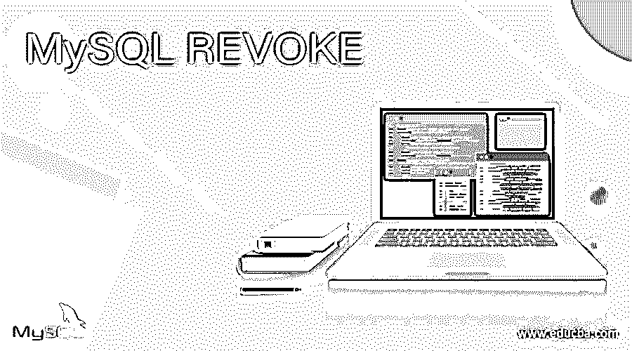

# MySQL 撤销

> 原文：<https://www.educba.com/mysql-revoke/>

## MySQL REVOKE 简介

MySQL 中的“撤销”功能用于撤销用户的所有或指定访问权限。该函数可用于在一次查询中撤销一个特定访问和多个或所有访问。它可以从不同的数据库对象(如整个数据库、表或列级)中删除权限。用户必须根据需要拥有“创建用户”或“更新”权限，才能使用“撤销”功能。这个函数只是取消用户的访问权限，保证用户帐户在 MySQL.user 系统表中的安全。

撤销查询的输出总是一条消息，表示“Query OK”。“0 行受影响”。

<small>Hadoop、数据科学、统计学&其他</small>

在进一步讨论 REVOKE 函数之前，最好对 GRANT 函数以及 MySQL 中的访问范围和特权有一个深入的了解。

**语法:**

“撤销”功能有三个级别，语法如下:

`REVOKE privilege_type[column_name] ON [obj_type] privilege_level
FROM user1 [,user2]…;`

`REVOKE ALL [privileges],
GRANT OPTION
FROM user1 [,user2]…;`

`REVOKE PROXY
ON user
FROM user1 [,user2]…;`

**说明:**

*   **obj_type:** 是被撤销访问权限的数据库对象。
*   **特权类型:**是被撤销的特权的类型。
*   **用户:**是取消权限的实体。【T2

### MySQL 中的 REVOKE 函数是如何工作的？

当我们讨论 REVOKE access 函数时，我们需要一个拥有我们希望撤销的访问权限的用户。因此，让我们首先创建一个用户，并授予一些访问权限。

**查询:**

`CREATE USER abraham
IDENTIFIED BY 'marklist';`

创建的新用户是“abraham”，范围是表“marklist”。

**输出:**

**查询:**

我们已经授予新用户对数据库“world”的“all”访问权限。

`SHOW GRANTS FOR abraham;`

**输出:**

因此新用户拥有继续操作的所有权限。现在让我们看看不同的作用域来撤销相同的作用域。

**查询:**

让我们删除用户“abraham”的更新访问权限。

`REVOKE UPDATE ON marklist FROM abraham;`

因此，最初用户‘Abraham’拥有更新表‘mark list’中任何行或列的特权。但是查询已经删除了它。

**输出:**

在 REVOKE 查询之后执行 SHOW GRANTS 查询会显示执行 REVOKE 功能前后用户所拥有的特权的差异。

**查询:**

要撤销用户的所有权限，我们可以使用 revoke all 语法。确保您没有撤销 GRANT 选项，否则您将无法在需要时授予特权。

`REVOKE ALL, GRANT OPTION FROM abraham;`

**输出:**

在 REVOKE 查询之后执行 SHOW GRANTS 查询会显示用户拥有的特权的差异。现在，用户的所有权限都被删除了。用户只能登录数据库，但没有其他权限。

**说明:**

当用户被授予代理特权时，使用一个特殊的 revoke 语句来收回该特权。现在，考虑用户“abraham”作为“alina”用户进行代理访问。为此，让我们看看用户“alina”拥有哪些权限，并授予新用户“abraham”同样的权限。

**查询:**

`SHOW GRANTS FOR alina;`

**输出:**

用户“alina”拥有除“更新”和“更改”权限之外的所有权限。我们的用户‘Abraham’没有特权，正如我们在上次查询中检查的那样。

**查询:**

让我们授予用户“alina”拥有的所有特权。

`GRANT PROXY
ON alina
TO abraham;`

**输出:**

这将授予 Abraham 除“更新”和“更改”权限之外的所有权限，因为“alina”没有这些权限。让我们通过对 Abraham 执行 SHOW GRANTS 来确认这一点。

**查询:**

如果我们现在对 Abraham 运行 REVOKE PROXY 查询，它将删除 Abraham 的所有代理权限。

`REVOKE PROXY
ON alina
FROM abraham;`

**输出:**

该查询从用户“alina”中删除了作为代理授予用户“abraham”的那些权限。

执行“亚伯拉罕”的演出许可。

`SHOW GRANTS;`

用户失去了所有权限，现在只有登录权限。

**解释:**撤销函数或过程的“执行”特权。“REVOKE”命令可用于收回函数或过程的执行权限。

举个例子，我们可以考虑‘加法’函数和用户‘亚伯拉罕’。要向该用户授予“执行”权限，请使用以下查询:

**查询:**

`GRANT EXECUTE ON FUNCTION Addition TO abraham;`

该查询授予用户“abraham”执行函数添加的权限。

**输出:**

用户“abraham”被授予执行权限以添加功能。

SHOW GRANTS 查询返回用户“abraham”的权限列表。

`SHOW GRANTS;`

现在，让我们通过 revoke 函数撤销这个用户的 EXECUTE 特权。

**查询:**

`REVOKE EXECUTE ON FUNCTION Addition FROM abraham;`

**输出:**

在此查询中，用户“abraham”的执行权限被撤销。让我们尝试使用 SHOW GRANTS 查询来检查这一点。

`SHOW GRANTS;`

这里需要注意的重要一点是，revoke 函数只对 MySQL 中的存储函数或过程有效。

我们还将看到一个在过程中取消执行特权的例子。考虑表 world.city 和定义为“CountOfCities”的过程。要向用户' abraham '授予执行此过程权限，请使用以下查询:

**查询:**

`GRANT EXECUTE ON PROCEDURE CountOfCities TO abraham;`

该查询将 execute 特权授予我们的用户。

**输出:**

让我们运行 SHOW GRANTS 查询来检查分配给用户“abraham”的权限。

`SHOW GRANTS;`

现在，我们可以使用下面的查询撤销用户的特权。

**查询:**

`REVOKE EXECUTE ON PROCEDURE CountOfCities FROM abraham;`

该查询撤销了用户“abraham”的执行权限。

**输出:**

我们可以通过为用户‘Abraham’运行 SHOW GRANTS 查询来检查特权是否被撤销。

`SHOW GRANTS;`

所以特权现在被取消了。

因此，我们看到了在不同级别撤销特定用户特权的例子。

### 结论

如前所述，REVOKE 函数用于收回为特定用户或用户列表授予的任何特权。该函数保留系统表中的用户详细信息行，但删除用户的所有访问权限。如果执行成功，REVOKE 函数将返回常量输出。撤销功能的三个级别是个人权限、一次性所有权限和授予任何用户的代理权限。同一个函数还可以从任何存储函数或过程 ***中删除 EXECUTE 特权。**T3】*

### 推荐文章

这是一个 MySQL 撤销指南。这里我们讨论 MySQL REVOKE 和实际例子，以及不同的子查询表达式和输出。您也可以浏览我们推荐的文章，了解更多信息——

1.  [MySQL 操作符介绍](https://www.educba.com/mysql-operators/)
2.  [MySQL 与 SQLite | 14 强对比](https://www.educba.com/mysql-vs-sqlite/)
3.  [举例说明 MySQL 中的插入命令](https://www.educba.com/insert-in-mysql/)
4.  [在](https://www.educba.com/mysql-between/)之间完成 MySQL 指南

