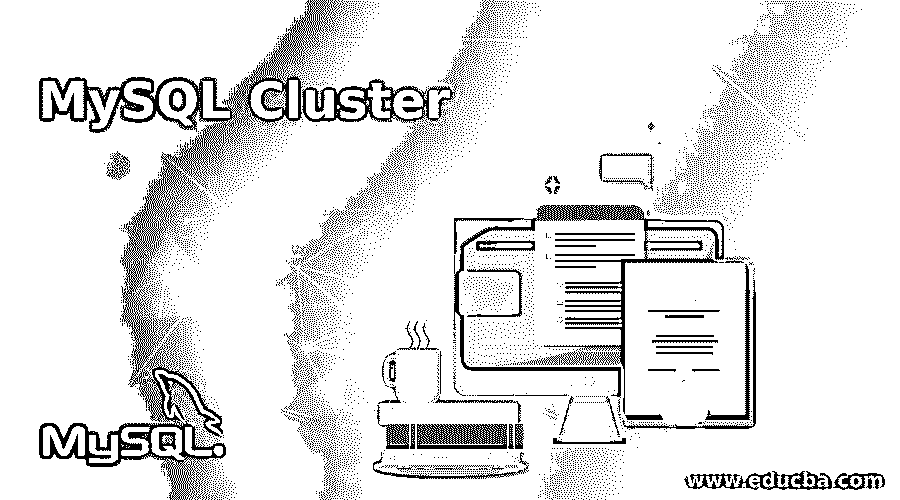
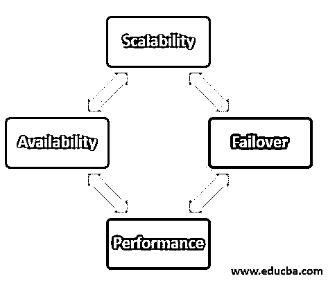

# MySQL 集群

> 原文：<https://www.educba.com/mysql-cluster/>

## MySQL 集群简介

数据库的主要目的是存储用户所需的数据，并使其在需要时可供使用和操作。尽管这种说法似乎说起来容易，实现起来也容易，但实际上很难确保一个数据库可供数量庞大的所有用户使用。高可用性一直是数据库工程师面临的挑战。为了克服这些问题，使用了多种技术。其中一个关键的问题是数据库表的聚集。在本文中，我们将了解 MySQL 集群的特性、优势、性能指标、先决条件以及何时应该使用集群。

### MySQL 集群的特性

MySQL cluster 的当前和最新版本是 703，它集成并捆绑在 Mysql 5.6 版本中。Mysql 集群具有以下特性

<small>Hadoop、数据科学、统计学&其他</small>

*   它是高度可伸缩的实时功能，并且完全符合事务数据库，遵循所有 ACID(原子性、一致性、隔离性和持久性)属性。
*   它是开源的，为数据库提供 99.999%的可用性。
*   Mysql 集群在设计时考虑到了多主结构，这种结构使得它是分布式的，不会出现单点故障。
*   由于 MySQL 集群是水平扩展的，因此密集型事务和读/写操作很容易处理。
*   Mysql 集群可以通过两种类型的接口 sql 和 NoSQL 接口访问。
*   在实时实现中，Mysql cluster 可以在一秒钟内处理数百万次操作，响应时间可预测，范围从几毫秒。
*   Mysql 集群提供了数据库自动分区的特性，称为分片技术，可以平衡负载，数据可以存储在内存或磁盘中。
*   由于数据库的线性可扩展性，不可预测的基于 Web 的工作负载可以轻松处理，即使在群集运行时，也可以向群集网络添加新节点，并且它的停机时间为零，从而实现线性可扩展性。

### 先决条件

要使用下面列出的 MySQL 集群，您的计算机应该满足某些系统要求

*   **CPU:** Intel/AMD x86 以上，UltraSPARC 以上。
*   **硬盘容量:**最低 3 GB。
*   **RAM 容量:**最低 1 GB。
*   **网络:**网络应该是遵循 TCP/IP 协议的千兆以太网，并且应该包含一个以上的节点。

### 什么时候应该使用 MySQL Cluster？

有必要了解我们何时应该根据我们的需求来使用 MySQL 集群。下面是在决定是否应该使用集群来管理数据库时可以考虑的一些要点:

*   如果您的数据库应用程序涉及大量事务，这些事务已经开始在 MySQL 服务器上产生负载，那么为了应对不断增长的数据库 CRUD 操作，您可以使用集群分片技术。
*   群集可用于确保一致性得到维护，而不管哪个节点为数据检索的选择操作提供服务。
*   如果数据库服务出现故障，是否会导致应用程序停机，以及处理这种停机是否可以承受。
*   如果发生故障，在故障发生的几秒钟内，是否会有值得考虑的数据丢失？
*   需要提供跨地理区域的复制工具，以便于在该特定区域的每个节点上进行读写操作。
*   事务中涉及的操作数量应该更大(例如单个事务中有 1000 个操作)，以便在不同的节点上并行运行它们，从而提高性能。然而，如果操作的数量较少，例如单个事务中的 10 个操作，那么将任务分布在多个节点上以并行运行事务的操作并收集结果将不是优选的，因为这将对性能产生负面影响。
*   考虑来自应用的数据请求的类型。例如，检索是基于数据库表的主键(涉及多个表上的少量连接)还是基于表记录的完整扫描(涉及其他表上的连接，返回数万行的大量数据)。对于以第二种情况为场景的应用程序，集群可以作为 it 的首选解决方案，以提高应用程序的性能。

### MySQL 集群的性能指标

在大型数据库中使用 MySQL 集群来管理它们肯定证明是非常有利可图的，并且如果应用程序是以数据为中心的(这在实时应用程序中是最常见的情况),那么它的性能会有显著的提高。MySQL 集群的一些性能指标如下所示:

*   **可扩展性:**我们可以动态扩展、横向扩展或纵向扩展。为了经济高效，我们通常通过在每个集群中使用更多的应用程序和数据节点，或者增加 CPU 线程的数量，或者为每个数据节点增加更多的空间/内存来进行横向扩展。
*   **故障转移:**每当数据库出现任何故障时，亚秒级故障转移设施都会确保服务不会中断。
*   **性能:**对数据检索请求的响应时间大大提高，最多 5 秒。此外，可以使用一种 NoSQL 接入方法来改善响应时间。由于使用 MySQL 集群后，数据库系统的吞吐量增加了，更新操作也可以在大规模上执行，而不必担心数据库的负载。
*   **可用性:** Mysql 集群的使用提供了 99.999%的可用性，这意味着每年不到 5 分钟的停机/不可用时间。

### 结论

聚类极大地提高了性能，并使查询结果集的检索非常快，因为执行时间降低了，因为记录现在在聚类后出现在单个位置，而不是以扭曲的格式出现。这逐渐影响了数据库对用户的可用性。随着执行时间的减少，访问时间减少，使得数据库对其他用户可用，从而为用户实现数据库的高性能和可用性。

### 推荐文章

这是一个 MySQL 集群的指南。在这里，我们还将讨论 MySQL Cluster 的介绍和特性，以及 MySQL Cluster 的性能指标。您也可以看看以下文章，了解更多信息–

1.  [MySQL REGEXP_REPLACE()](https://www.educba.com/mysql-regexp_replace/)
2.  [MySQL count()](https://www.educba.com/mysql-count/)
3.  [MySQL Root 密码](https://www.educba.com/mysql-root-password/)
4.  [MySQL BIN()](https://www.educba.com/mysql-bin/)

