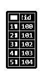
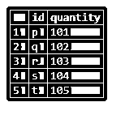
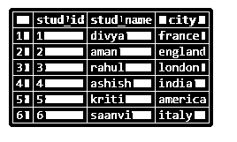
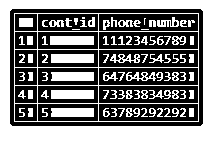
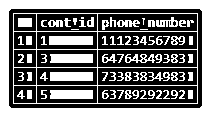
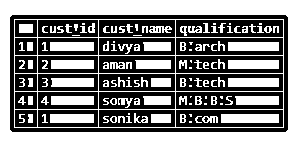
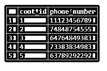

# MySQL 删除连接

> 原文：<https://www.educba.com/mysql-delete-join/>

## MySQL 删除连接简介

Mysql delete join 用于删除一个表中的行和记录以及另一个表中的匹配记录。在连接语句中匹配记录或行完全取决于我们在查询中应用的连接类型，比如我们是应用内部连接、外部连接还是完全连接等等。

### MySQL 删除连接案例研究

下面我们将学习两个不同的案例来研究 MySQL 中的删除连接:

<small>Hadoop、数据科学、统计学&其他</small>

#### 案例 1

先从 mysql delete join with inner join 子句的解释开始。Inner join 子句用于选择与另一个表中的值相匹配的记录或行。

下面是选择给定的两个表 table1 和 table2 的匹配记录的 inner join 子句:

`Select col_name1,col_name2...col_namen from table1 INNER JOIN table2 ON table1.col_name=table2.col_name;`

Mysql inner join 子句用于删除与表中的值匹配的行或记录。例如，下面的语句用于从表 table1 和 table2 中删除满足给定条件的记录。

`Delete table1,table2 from table1 INNER JOIN table2 on table1.joining_col=table2.joining_col where condition;`

在上面的语句 table1 . joining _ col = table2 . joining _ col 中，表达式是需要删除的两个表 table 1 和 table 2 之间的匹配条件。此外，where 子句后面的条件将导致需要删除表 1 和表 2 中的行。

这里，如果我们删除 table1，那么 delete 语句只应用于 table2，并且只从 table2 中删除行。类似地，如果我们删除 table2，那么 delete 语句只应用于 table1，并且只删除 table 1 中的行。

### 要实现的示例

下面是提到的例子:

#### 示例#1

为了解释 delete inner join，我们在数据库中创建了两个名为 table1 和 table2 的表，并在其中插入了 5 行。

**代码# 1–创建表格 1**

`create table table1(id int primary key auto_increment);
insert into table1 values(100);
insert into table1 values(101);
insert into table1 values(102);
insert into table1 values(103);
insert into table1 values(104);
select * from table1;`

**输出:**

**代码# 2–创建表格 2**

`create table table2(id varchar(100) primary key,quantity int not null);
insert into table2(id,quantity) values('p',101);
insert into table2(id,quantity) values('q',102);
insert into table2(id,quantity) values('r',103);
insert into table2(id,quantity) values('s',104);
insert into table2(id,quantity) values('t',105);
select * from table22;
delete table1,table2 from table1 inner join table2 on table2.quantity=table1.id where table1.id=100;`

**输出:输出控制台中上述查询的**:

它表示已删除两行。

#### 实施例 2

现在我们将创建另外两个表 student 和 contact 来解释删除内部连接:

**代码#1:** 创建的两个表是学生和联系人。

`create table student(stud_id int, stud_name varchar(150),city varchar(150));
insert into student values (1,'divya','france');
insert into student values(2,'aman','england');
insert into student values(3,'rahul','london');
insert into student values(4,'ashish','india');
insert into student values(5,'kriti','america');
insert into student values (6,'saanvi','italy');
select * from student;`

**输出:学生表的**显示在下面的输出控制台中:

**代码#2**

`create table contact (cont_id int, phone_number varchar(150));
insert into contact values (1,'11123456789');
insert into contact values (2,'74848754555');
insert into contact values (3,'64764849383');
insert into contact values (4,'73383834983');
insert into contact values (5,'63789292292');
select * from contact;
delete student,contact from student inner join contact on student.stud_id=contact.col_id where student.stud_id=2;`

成功执行上述查询后，输出将显示在输出控制台上:

我们还可以使用下面给出的选择查询来验证我们的结果。

**代码#2**

`select * from contact;`

**输出:**

#### 案例 2

Mysql 删除带左连接的连接:

left join 子句用于选择左表中的所有行，即使它们在右表中有匹配或没有匹配。删除左连接表用于从左表中删除在右表中没有匹配记录的行。

下面是删除左连接的行的语法，该左连接在另一个表中没有匹配的行:

`Delete table1 from table1 LEFT JOIN table2 ON table1.col_name=table2.column2 where table2.col_name is NULL;`

**NOTE:** Here,we have written only table table1 after delete clause, not both table1 and table2.

**输出:上面查询的**果然是一个空集。

### 要实现的示例

我们将创建两个表 customer 和 contact，并在其中插入值来解释 delete left join:

**代码#1**

`create table customer (cust_id int, cust_name varchar(100),qualification varchar(100));
insert into customer values (1,'divya','B.arch');
insert into customer values(2,'aman','M.tech');
insert into customer values(3,'ashish','B.tech');
insert into customer values(4,'somya','M.B.B.S');
insert into customer values(1,'sonika','B.com');
select * from customer;`

**输出:**下面是在下面的输出控制台上显示的客户表的输出:

**代码#2**

`select * from contact;`

**输出:**

**代码#3**

`Delete customer from customer LEFT JOIN contact ON customer.cust_id=contact.cont_id where phone_number is NULL;`

**Output:** 成功执行上述查询后，输出控制台上会显示以下输出。

### 结论

在本文中，我们学习了 mysql 删除连接查询。我们已经学习了如何从由 joint 子句连接在一起的两个或多个表中删除记录。在本文中，我们采用了两种连接方式，即内连接和左连接。我们还学习了如何从两个或多个表中选择行，在删除它们之前用 join 子句将它们连接在一起。为了让读者更好地理解，本文还提供了输出控制台执行的所有查询的屏幕截图。

### 推荐文章

这是一个 MySQL 删除连接的指南。在这里，我们讨论了 MySQL 删除连接的介绍，语法，案例研究与查询的例子，以更好地理解。您也可以浏览我们的其他相关文章，了解更多信息——

1.  [MySQL 索引](https://www.educba.com/mysql-index/)
2.  [MySQL 中的 MIN()](https://www.educba.com/min-in-mysql/)
3.  [MySQL avg()](https://www.educba.com/mysql-avg/)
4.  [MySQL MAX()函数](https://www.educba.com/mysql-max-function/)

