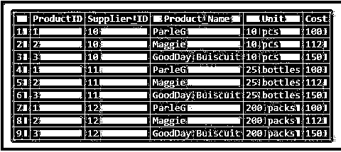
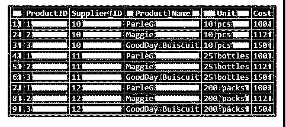
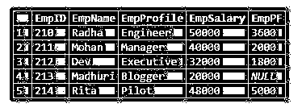
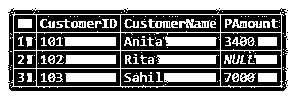
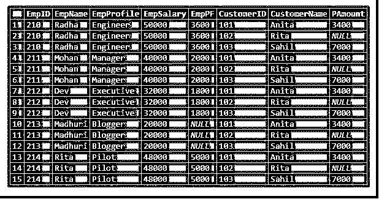

# MySQL 交叉连接

> 原文：<https://www.educba.com/mysql-cross-join/>

## MySQL 交叉连接简介

MySQL Cross Join 是 MySQL JOINs 的一种，其特征是提供笛卡尔积作为数据库中两个表的结果集。像 INNER JOIN 或其他，这个 MySQL 交叉连接不需要任何公共表列来执行连接查询。这里，笛卡尔乘积被定义为一个表中的表行数乘以下一个表中的表行数。因此，使用 MySQL CROSS JOIN，我们应该知道它的实现是为了在包含两个表中的行组合的结果集中获得所有可用的可能性。

### 句法

下面提供了 MySQL 交叉连接的基本语法结构:

<small>Hadoop、数据科学、统计学&其他</small>

`SELECT TableNameA. ColumnName1, TableNameB.ColumnName2,..............................,TableNameN.ColumnNameN FROM TableNameA CROSS JOIN TableNameB;`

**解释:**MySQL 的 CROSS JOIN 子句与 SELECT 关键字相关联，JOIN 在 FROM 关键字之后应用。然后，连接将从连接的表中检索所有记录作为输出。餐桌名称。ColumnNameN 等列出了要从各自的 tablesTableNameA 和 TableNameB 中联接以执行交叉联接的列字段的名称。

### MySQL 中的交叉连接是如何工作的？

因为 MySQL 连接是在 MySQL 中实现的，它们有助于从两个或多个数据库表中获取数据。这些表包含主键和外键，通过它们彼此相互关联，从而有效地应用连接查询。假设我们有两个表，每个表在数据库中分别有 j 和 k 行，当我们对这些表应用 CROSS JOIN 子句查询时。结果行集合将生成 j*k 行中的数据。

下面的查询语句说明了交叉连接如何连接两个表和 b:

`SELECT * FROM Table_a CROSS JOIN Table_b;`

请记住，与 INNER、RIGHT 或 LEFT JOIN 子句不同，这个 CROSS JOIN 子句不包含连接谓词。简单来说，我们可以说它不包括 USING 或 ON 子句。如果我们应用 WHERE 子句来显示两个表之间的关系，那么交叉连接查询的工作方式类似于内部连接子句。这个查询变成这样:

`SELECT * FROM Table_a CROSS JOIN Table_b WHERE Table_a.ID = Table_b.ID;`

WHERE 子句定义两个表有一个公共的列类型来建立关系并产生内部连接类型的结果集。但是我们可以使用它在交叉连接查询中定义特定的表列条件。

### 实现 MySQL 交叉连接的例子

让我们演示一些例子来说明 MySQL 服务器中的 CROSS JOIN 子句与相关表行的工作原理:

#### 示例 1:具有相同的行和非空值

**第一步:**首先，我们会在一个新的数据库中建立一个演示表。使用以下查询创建新的数据库 empdb

**代码:**

`CREATE DATABASE IF NOT EXISTS empdb;`

**步骤 2:** 再次将当前数据切换到新创建的数据库 empdb

**代码:**

`USE empdb;`

第三步:之后，让我们通过下面的查询语句在 empdb 数据库中建立一个演示表

**代码:**

`CREATE TABLE products (ProductID INT PRIMARY KEY AUTO_INCREMENT, Product_NameVARCHAR(255) NOT NULL, Cost INT NOT NULL);`

**步骤 4:** 同样，让我们使用下面的查询将一些记录输入到表 products 中

**代码:**

`INSERT INTO products(ProductID, Product_Name, Cost) VALUES
('1','Parle G','100')
('2','Maggie','112')
('3','GoodDay Buiscuit','150');`

**第五步:**显示表格内容如下

**代码:**

`SELECT * FROM Products;`

**输出:**

**步骤 6:** 此外，我们需要创建另一个表作为供应商，其字段如下

**代码:**

`CREATE TABLE Suppliers(Supplier_ID INT PRIMARY KEY AUTO_INCREMENT, CategoryVARCHAR(255) NOT NULL, Unit VARCHAR(255) NOT NULL);`

**步骤 7:** 使用下面的查询语句向供应商表中添加一些条目

**代码:**

`INSERT INTO suppliers(Supplier_ID, Category, Unit, CostEach) VALUES
('10','Snacks','10 pcs'),
('11','Drinks','25 bottles'),
('12','Kitchen Needs','200 packs');`

**第 8 步:**查看表中的记录

**代码:**

`SELECT * FROM Suppliers;`

**输出:**

**步骤 9:** 现在，让我们借助后续的查询命令在这些表上实现交叉连接，并查看结果集

**代码:**

`SELECT ProductID, Supplier_ID, Product_Name, Unit, Cost FROM Products CROSS JOIN Suppliers;`

**输出:**

步骤 10: 我们也可以简单地将上面的查询写成下面的查询，它将产生相同的结果

**代码:**

`SELECT ProductID, Supplier_ID, Product_Name, Unit, Cost FROM Products, Suppliers;`

**输出:**

**Note:** Both tables joined have an equal number of rows so the result is shown above.

**解释:**这里，一个表格的行与另一个表格的所有行一一显示可能的组合。

#### 示例 2:具有不同的行和空值

**步骤 1:** 我们使用下面的查询同时创建了两个表来应用交叉连接子句

**代码:**

`CREATE TABLE Employees(EmpID INT PRIMARY KEY, EmpName VARCHAR(255), EmpProfile VARCHAR(255), EmpSalary INT NOT NULL, EmpPF INT);
CREATE TABLE Payment(CustomerID INT PRIMARY KEY, CustomerName VARCHAR(255), PAmount INT);`

**步骤 2:** 同样，让我们输入一些记录，如下所示:

**代码:**

`INSERT INTO employees(EmpID, EmpName, EmpProfile, EmpSalary, EmpPF) VALUES ('210','Radha','Engineer','50000','3600'),
('211','Mohan','Manager','40000','2000'),
('212','Dev','Executive','32000','1800'),
('213','Madhuri','Blogger','20000',NULL),
('214','Rita','Pilot','48000','5000');
INSERT INTO payment(CustomerID, CustomerName, PAmount) VALUES
('101','Anita','3400'),
('102','Rita',NULL),
('103','Sahil','7000');`

**第三步:**表格记录同时插入到表格中。我们可以使用下面的 SELECT 语句查看数据库中这些表的内容

**代码:**

`SELECT * FROM employees;`

**输出:**

**代码:**

`SELECT * FROM payment;`

**输出:**

**步骤 4:** 现在，让我们执行合并两个表的查询语句，将一个表中的每条记录与另一个表中的每一行进行匹配，以生成一个连接表。为此，交叉连接查询如下

**代码:**

`SELECT * FROM Employees CROSS JOIN Payment;`

**输出:**

**解释:**很明显，如果任何列中有空值，那么在交叉连接实现之后，您可以看到这些值也被组合起来，以在连接的表中执行笛卡尔积，并产生结果集。

### 结论

我们研究了 MySQL 交叉连接子句的应用，以回答 MySQL 中一些有趣的数据问题。因此，交叉连接不需要任何共同的列，有助于返回表连接在一起的行的笛卡尔积集。这允许从每个表中产生所有可能的行组合。

### 推荐文章

这是一个 MySQL 交叉连接的指南。这里我们讨论一个 MySQL 交叉连接的介绍，语法，它是如何与查询例子更好地理解。您也可以浏览我们的其他相关文章，了解更多信息——

1.  [SQL 左连接](https://www.educba.com/sql-left-join/)
2.  [SQL 完全连接](https://www.educba.com/sql-full-join/)
3.  [SQL 删除连接](https://www.educba.com/sql-delete-join/)
4.  [MySQL 中的自然连接](https://www.educba.com/natural-join-in-mysql/)

