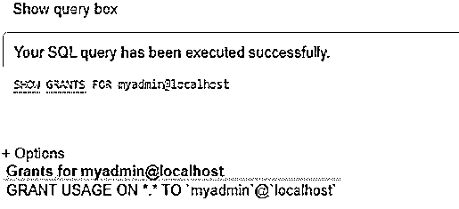
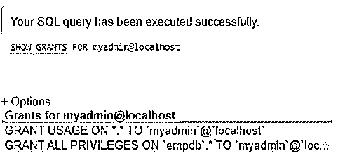

# MySQL 授予所有权限

> 原文：<https://www.educba.com/mysql-grant-all-privileges/>

## MySQL 简介授予所有权限

MySQL Grant All Privileges 是 MySQL 命令，实现这些命令是为了允许 MySQL 用户帐户以适当的权限管理和访问数据库。当我们授予 MySQL 用户帐户权限时，它控制用户可以执行哪些操作。

这些权限可以在不同的操作级别上以不同的方式使用:

<small>Hadoop、数据科学、统计学&其他</small>

*   然后，全局应用管理权限来完成 MySQL 服务器的操作，而不是指定给特定的 MySQL 数据库。
*   数据库特权可以应用于特定的数据库，也可以应用于所有服务器数据库以及数据库中与其相关的所有对象。
*   对于 MySQL 数据库对象，包括索引、表、视图以及存储的例程，对于数据库中给定类型的所有 MySQL 对象或所有 MySQL 数据库表，甚至对于所有 MySQL 数据库中给定类型的所有对象，都可以允许特权。

### MySQL 语法授予所有权限

为了使用 MySQL 授予任何特定 MySQL 数据库的用户帐户的所有权限并执行 MySQL 命令，我们需要应用以下授予权限的基本语法结构:

`GRANT [ALL | Specific Privilege] [, privilege], ... ON PrivilegeLevel TO AccountName;`

上述语法如下所示:

最初，我们必须在关键字 GRANT 之后指定一个或多个特权。假设你提供更多的特权；我们需要用逗号来区分每个特权。为了进行演示，让我们将服务器中演示数据库中名为“Books”的表的 SELECT 权限授予 MySQL 用户帐户 admin@localhost:

`GRANT SELECT ON Books TO admin@localhost;`

一个 MySQL 用户帐户包括两个片段:用户名和主机名，如上所示。

类似地，下面的示例将向您展示如何向 admin@localhost 授予对 Books 表的插入、更新和删除等多个权限:

`GRANT INSERT, UPDATE, DELETE ON Books TO admin@localhost;`

同样，第二，我们需要声明 PrivilegeLevel，它将决定授予特权所应用的特权级别。

### 如何授予 MySQL 中的所有权限？

MySQL Grant All Privileges 是 MySQL 管理语句，授予用户帐户管理和执行 MySQL 操作的权限。当新用户使用 CREATE USER 语句创建一个或多个用户帐户时，该用户不会获得任何权限。这意味着 MySQL 用户可以登录到服务器，但是 MySQL 用户不能执行任何类似 MySQL 的操作，包括选择 MySQL 数据库、将数据插入数据库表以及从表中检索其他数据的查询。因此，如果我们想要使用 MySQL 数据库及其组成对象，用户帐户将需要权限或用户帐户特权来执行服务器中的任何管理或行政操作。

为了拥有一个用户帐户的所有权限，我们必须使用 MySQL Grant All Privileges 语句来处理数据库表和其他数据库对象，以便在不同的权限级别上进行访问，定义如下:

#### 1.全球特权

这会将全局特权应用于服务器中的所有 MySQL 数据库，用语法*表示。*

**举例:**

`GRANT SELECT ON *.* TO myadmin@localhost;`

这里，用户帐户 myadmin@localhost 将查询服务器上所有 MySQL 数据库中所有表的数据记录。

#### 2.数据库特权

这为所有数据库对象提供了数据库级别的权限。我们需要使用 databasename 上的语法。*

**举例:**

`GRANT INSERT ON databasename.* TO myadmin@localhost;`

#### 3.表特权

它通过使用 databasename.tablename 上的语法将表级权限分配给所有表列。在这里，如果我们不添加 databasename，MySQL 将实现默认数据库，如果没有找到默认数据库，它可能会发出一个错误。

**举例:**

`GRANT DELETE ON databasename.tablename TO myadmin@locolhost;`

#### 4.列权限

它适用于服务器中每个特权的表列。

**举例:**

`GRANT SELECT (ColumnName1, COlumnName2,..) UPDATE (ColumnName1) ON TableName TO myadmin@localhost;`

#### 5.存储例行特权

这个特权级别适用于 MySQL 存储例程过程和函数。

**举例:**

`GRANT EXECUTE ON PROCEDURE Procedure_Name TO myadmin@localhost;`

在此，指定当前数据库中的 Procedure_Name。

#### 6.代理用户权限

MySQL 的这个权限级别“授予所有权限”允许单个用户作为其他用户的代理。在这里，代理用户接收代理用户的所有特权。

**举例:**

`GRANT PROXY ON root TO myadmin@localhost;`

在这里，myadmin@localhost 采用 MySQL root 的所有权限。

需要注意的是，使用 GRANT 语句；MySQL 用户必须拥有特权授予选项以及将要授予的特权。例如，如果系统变量 read-only 是允许的，那么用户需要拥有超级特权来执行 GRANT 语句。

### MySQL 授予所有权限的示例

通常，首先我们需要使用语句 CREATE USER 创建一个新的用户帐户，然后，我们需要进一步使用 grant 语句将所有权限授予用户创建的帐户。

最初，我们将通过与 CREATE TABLE 语句相同的命令在 MySQL 服务器中创建一个名为 myadmin@localhost 的用户帐户:

**代码:**

`CREATE USER myadmin@localhost IDENTIFIED BY 'Adminpass@123';`

接下来，我们可以使用语句 SHOW GRANTS 查看分配给用户创建的 myadmin@localhost 的初始权限:

**代码:**

`SHOW GRANTS FOR myadmin@localhost;`

**输出:**

这里，使用术语表示用户可以登录到数据库帐户服务器，但是不具有执行任何操作动作的特权。

现在，我们将使用以下查询语句将当前数据库服务器中所有 MySQL 数据库的所有权限授予 myadmin@localhost:

**代码:**

`GRANT ALL ON empdb.* TO myadmin@localhost;`

同样，让我们使用 SHOW GRANT 命令显示和查看名为 myadmin@localhost 的用户帐户的权限:

**代码:**

`SHOW GRANTS FOR myadmin@localhost;`

**输出:**

### 结论

MySQL Grant All Privileges 允许 MySQL 用户授予特定访问级别的所有权限，但 MySQL 服务器数据库中的 Grant 选项除外。特权说明符是在特定特权级别存在的所有特权的缩写，它授予 MySQL 服务器中全局或表级别的所有权限。因此，用户帐户可以使用 MySQL Grant All 特权在不同的特权级别执行各种 MySQL 查询。

### 推荐文章

这是一个 MySQL 授予所有权限的指南。这里我们讨论一下入门，如何授予 MySQL 中的所有权限？还有例子。您也可以看看以下文章，了解更多信息–

1.  [MySQL COALESCE](https://www.educba.com/mysql-coalesce/)
2.  [MySQL 用户权限](https://www.educba.com/mysql-user-permissions/)
3.  [mysql_real_escape_string](https://www.educba.com/mysql_real_escape_string/)
4.  [MySQL 展示](https://www.educba.com/mysql-show/)

