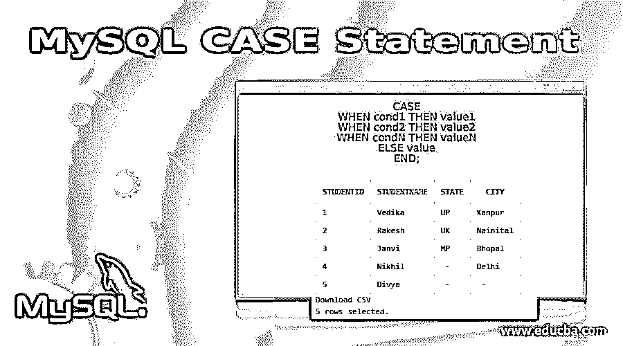
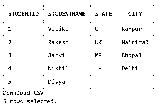
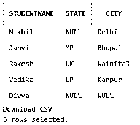
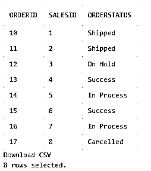

# MySQL CASE 语句

> 原文：<https://www.educba.com/mysql-case-statement/>

## MySQL CASE 语句介绍

MySQL CASE 是一个 MySQL 语句查询关键字，它定义了处理循环概念的方式，以执行条件集并使用 IF ELSE 返回匹配案例。MySQL 中的 case 是一种控制语句，它验证条件 CASE 集，并在第一个 CASE 满足 else 值时显示值，然后退出循环。如果没有发现任何情况为真，并且该语句没有 ELSE 部分或值，则该情况返回 NULL。基本上，CASE 语句类似于 IF THEN ELSE 逻辑循环语句。当在 MySQL 服务器上运行时，它读取条件表达式，当表达式大小写匹配时，nit 显示结果。之后，它会进一步停止执行。

### MySQL CASE 语句的语法

下面的语法定义了 CASE 语句 SQL 查询结构:

<small>Hadoop、数据科学、统计学&其他</small>

`CASE
WHEN cond1 THEN value1
WHEN cond2 THEN value2
WHEN condN THEN valueN
ELSE value
END;`

让我们讨论上面语法中给出的这些参数:

*   **条件 1，条件 2，…..，condN:** 表示 CASE 语句列表中需要评估的条件。
*   值 1，值 2，…..，valueN: 表示满足条件时需要显示的各个值。
*   **值:**表示当 else 部分满足时显示的值。

这部分允许在 MySQL 的查询中添加逻辑 CASE 语句。为了使语句有效，我们在任何地方都使用 CASE 语句，并带有 WHERE SELECT 和 ORDER BY 等子句。您可以通过如下所示的语法进行评估:

`SELECT column1,column2,
CASE
WHEN cond1 THEN value1
WHEN cond2 THEN value2
WHEN condN THEN valueN
ELSE value
END
FROM TableName;`

### MySQL 中 CASE 语句是如何工作的？

CASE 语句包含两个过程:一个是简单 CASE，另一个是搜索 CASE。我们使用一个 CASE 语句来提供基于匹配条件的结果值，使用逻辑控制方法和 SQL 子句(如 SELECT、WHERE 和 ORDER BY)来执行 SQL 查询。

假设，下面的查询解释了 CASE 逻辑部分，其中我们提到了一个表，如带有字段 StudentName、State、City 的 Students，则该查询将写成:

`SELECT StudentName, State, City FROM Students ORDER BY (
CASE
WHEN State IS NULL THEN City
ELSE State
END);`

从这里我们将知道，当我们在 SELECT 查询中应用 case 语句来获取满足特定 CASE 条件的特定值时。在上图中，我们将 case 语句放在 State 和 City 列中，如果 State 列包含空值，则查询将显示 City 列值，如果 CASE 语句无效或未找到值，则返回 else 部分值，即 State 列值。在这里，我们获取了学生、州和城市的名称，其中应用了 ORDER BY 子句对结果行进行排序。

在简单的情况下，列值与 WHEN 子句中的条件语句值匹配以实现等价，然后在语法中的一个之后生成结果值。但是，如果没有等于 then 的值，它将返回 ELSE 部分的值(如果提供的话)。

不应在 WHEN 子句值中使用 NULL，因为如果执行，逻辑部分将为 NULL = NULL，结果为 FALSE。

现在对于 search case，它遵循与这种简单情况相同的逻辑过程，但是 Search CASE 的一个部分使它执行起来有所不同。在这里，关于满足的情况产生了其 MySQL 数据类型基于它所用于的上下文的值。例如，如果语句中使用了字符串上下文，那么结果值将是相同的数据类型，即字符串。此外，如果 CASE 条件表达式使用数值上下文，则返回值将是整数、小数或实数值数据类型。

### 实现 MySQL CASE 语句的示例

以下是带有输出的 CASE 语句示例:

#### 示例 1–带有 SELECT & ORDER BY 子句的 CASE 语句

让我们执行上面的 SQL 查询，并显示 CASE 部分执行的结果。为此，我们需要创建一个学生表，并插入一些值。

**1。创建表格**

`CREATE TABLE Students(StudentIDint, StudentNamevarchar(255), State varchar(255), City varchar(255) );`

**2。插入几个字段**

`INSERT INTO Students (StudentID, StudentName, State, City) VALUES ('01', 'Vedika', 'UP', 'Kanpur');`

诸如此类。

**3。选择语句以显示表格数据**

**查询:**

`SELECT * FROM Students;`

**输出:**

**4。带有选择查询的 CASE 语句**

**查询:**

`SELECT StudentName, State, City FROM Students ORDER BY (
CASE
WHEN State IS NULL THEN City
ELSE State
END);`

**输出:**

#### 示例 2–带有聚合函数的 CASE 语句

我们将使用 CASE 语句和 SUM() MySQL 函数根据订单状态计算 Orders 表中的总销售额。

**1。创建表格**

**查询:**

`CREATE TABLE Orders (OrderIDint,SalesIDint, OrderStatusvarchar(255) );`

**2。插入几个字段**

**查询:**

`INSERT INTO Orders (OrderID, SalesID,OrderStatus) VALUES ('10', '001', 'Shipped');`

诸如此类。

**3。选择语句以显示表格数据**

**查询:**

`SELECT * FROM Orders;`

**输出:**

*

* 

**3。SQL 选择查询**中将 SUM()和 COUNT 作为聚合函数的 CASE 语句

**查询:**

`SELECT
SUM(CASE
WHEN OrderStatus = 'Success' THEN 1
ELSE 0
END) AS 'Success Count',
SUM(CASE
WHEN OrderStatus = 'On Hold' THEN 1
ELSE 0
END) AS 'Hold Count',
SUM(CASE
WHEN OrderStatus = 'In Process' THEN 1
ELSE 0
END) AS 'Processing',
SUM(CASE
WHEN OrderStatus = 'Shipped' THEN 1
ELSE 0
END) AS 'Shipping count',
SUM(CASE
WHEN OrderStatus = 'Cancelled' THEN 1
ELSE 0
END) AS 'Cancellation Count',
COUNT(*) AS Sum Total
FROM
Orders;`

**输出:**

**解释:**在上面的查询中，首先执行 case 语句，当 CASE 与相应的订单状态(如成功、进行中、已发货、已取消、暂挂)匹配时，返回 1，否则返回 0。其次，在此之后，Sum()函数根据订单状态找出订单总数。

### 结论

*   MySQL CASE 语句允许对 SQL 查询执行 IF ELSE 逻辑，以检查条件语句并从数据库表中获取所需的结果集或值。
*   我们只能对存储过程、存储事件、函数和触发器使用 CASE 语句。它用于将条件表达式与一系列不同的值进行比较，从而提供包含数据类型的相应结果，该数据类型取决于查询中使用的上下文。
*   因此，我们可以说 MySQL 中的 CASE 语句使得查询代码更加高效和可读。

### 推荐文章

这是一个 MySQL CASE 语句的指南。这里我们讨论 MySQL CASE 语句的介绍和实际例子以及不同的子查询表达式。您也可以浏览我们推荐的文章，了解更多信息——

1.  [MySQL 操作符介绍](https://www.educba.com/mysql-operators/)
2.  [前 23 个 MySQL 字符串函数](https://www.educba.com/mysql-string-functions/)
3.  [MySQL 与 SQLite | 14 大对比](https://www.educba.com/mysql-vs-sqlite/)
4.  [MySQL 时间戳指南](https://www.educba.com/mysql-timestamp/)

