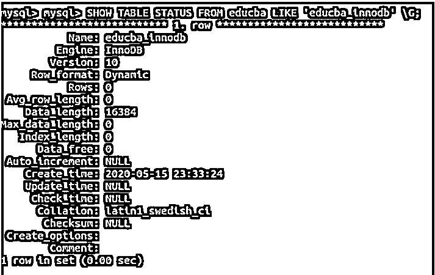
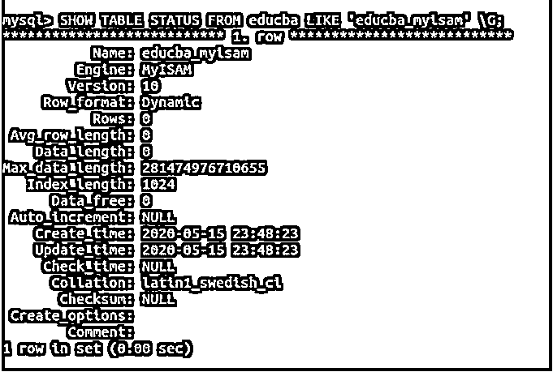
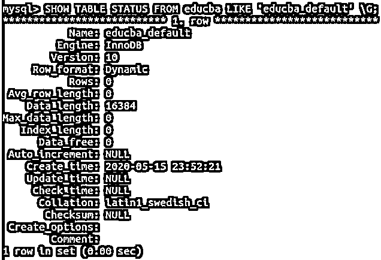

# MySQL InnoDB

> 原文：<https://www.educba.com/mysql-innodb/>

## MySQL InnoDB 简介

Mysql 支持许多表存储引擎，这些引擎定义了表的内部工作和对不同特性的支持。MySQL 支持的一些存储引擎包括 InnoDB、MyISAM、Memory、CSV、Merge、Archive、Federated、Blackhole 和 Example。其中，Innodb 是使用最广泛的存储引擎，而 MyISAM 是最初的存储引擎之一，用于一些内部表，这些表用于操作属于 information_schema 和 MySQL 数据库的 MySQL 数据库。

MyISAM 引擎是非事务性的，具有表级锁定，而 InnoDB 是具有行级锁定特性的事务性存储引擎。InnoDB 存储引擎提供了卓越的性能和可靠性平衡，是 oracle 最青睐和推荐的存储引擎之一。在本文中，我们将了解 MySQL 的 InnoDB 存储引擎、支持的特性，以及通过显式指定 InnoDB 存储引擎来创建表的工作和示例。

<small>Hadoop、数据科学、统计学&其他</small>

### InnoDB 存储引擎的优势

InnoDB 存储引擎有许多优点，其中一些列举如下

*   所有数据操作语言语句和操作都支持事务的 ACID(原子性、一致性、隔离性和持久性)属性，以及回滚、提交和崩溃恢复支持的其他事务特性，以保护用户数据。
*   由于 InnoDB 存储引擎的行级锁定特性，可以实现多个用户以 oracle 风格进行高性能和一致读取的并发访问。
*   当在查询中使用主键时，数据在磁盘上的排列方式将导致数据检索的优化。在 InnoDB 表的主键上定义的聚集索引导致数据的组织方式将主键查找的输入/输出操作减到最少。
*   为了避免相互关联和依赖的表中出现不一致，InnoDB 存储引擎支持使用外键来帮助进行一致的更新、插入和删除操作，并帮助维护数据库表内容的完整性和一致性。

### MySQL InnoDB 的特性

InnoDB 的特性包括 B 树索引、备份/时间点恢复、聚集索引、压缩数据、数据缓存、加密数据、外键支持、MySQL 5.6 和更高版本的全文搜索索引、地理空间数据类型支持、MySQL 5.7 和更高版本的地理空间索引支持、索引缓存、行级锁定粒度、MVCC、复制支持、高达 64TB 的存储限制、事务、数据字典的更新统计。对于自适应散列索引特性，InnoDB 在内部使用散列索引，但是在操作时 InnoDB 表不支持散列索引。

### MySQL InnoDB 示例

每当我们在 MySQL 5.5 及以上版本中使用 create table 语句创建表时，所创建的表的默认存储引擎总是 Innodb，而对于 MySQL 5.5 之前的版本，MyISAM 是表的默认存储引擎。如果我们想要创建任何其他存储引擎的表，或者如果我们想要显式地将引擎类型指定为 InnoDB，我们可以在创建表时通过使用 ENGINE=子句来提及表的存储引擎。

首先，我们将借助一个示例来看看如何使用 ENGINE=子句来指定存储引擎。我们将使用下面的 create table 语句创建一个名为 educba_innodb 的表

`CREATE TABLE educba_innodb (id INTEGER, description VARCHAR(20), PRIMARY KEY (id)) ENGINE=InnoDB;`

**输出:**

使用 InnoDB 存储引擎创建表格时，必须使用具有以下属性的主键列

*   大多数关键查询都应该使用和引用这个列。
*   此栏不应留空。
*   此列不应有重复值。
*   一旦将它们插入到表中，该列不应更改值。

我们可以使用 MySQL 中的 SHOW TABLE STATUS 语句来检查表的状态和所有相关信息。例如，如果我们想要检查我们之前创建的名为 educba_innodb 的表的状态，那么我们将使用下面的查询语句

`SHOW TABLE STATUS FROM educba LIKE 'educba_innodb' \G;`

这将给出以下输出，显示与 educba_innodb 表相关的所有详细信息

在这种状态下，我们甚至可以看到表的引擎，在我们的例子中是 InnoDB。

让我们试着用不同的存储引擎创建一个表，比如名为 educba_myisam 的 MyISAM。为此，我们将提到 ENGINE= MyISAM 子句来创建如下所示的查询

`CREATE TABLE educba_myisam (id INTEGER, description VARCHAR(20), PRIMARY KEY (id)) ENGINE=MyISAM;`

这将产生以下输出–

检查状态后，使用以下查询 educba_myisam 表–

`SHOW TABLE STATUS FROM educba LIKE 'educba_myisam' \G;`

给出以下输出，表示表的引擎是 MyISAM–

要检查数据库服务器安装的默认存储引擎，可以执行以下命令

`SELECT @@default_storage_engine;`

执行上述命令会产生以下输出:

让我们尝试在 CREATE TABLE 语句中不指定 ENGINE=子句的情况下创建一个表。我们将使用以下查询创建一个名为 educba_default 的表

`CREATE TABLE educba_default (id INTEGER, description VARCHAR(20), PRIMARY KEY (id));`

在执行后给出如下输出

现在，让我们检查该表的状态，看看在默认情况下创建该表时使用了哪个存储引擎。我们之前查询过，我的机器上安装的 mysql 的默认存储引擎是 InnoDB。因此，educba_default 应该有 InnoDB 引擎。这是输出——

`SHOW TABLE STATUS FROM educba LIKE 'educba_default' \G;`

### 结论

在 Mysql 5.5 和更高版本中创建表时，InnoDB 存储引擎是分配给表的默认引擎。为了在创建时明确提到表的存储引擎，可以使用 ENGINE=子句。Innodb engine 提供了高性能，因为它具有许多特性，如行级锁定、事务支持和主键索引。InnoDB storage engine 还提供了使用外键的特性，有助于维护 MySQL 数据库的一致性和完整性。使用 InnoDB 存储引擎，多个用户可以并发访问，并且每个用户都可以检索一致的数据。

### 推荐文章

这是一个 MySQL InnoDB 的指南。在这里，我们还将讨论 innodb 存储引擎的介绍和优点，以及示例和代码实现。您也可以看看以下文章，了解更多信息–

1.  [改变表格 MySQL](https://www.educba.com/alter-table-mysql/)
2.  [MySQL BLOB](https://www.educba.com/mysql-blob/)
3.  [MySQL today()](https://www.educba.com/mysql-today/)
4.  [MySQL 插入忽略](https://www.educba.com/mysql-insert-ignore/)

