# 如何安装 Oracle

> 原文：<https://www.educba.com/install-oracle/>

## 如何安装 Oracle？

以下文章概述了如何安装 Oracle。Oracle 数据库是被视为一个单元的数据集合。它是由甲骨文公司创造的。这是第一个为企业网格计算设计的数据库。它在成本和性能方面表现得灵活而有效。它还管理所有信息和应用程序。整个系统是围绕关系数据库框架构建的。存储在这里的数据可以由不同的用户通过结构化查询语言(SQL)进行评估。它是完全可扩展的，被许多管理和处理数据的全球性企业所使用。

### 安装 Oracle 的步骤

让我们看看安装 Oracle 所需的步骤，如下所示:

<small>Hadoop、数据科学、统计学&其他</small>

**在 Linux 上安装:**

**步骤 1:** 创建一个 dba 组和操作系统组和用户。

# group add–g 700 数据库管理员

**第二步:**在 stage 区复制 Oracle 11g 软件，并更改其所有权。

**步骤 3:** 执行预安装任务，并检查 RAM 上的可用容量。

**第四步:**检查与 Linux 等软件需求的兼容性。

**第 5 步:**完成后，配置内核参数，并将以下参数添加到/etc/sysctl.conf 中。

`Fs.file-max = 76800
Kernel.shmall = 2097152
Kernel.shmmax  = 2147483648(half of the ram size)
Kernel.shmmni  =  4096
Kernel.sem = 250  32000  100 128
Net.ipv4.ip_local_port_range  =  1024     65000
Net.core.rmem_default = 4194304
Net.core.rmem_max = 4194304
Net.core.wmem_default = 262144
Net.core.wmem_max  =  262144`

**第六步:**现在将内核参数的当前值改为#/sbin/sysctl–p。

**步骤 7:** 完成所有这些任务后，重启服务器并重新引导，然后以 root 用户身份重新登录并运行此命令以启用图形模式:xhost +。

**步骤 8:** 完成后，以 oracle 用户身份登录，并在. bash_profile 文件中添加以下环境变量。

`$vi .bash_profile
Export  oracle_base=/opt /oracle
Export oracle_home=/opt/oracle/product/11.1.0
Export oracle_sid=orcl
Export path=$oracle_home/bin:$path:.
:wq (save & quit)`

第 9 步:运行。bash_profile 通过使用:。bash_profile，然后提取 oracle11g zip 文件。

`$ cd /opt
$ ls –lrt
$ unzip oracle11g.zip
$ ls –lrt`

**步骤 10:** 现在移动目录后运行安装程序并执行。

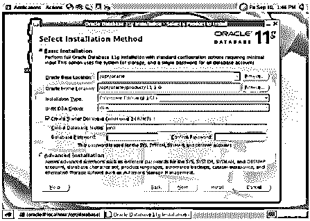

**第十一步:**设置要安装 Oracle 的路径。

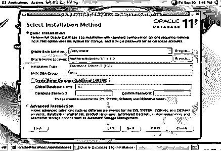

**步骤 12:** 禁用创建启动数据库。

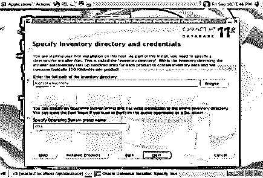

**步骤 13:** 现在指定库存目录和凭证。

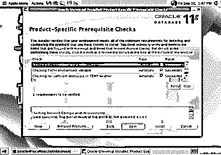

第 14 步:指定你想要的先决条件检查和规范。

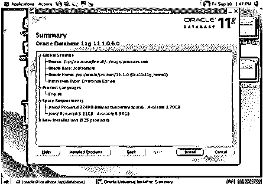

**第 15 步:**完成后，您将看到安装选项。

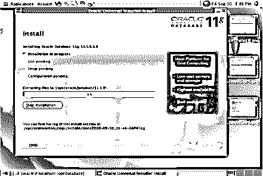

一旦您点击安装，安装就开始了。完成后，打开一个新的终端。

**步骤 16:** 以 root 用户身份登录，执行下面两个脚本。

`#/opt/orainventory/orainstroot.sh (press enter)
#/opt/oracle/product/11.1.0/root.sh (press enter)`

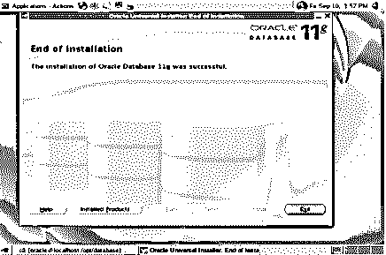

安装现已完成。

### 在 Windows 上安装 Oracle

**步骤 1:** 首先在 Windows 上安装 Oracle，根据您的系统要求从 Oracle 网站下载软件。

**步骤 2:** 下载完成后，解压下载的文件并运行 setup.exe 文件。右键单击该文件，然后“以管理员身份运行”。

一个安装程序弹出窗口将出现如下。

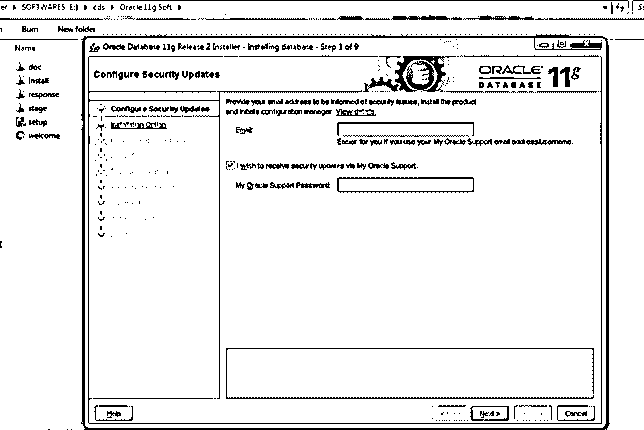

**步骤 3:** 跳过“配置安全更新”选项，单击“下一步”。

**第 4 步:**完成后，选择您选择的系统类别。最好为初学者选择一个桌面课程，然后点击下一步。

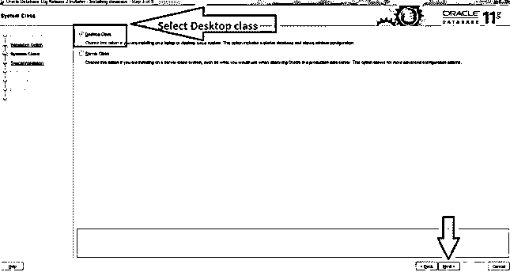

**步骤 5:** 选择您希望在系统上安装 Oracle 的路径。如果您希望将驱动器从 C:\更改为 D:\，您可以选择它，所有选项都应保持不变。选择一个标准密码，并将全局数据库命名为“orcl”。

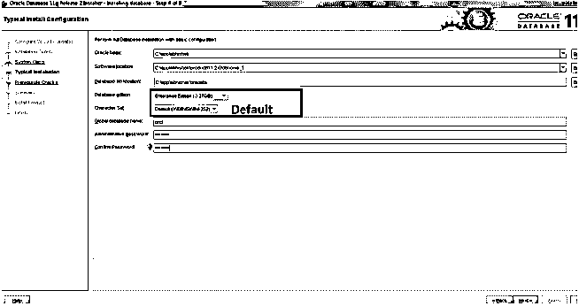

**步骤 6:** 完成后，Oracle 将检查软件要求，并为您提供安装摘要。如果总结是好的，那么安装继续进行。

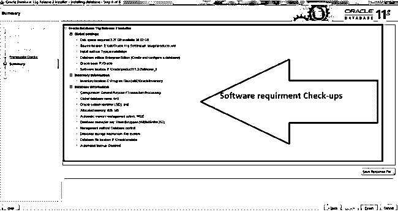

**步骤 7:** 现在，Oracle 将开始在您的系统中安装以下产品。这些将包括安装文件和数据库配置，助理。

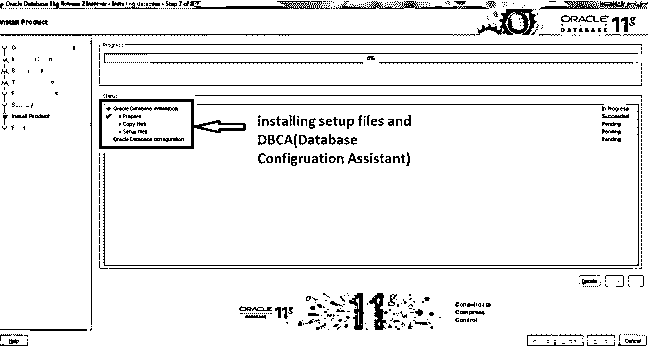

第八步:当防火墙出现在你的系统中时，允许它。

**步骤 9:** 完成后，您可以看到正在安装数据库配置的 DBCA。

DBCA 是一种借助图形用户界面帮助创建和管理 Oracle 数据库的工具。

**步骤 10:** 当 DBCA 安装完成后，将会打开一个弹出窗口。借助密码管理工具，为特定的数据库帐户设置密码。

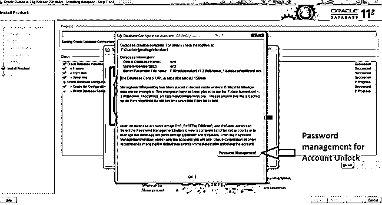

**步骤 11:** 之后，你应该可以看到安装成功的消息窗口。你可以关闭这个窗口。

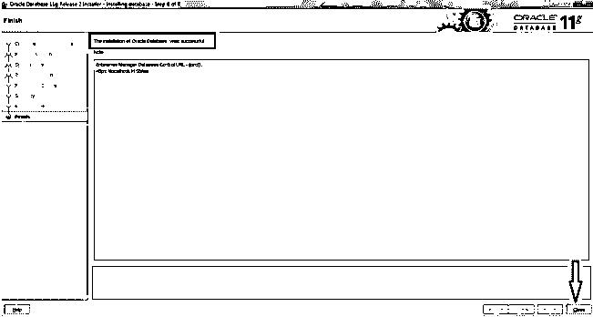

**步骤 12:** 完成安装后，您现在可以继续测试安装是否正确；为此，请以管理员身份打开 cmd 提示符。

您可以运行以下命令

`set oracle_sid=orcl
Sqlplus / as sysdba`

运行这些命令后，您将观察到 Oracle Database 11g Enterprise 现在已连接。您现在可以开始工作并使用 Oracle Database 11g Enterprise 了。

### 在 MAC 上安装 Oracle

为了在 MAC 上安装 Oracle，你需要在网上找到一致的资源。您甚至可以亲自动手编译二进制文件和包。

按照以下步骤在 MAC 上安装 Oracle:

**第一步:**设置 VirtualBox。

这是在 MAC 上安装 Oracle 的最简单的方法之一。可以下载 x86 版本。

**第二步:**获取 VM 文件。

ova VM 文件很大，最好从它开始。你可以在浏览器上下载，然后与 Firefox 整合。这个虚拟机最初是为开发人员创建的，它经常使用最新的 Oracle 客户端和其他工具进行更新。

**第三步:**启动虚拟机。

一旦虚拟机准备好启动，当提示用户输入用户名/密码时，启动虚拟机并插入 oracle/oracle。

**步骤 4:** 使 Oracle DB 可见–互联网连接和防火墙。

在虚拟机的右上角，您应该会看到一个关于互联网连接的图标。默认情况下是禁用的，只要您的主机操作系统有互联网连接，您就可以连接到它。默认情况下，防火墙已经在虚拟机中激活。

**第五步:**可以开始使用 IntelliJ，它成功连接 Oracle。

### 结论

因此，Oracle 可以安装在所有主要的操作系统上。它提供了数据库管理功能，有助于很好地管理数据。使用 Oracle 管理、修改和创建数据非常容易。因此，它被所有组织广泛使用。它是完全可扩展的，被许多管理和处理数据的全球性企业所使用。因为它可以在所有操作系统上扩展，所以在消费者中很有名。

### 推荐文章

这是如何安装 Oracle 的指南。这里我们讨论了在 Linux、Windows、MAC 等操作系统上安装 Oracle 的意义和不同步骤。您也可以阅读以下文章，了解更多信息——

1.  [Oracle 数据库管理员职业生涯](https://www.educba.com/career-in-oracle-database-administrator/)
2.  [甲骨文 RAC 面试问题](https://www.educba.com/oracle-rac-interview-questions/)
3.  [Oracle vs SQL Server](https://www.educba.com/oracle-vs-sql-server/)
4.  [甲骨文表格面试问题](https://www.educba.com/oracle-forms-interview-questions/)

