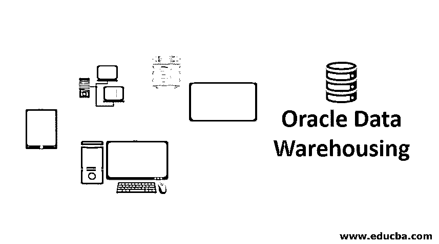
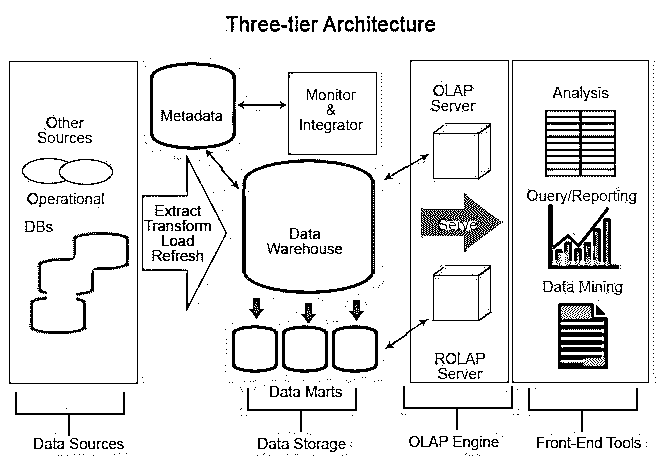

# Oracle 数据仓库

> 原文：<https://www.educba.com/oracle-data-warehousing/>

## Oracle 数据仓库简介

Oracle 数据仓库是通过 Oracle 商业智能数据库系统存储和处理业务数据的概念。Oracle 数据仓库体系结构有几种类型，如单层、两层和三层体系结构。Oracle domain 是一家受欢迎的数据库供应商，为数据仓库实施提供行业标准的数据库服务。它遵循特定的特征，如面向业务主题、与各种系统集成、非易失性和时变性。Oracle 支持数据仓库解决方案的数据质量、高效数据处理和元数据管理特性。Oracle 数据仓库通过数据驱动的决策流程帮助企业。Oracle 支持各种用于数据仓库的 ETL 工具。

确切地说，数据仓库包括:

<small>Hadoop、数据科学、统计学&其他</small>

*   从不同的数据源积累历史记录。
*   检查和分析过去的业务记录。
*   获取洞察力和所需信息，以推动业务需求和动机。

因此，大多数操作是面向读取的，而不是对数据集的直接操作。Oracle 数据仓库是 Oracle 数据库的一个完全优化的、基于云的、全面的、可靠的数据库概念。它主要是为了体验高效灵活的数据库操作而构建的，这使它能够提供市场领先的性能。

### 数据仓库的特征

美国计算机科学家 William H. Inmon 将数据仓库的特征称为:

*   **面向主题:**数据仓库主要用于分析数据和获得洞察力。我们可以在公司的特定部门定制仓库，这反过来可以推断出排行榜上的表现者、目标客户等。
*   **集成:**被操作的数据经常从不同的来源获取。在这种情况下，应始终以数据为准，防止冲突。这样获得的特质就是正直。
*   **非易失:**数据入库后，不可操作或修改。因为分析是对已经发生的数据进行的。
*   **时变:**为了得出历史数据的趋势和回归，分析师需要大量的数据。

### Oracle 数据仓库的体系结构

一般来说，Oracle 数据仓库架构可以大致分为以下几类:

#### 1.单层架构

主要目标是大幅减少数据存储，从而消除冗余。但实际上，它在周围很少使用。

#### 2.双层架构

物理上可用的数据源和数据仓库的离散层。相比之下，该架构不可扩展，并且还面临连接限制。

#### 3.三层架构

著名的架构由底层、中间层和顶层组成。

*   **底层:**数据库属于这一层，主要是关系数据库系统。使用各种后端应用程序收集和操作数据资源，并将其输入数据库。

*   **中间层:**数据库的抽象分层视图，充当用户和数据库之间的中介。Oracle 支持在中间层实施的强大的 OLAP，在系统中提供安全、可扩展的分析措施。

*   **顶层:**前端层从数据库中取出数据，呈现给客户端。它可以是任何基于 Oracle 的查询工具，如 SQLPlus、SQL developer。

现在，我们将继续探索整体架构的细节。参考下图:

*   主要地，中央系统，即 Oracle 数据仓库，由原始数据、元数据和汇总数据组成。
*   原始数据是存储的常规 OLTP 的实际负载，以及定义其中存在的数据的元数据。
*   另一方面，汇总数据保存所有冗余、昂贵和长时间运行的操作，这也称为物化视图。
*   提供正确的高质量数据源更为重要，从长远来看，这反过来会影响数据仓库的质量和维护。

**数据来源**

*   在大型企业中，数据通常来自不同的数据源。
*   它可以在任何地方，从遗留数据、外部源、垂直应用程序。

**集结地**

*   运营数据应该在被放入数据仓库之前进行处理和清理。
*   staging area 负责这个过程，这个过程也可以以编程方式运行。
*   临时区域负责整合和处理来自各种数据源的非结构化数据。
*   中转区的意义可以在处理企业级仓储时实现。数据应该以非结构化的格式集中提供，经过处理和整合后再送入数据仓库。

**数据集市**

*   除了处理数据源之外，企业公司经常需要为不同的组定制架构范围。
*   数据集市服务于这样一个目的，其中系统依赖于不同的部门，如市场营销、库存被有目的地分开以供指定的使用。[数据集市定义](https://www.educba.com/what-is-data-mart/)用户和用户组的可访问范围，并管理预防措施。
*   例如，报告团队将访问业务的销售数据和流程仪表板，而销售团队使用来自分析团队的数据来推动业务决策。这种整合和范围定义在数据集市中声明。
*   此外，数据集市通常可以与 Oracle 数据仓库系统放在一起，或者有时可以构建为独立的系统，以帮助实现可伸缩性。

### 优势

*   相比之下，如果目标和来源明确，Oracle warehouse 被认为是简单且易于配置的。
*   它的主要目的是在商业中即兴决策。
*   提高生产率和有效运营成本。
*   支持将大量原始数据转化为有价值的见解。
*   数据的完整性可以得到及时的质量保证。

### 不足之处

抛开所有的优点不谈，Oracle 数据仓库也有一些缺点，如下所述:

*   **安全性问题:**数据安全性可以精确计算，保证与供应商资源一样好。此外，如果内部实现确保公司不同流程之间的可信可访问性范围可能会很困难。
*   **数据灵活性:**通常，仓库倾向于保存静态数据，并且受到严格的查询结构的限制。
*   **成本/收益比:**维护和扩展 it 工时是实施 Oracle 数据仓库的一个重要因素。

### Oracle 数据仓库中的质量管理

*   支持端到端质量解决方案。
*   跟踪存储库的元数据和摘要。
*   根据需要，它可以生成用于数据修正的映射。

公司中的数据仓库角色可以具体分类为不同的职位，从数据挖掘者、数据仓库顾问/开发人员到架构师。IT 行业不断见证商业智能技术中数据仓库专业化的快速增长。

### 推荐文章

这是 Oracle 数据仓库指南。在这里，我们讨论 Oracle 数据仓库的体系结构、特征、优点和缺点。您还可以浏览我们推荐的其他文章——

1.  [Oracle Warehouse Builder](https://www.educba.com/oracle-warehouse-builder/)
2.  [什么是 Oracle 数据库？](https://www.educba.com/what-is-oracle-database/)
3.  [甲骨文字符串函数](https://www.educba.com/oracle-string-functions/)
4.  [安装 Oracle](https://www.educba.com/install-oracle/)

