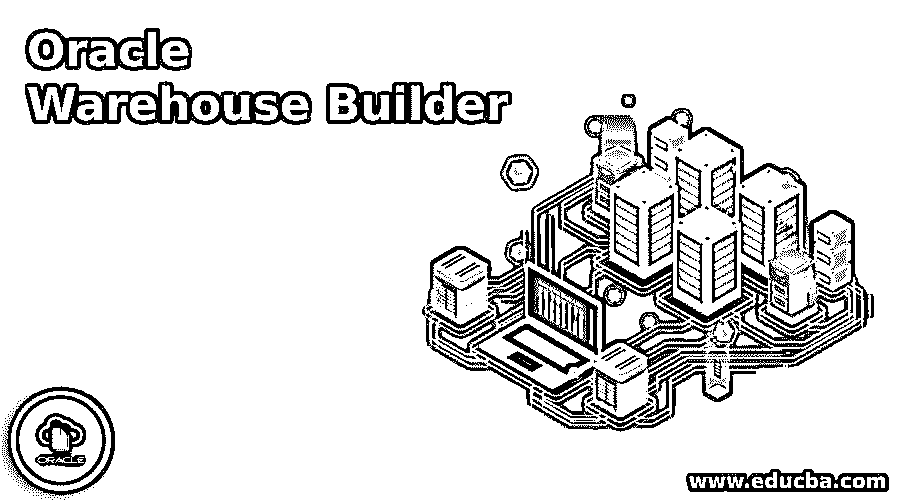
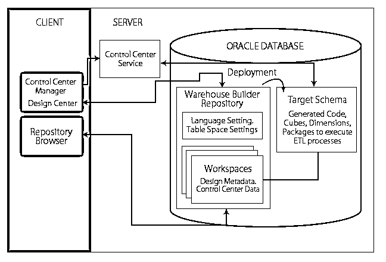

# Oracle 仓库生成器

> 原文：<https://www.educba.com/oracle-warehouse-builder/>

## 什么是 Oracle Warehouse Builder？

Oracle warehouse builder 是由 Oracle corporation 创建的 ETL(提取、转换、加载)工具，它提供了图形环境来创建和构建数据集成流程，这实际上是一种数据预处理技术，用于将来自多个数据源的数据合并到统一的视图中(将多个异构数据源合并到一个一致的源中),从而允许用户从多个数据源(如文件和多个数据库)中集成数据，以从数据中获得一些有价值且有意义的见解，用于进一步分析。

oracle warehouse builder 的主要功能领域包括数据建模、数据分析、数据质量、ETL(提取、转换、加载)、高级数据沿袭、元数据管理、ERP 应用程序数据的业务级集成、影响分析以及与用于报告目的的商业智能工具的集成。

<small>Hadoop、数据科学、统计学&其他</small>

### Oracle Warehouse Builder 的组件

Oracle warehouse builder 的主要组件讨论如下:

#### 1.仓库生成器客户端应用程序

oracle warehouse builder 客户端应用程序提供了一个 GUI(图形用户界面),允许用户定义、设计和实施商业智能系统。它使工作变得容易。部署管理器和代码生成器是客户端应用程序的组件。他们帮助创建和管理由用户创建的系统。

#### 2.部署经理

该组件负责管理与已部署对象和部署相关的所有方面。它允许用户选择要部署的对象以及用户希望部署这些对象的方式。部署对象后，可以执行这些对象。可以通过访问部署历史来管理用户系统的生命周期。

#### 3.编码发生器

该组件有助于基于存储库中的元数据生成脚本[，如 PL/SQL](https://www.educba.com/what-is-pl-sql/) 和 DDL。代码生成器增强了 Oracle 数据库系统的最佳性能。

#### 4.Warehouse Builder 运行时平台服务

warehouse builder 的服务器端组件是运行时平台服务。它允许部署和执行服务。如果用户想要运行这些服务，那么运行时平台服务应该是活动的。这有助于用户管理 warehouse builder 中映射和流程的执行。它确保部署和执行审计数据存储在运行时存储库中。

#### 5.Warehouse Builder 设计信息库

warehouse builder 设计存储库安装在 [Oracle 数据库](https://www.educba.com/what-is-oracle-database/)中。它存储 Warehouse Builder 中使用的所有对象的元数据定义或信息。它存储了用户想要创建或正在创建的目标系统的所有设计信息。存储在设计存储库中的元数据可以通过客户端用户界面进行访问。

#### 6.仓库生成器运行时存储库

warehouse builder 运行时资料档案库安装在 Oracle 数据库中。它存储了映射执行的所有数据以及流程流和部署数据。它存储用户打算创建的商业智能系统的环境信息。它还存储与所有部署位置相关的连接信息。

#### 7.审计存储库浏览器

它允许用户通过基于 web 的应用程序查看审计信息的执行和部署。生成的报告基于运行时存储库中的数据。

#### 8.元数据存储库浏览器

它允许用户通过基于 web 的应用程序查看存储在设计存储库中的元数据。所提供的信息是以适合面向业务的用户的格式组织的。生成的报告基于设计存储库中的数据。

### Oracle Warehouse Builder 是如何工作的？

Oracle warehouse builder 按照以下步骤创建数据仓库:

*   安装仓库生成器软件。
*   启动设计中心。
*   准备设计中心。
*   从项目浏览器中确定您想要使用的项目。
*   使用连接资源管理器，连接到源和目标数据对象。
*   确定要使用的目标模式。您可以使用 Oracle 数据库作为目标模式。这可以通过创建一个模块来完成。
*   确定执行环境。
*   根据客户偏好调整设置或选择默认设置。
*   导入源元数据。
*   必须为每种类型的设计对象创建模块。
*   元数据是从不同的数据源导入的。
*   分析数据并确保数据质量。
*   设计目标模式。
*   为目标模块创建和设计数据对象。
*   经常验证设计的对象是必要的。
*   配置数据对象。
*   生成代码。
*   设计 ETL 逻辑。
*   映射必须设计为显示从源到目标对象的数据流。
*   管理映射之间的依赖关系。
*   部署和执行解决方案。
*   从控制中心管理器或设计中心部署对象。
*   执行 ETL 逻辑。
*   监控和报告数据仓库。

### 使用 Oracle Warehouse Builder 可以做什么？

它可用于以下目的:

*   数据建模。
*   数据分析。
*   确保数据质量。
*   数据的提取、转换和加载。
*   ERP 应用数据的业务级集成。
*   元数据管理。
*   高级数据血统。
*   用于报告目的。
*   进行影响分析。

### 优势

下面给出了所解释的优点。

*   它缩短了设计时间，因为它提供了易于使用的向导驱动的用户界面、可视化编辑器等。
*   Warehouse builder 设计存储库是存储和管理所有系统信息的中心位置。由于它是单个位置，不一致的成本由于元数据冗余的减少而降低。
*   它减少了整合变更的时间。
*   代码没有错误，易于重新创建、维护和更新。
*   它利用技术投资。

### 结论

在本文中，我们详细讨论了 Oracle warehouse builder。这是第一代功能强大的工具，帮助许多组织创建仓库和报表，以补充其 ERP 应用程序。

### 推荐文章:

这是 Oracle Warehouse Builder 的指南。在这里，我们将讨论 Oracle Warehouse Builder 的组件、工作原理、优势和用途。您也可以浏览我们推荐的其他文章，了解更多信息——

1.  [数据仓库架构](https://www.educba.com/data-warehouse-architecture/)
2.  [甲骨文字符串函数](https://www.educba.com/oracle-string-functions/)
3.  [在甲骨文的职业生涯](https://www.educba.com/career-in-oracle/)
4.  [甲骨文面试问题](https://www.educba.com/oracle-interview-questions/)

