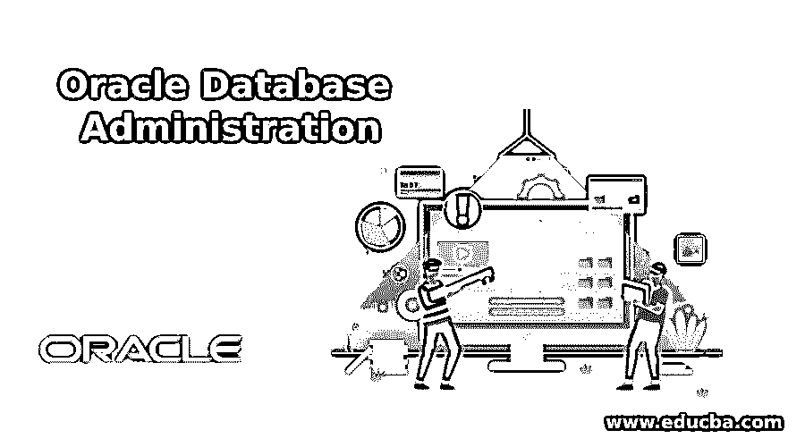

# Oracle 数据库管理

> 原文：<https://www.educba.com/oracle-database-administration/>

## 什么是 Oracle 数据库管理？

Oracle 数据库管理只是一个预定义的角色名，即 DBA。DBA 包含所有数据库系统级别的权限。所以，这是一个非常强大的角色。DBA 执行系统级任务，包括安装、配置、监控、调优、安全等。

Oracle 数据库管理是一个包含各种权限和责任的角色。要得到这个角色，需要技能和知识。下面列出。

<small>Hadoop、数据科学、统计学&其他</small>

*   非常好的关系数据库管理系统知识
*   关于 SQL 语言的知识
*   如何设计数据库
*   数据库文件分发知识
*   如何提高性能和调优
*   了解存储技术
*   数据库架构和设计知识
*   了解客户服务器模型
*   了解如何处理和组织大量数据

### 为什么我们需要 Oracle 数据库管理？

由于 DBA 角色包含系统级权限，因此 DBA 保持数据库环境正常运行。DBA 密切关注数据库的使用、安全性等。DBA 向用户授予访问权限。DBA 角色包括系统级问题故障排除、数据库设计、迁移、性能、安全性、安装、配置、容量规划、备份、恢复、硬件问题等。Oracle 数据库管理是在数据库系统级执行任务/工作的非常重要的角色。

### Oracle 数据库管理是如何工作的？

Oracle 数据库管理工作围绕系统级展开。DBA 支持生产环境，并为应用程序开发团队提供数据库服务。数据库管理员使数据库运行起来，并总是提高生产力。有许多服务、SQL 查询等在数据库上运行，由于这种情况下数据库服务器上的负载增加，DBA 跟踪并增强它。DBA 扮演着一个非常重要的角色，让数据库为客户问题提供更具生产力和创造性的解决方案。

### Oracle 数据库管理的角色

Oracle 数据库管理员专门从事 Oracle 数据库管理。面向系统级的 Oracle 数据库管理角色，包括数据库安装、维护、专门的数据处理、数据库恢复和备份任务。数据库管理员根据数据量制定存储计划。DBA 监控和优化性能也增强了缓慢执行或长时间运行的查询。DBA 是一个很好的专家，总是试图找到替代方法来减少生产数据库的负载。DBA 以能够处理大量数据的方式设计数据库。

下面列出了一些重要的角色:

*   DBA 处理数据库安装、修补、维护和监控
*   DBA 创建并维护 SQL 和 PL / SQL 查询以及 shell 脚本
*   DBA 处理内存利用和管理
*   DBA 增强和调整数据库系统
*   DBA 执行常规安全措施
*   DBA 执行数据库迁移
*   DBA 更改数据库实例
*   DBA 监控数据库系统

### Oracle 数据库管理的优势

Oracle 数据库管理有许多优点。

*   数据库管理员是数据库系统方面的专家
*   精通以不影响生产力的方式处理应用程序生成的大量数据。
*   DBA 总是增强数据库性能。
*   数据库管理员制作数据管理系统以减少数据冗余。
*   DBA 角色提供系统安全性、用户访问监控、维护存档数据、根据需要修改数据库结构等。
*   DBA 在数据提取、转换和加载方面非常专业和熟练
*   DBA 设计一个数据库来存储数据，以使用户更容易阅读和理解数据。
*   在 21 世纪，数据对每个人来说都是最重要和最关键的东西，数据库管理系统软件存储数据，DBA 提供来自未知用户的安全性和身份验证。
*   每天都会生成数百万条记录，这些记录需要在不丢失任何数据的情况下进行存储，因此 DBA 有责任相应地规划数据库容量。
*   DBA 调优数据库对象以获得快速响应。
*   需要存储的数据量日益增加，DBA 评估数据库服务器存储。
*   DBA 处理 Oracle 数据库服务器硬件问题。

**Note:** National Bureau of Labor predicted that Oracle Database Administration jobs will rise 11% through 2026.

### 结论

Oracle 数据库管理只不过是一个包含各种强大权限的角色。该特权提供了处理数据库系统并保持预期生产力的能力。Oracle 数据库管理员在维护数据库环境稳定运行以保持业务连续性方面非常专业和熟练。DBA 非常擅长处理大规模数据。

### 推荐文章

这是 Oracle 数据库管理指南。在这里，我们还将讨论 oracle 数据库管理的介绍和需求，以及角色和优势。您也可以看看以下文章，了解更多信息–

1.  [在 Oracle 中获取](https://www.educba.com/fetch-in-oracle/)
2.  [Oracle 唯一约束](https://www.educba.com/oracle-unique-constraint/)
3.  [甲骨文提交](https://www.educba.com/oracle-commit/)
4.  [Oracle 子查询](https://www.educba.com/oracle-subquery/)

