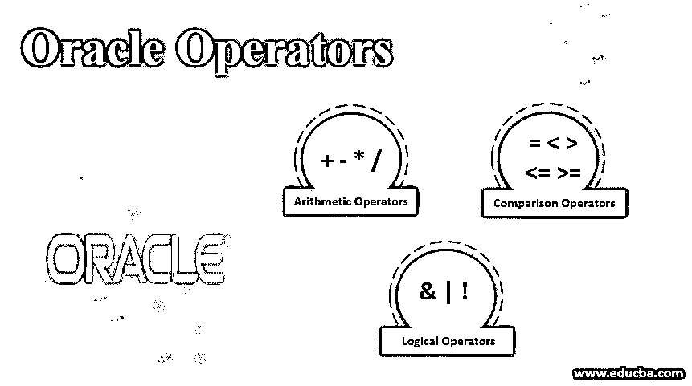
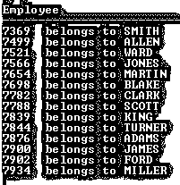
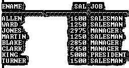
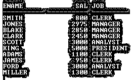
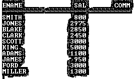

# Oracle 操作员

> 原文：<https://www.educba.com/oracle-operators/>

## 什么是 Oracle 运算符？

操作符只不过是代表一个动作或过程的字符或符号。运算符能够操作操作数项并返回结果。所有 oracle 操作符都被分成几个类别。它们列举如下:

*   一元和二元运算符
*   算术运算符
*   比较运算符
*   逻辑运算符
*   集合运算符
*   其他一些内置运算符
*   用户定义的运算符

### 7 大 Oracle 运营商

下面是不同的 oracle 运算符及其示例。

<small>Hadoop、数据科学、统计学&其他</small>

#### 1.一元和二元运算符

有两大类运算符。它们是:

*   **一元**:****T5】只对一个操作数进行运算的运算符称为一元运算符，格式为运算符操作数。****
***   **二元:**对两个操作数进行运算的运算符称为二元运算符，格式为操作数运算符 operand。**

 **#### **2。算术运算符**

 **通过 SELECT 语句，可以使用算术运算符。算术运算符的使用:

*   按照要求展示数据。
*   进行计算。
*   来执行数学运算。

算术表达式可以用什么？

*   表列名。
*   数值。
*   算术运算符。

可以使用算术运算符在数字或日期数据类型上创建算术表达式。在 FROM 子句中不能使用算术运算符。

支持的算术运算符有:

| ****操作员**** | ****描述**** |
| ****+**** | 添加 |
| ****–**** | 减法 |
| ********* | 增加 |
| ****/**** | 分开 |

****运算符优先级:****

 ***   **[ *，/，+，–]**
***   乘法和除法的优先级高于加法和减法。*   算术运算符从左到右得到求值它们具有相同的优先级 ****。*****   圆括号是优先考虑算术运算符计算的好选择。*   + / _ 运算符可以用作一元或二元运算符。**

 ****算术运算符示例:**

**查询:**

`SELECT 2*3/3+1-1 FROM DUAL;`

**输出:**

**查询:**

`SELECT 2*4/ ((3+1)-1) FROM DUAL;`

**输出:**

****Note:****  If any column value in an Arithmetic expression is NULL, the overall result is also NULL.

#### **3。比较运算符**

 ***   比较运算符用于将一个表达式与另一个表达式进行比较的情况。
*   WHERE 子句中运算符的格式是 WHERE 表达式运算符值。
*   不同的比较运算符如下所示:

| ****符号**** | ****名称**** |
| = | 等式运算符 |
| <>，！=, ^= | 非等式运算符 |
| > | 大于运算符 |
| < | 小于运算符 |
| >= | 大于或等于运算符 |
| <= | 小于或等于运算符 |

**比较运算符示例:**

**查询:**

`SELECT Ename, Sal, Job FROM Emp WHERE Job='MANAGER';`

**输出:**

**查询:**

`SELECT Ename, Sal, Job FROM Emp WHERE Sal>=3000;`

**输出:**

#### **4。逻辑运算符**

 **逻辑运算符将两个分量条件的结果组合在一起，产生一个结果。ORACLE 提供的逻辑运算符有:

| ****符号**** | ****名称**** |
| 和 | 逻辑合取运算符 |
| 运筹学 | 逻辑析取运算符 |
| 不 | 逻辑否定运算符 |

##### 逻辑积算符

*   如果两个或所有组件条件都为真，则返回 TRUE。
*   如果其中一个为假，则返回假，否则返回未知。

**真值表:**

T =真
F =假

| ****和**** | ****真实**** | ****假**** | ****NULL**** |
| ****真实**** | 英语字母表中第二十个字母 | 英语字母表中第六个字母 | 空 |
| ****假**** | 英语字母表中第六个字母 | 英语字母表中第六个字母 | 英语字母表中第六个字母 |
| ****NULL**** | 空 | 英语字母表中第六个字母 | 空 |

##### OR 运算符

*   如果任一部分为真，则返回 TRUE。
*   如果两个或所有组件条件都为假，则返回假，否则返回未知。

**真值表:**

| ****或**** | ****真实**** | ****假**** | ****NULL**** |
| 真实的 | 英语字母表中第二十个字母 | 英语字母表中第二十个字母 | 英语字母表中第二十个字母 |
| 错误的 | 英语字母表中第二十个字母 | 英语字母表中第六个字母 | 空 |
| 空 | 英语字母表中第二十个字母 | 空 | 空 |

##### “非”算符

*   如果以下条件为假，则返回 TRUE。
*   如果以下条件为真，则返回 FALSE。
*   如果条件未知，则返回 unknown。

**真值表:**

| ****不是**** | ****真实**** | ****假**** | ****NULL**** |
| 不 | 英语字母表中第六个字母 | 英语字母表中第二十个字母 | 空 |

**运算符优先级规则:**

默认的优先顺序是，

*   所有比较运算符
*   “非”算符
*   逻辑积算符
*   OR 运算符

**Note:** The order can be controlled using parenthesis.

#### **5。集合运算符**

 ***   集合运算符用于组合一个或多个表中关于相似数据类型的信息。他们可以将两个或多个查询组合成一个结果集。
*   所有 SELECT 语句中对应列的数据类型应该相同。不同类型的集合运算符有，
    1.  联合运算符
    2.  UNION ALL 运算符
    3.  交集运算符
    4.  减运算符

**语法:**

`< SQL Query>
{UNION | UNION ALL | INTERSECT | MINUS}
<SQL Query >;`

*   ****UNION:**** 它将两个 SELECT 语句的结果组合成一个结果集，然后从结果集中删除任何重复的行。
*   ****UNION ALL:**** 它将两个 SELECT 语句的结果组合成一个结果集，但不会从结果集中删除任何重复的行。
*   ****INTERSECT:**** 它只返回两个 SELECT 语句各自返回的那些行。
*   ****MINUS:**** 它接受一个 SELECT 语句的结果集，并删除第二个 SELECT 语句返回的那些行。

#### **6。其他内置运算符**

 **下面是几个内置的操作符。

##### **串联运算符**

 ***   串联运算符将列链接到另一列、算术表达式或常数值。
*   运算符两侧的列被组合成一个输出列。
*   结果列被视为字符表达式。
*   串联运算符在 ORACLE 中由双管符号( ****||**** )表示。

**查询:**

`SELECT Empno||' '|| ' belongs to '||Ename "Employee" FROM Emp;`

**输出:**

##### **在…和…运算符之间**

 ***   它用于显示基于一系列值的行。
*   声明的范围包括在内。
*   应该先声明下限。
*   运算符可用于任何数据类型。
*   运算符的否定不在…和…之间。

**查询:**

`SELECT Ename, Sal, Job FROM Emp WHERE Job BETWEEN 'MANAGER' AND 'SALESMAN';`

**输出:**

##### **在操作员**

 ***   它用于测试指定列表中的值。
*   运算符可用于任何数据类型。
*   这个运算符的否定不在。

**查询:**

`SELECT Ename, Sal, Job FROM Emp WHERE Job IN ‘SALESMAN’;`

**输出:**

**查询:**

`SELECT Ename, Sal, Job FROM Emp WHERE Job NOT IN ‘SALESMAN’;`

**输出:**

##### **是空运算符**

 ***   该运算符测试空值。
*   它是唯一可用于测试 NULL 的运算符。
*   此运算符的否定是 IS NOT NULL。

**查询:**

`SELECT Ename, Sal, Comm FROM Emp WHERE Comm IS NULL;`

**输出:**

**查询:**

`SELECT Ename, Sal, Comm FROM Emp WHERE Comm IS NOT NULL;`

**输出:**

#### 7 .**。用户定义的运算符**

 ***   与内置运算符一样，用户可以使用 CREATE OPERATOR 语句创建它们。
*   用户定义的运算符驻留在与表相同的名称空间中。
*   用户需要操作员权限来创建、删除、执行和修改操作员。

**语法:**

`CREATE OR REPLACE OPERATOR SCHEMA.OPERATOR
BINDING_CLAUSE;`

**BINDING_CLAUSE 语法:**

`BINDING
(parameter_type [, parameter_type]...)
RETURN return_type
[implementation_clause] using_function_clause
[, (parameter_type [, parameter_type]...)
RETURN return_type
[implementation_clause] using_function_clause]`

**例#1:**

`CREATE OR REPLACE FUNCTION equality_func (a VARCHAR2, b VARCHAR2)
RETURN NUMBER
AS
BEGIN
IF a = b THEN RETURN 1;
ELSE RETURN 0;
END IF;
END;`

**例 2:**

`CREATE OR REPLACE OPERATOR equality_operator
BINDING (VARCHAR2, VARCHAR2)
RETURN NUMBER
USING equality_func;`

### 结论

Oracle 操作符只不过是代表一个操作或过程的字符或符号。要操作单个数据项并返回结果，可以使用 Oracle 操作符。操作员处理单个数据项并返回结果。运算符由特殊字符或关键字表示。

### 推荐文章

这是 Oracle 操作员指南。在这里，我们讨论基本概念、7 大 oracle 操作符以及各种示例和查询实现。您也可以阅读以下文章，了解更多信息——

1.  [Oracle 中 INTERSECT 的实现](https://www.educba.com/intersect-in-oracle/)
2.  [Oracle UNION ALL |语法|示例](https://www.educba.com/oracle-union-all/)
3.  [在甲骨文的职业生涯](https://www.educba.com/career-in-oracle/)
4.  Oracle 中的[功能](https://www.educba.com/function-in-oracle/)

**************************