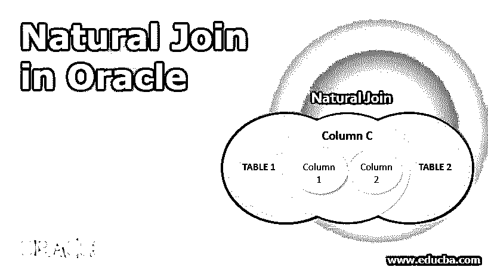

# Oracle 中的自然连接

> 原文：<https://www.educba.com/natural-join-in-oracle/>

## Oracle 中的自然连接简介

Oracle 中的自然连接是一种 SQL 查询技术，它将两个或多个表、视图或物化视图中的行组合在一起。自然联接根据参与联接的表中具有相同列名和数据类型的列来执行联接。为了执行这个连接操作，显式地使用了 Natural Join 关键字。

**集中点:**

<small>Hadoop、数据科学、统计学&其他</small>

*   自然连接结合多个表、视图或物化视图来检索数据。
*   自然联接返回满足相同列名和数据类型条件的所有行。
*   Oracle 提供了 Natural Join 关键字来执行自然连接。
*   如果自然连接不满足相同的列名和数据类型条件，那么它将返回一个笛卡尔结果。
*   自然连接不排除重复记录。

**语法:**

`SQL> SELECT Column_1, Column_2, Column_n FROM Table1 NATURAL JOIN                            Table2 WHERE condition;`

**描述:**

*   **Col_1/2/n:** 根据您的要求进行计算的列。
*   **表 1/2:** 根据表参与自然连接。
*   其中:可选。它用于过滤输出结果。

**举例:**

`SQL> SELECT Name, Designation, Salary, State, Deptnumber FROM Employee
NATURAL JOIN Dept_Category;`

**输出:**

### Oracle 中自然连接的规则和限制

以下是规则和条例:

*   自然连接不需要显式传递连接条件(公共列条件)，它自动查找公共列名和数据类型并执行连接。
*   如果所有参与的表中有多个列具有相同的名称和数据类型，那么自然连接也会将它们用于连接条件。
*   自然联接中使用的列不能有列限定符。

### Oracle 中的自然连接示例

下面是一些例子。在这里，我们将使用下面的样本表(员工&部门 _ 类别)和 14 & 8 条记录。

`SQL> SELECT * from Employee;`

**输出:**

`SQL> SELECT * from Dept_Category;`

**输出:**

#### 示例#1

没有任何条件的单个公共列的自然连接。

`SQL > SELECT Name, Designation, Salary, State, Deptnumber FROM Employee
NATURAL JOIN Dept_Category;`

**输出:**

在上面的示例中，自然联接使用 Deptnumber 列组合表(Employee 和 Dept_Category ),因为只有该列完全填充了两个表中相同的列名和数据类型条件。

#### 实施例 2

多个公共列的自然连接，没有任何条件。

`SQL> SELECT Designation, Sal, DOJ, Deptnumber FROM Emp NATURAL JOIN Employee;`

**输出:**

在上面的示例中，Emp 和 Employee 表参与了自然连接，这两个表都有两个公共列(DOJ 和部门编号)，每个表都有 14 条记录，部门编号列的所有数据都与其他表匹配。但是输出只返回 13 条记录。为什么？

因为在上面的例子中，有两个公共列(DOJ 和部门编号)作为连接条件参与。因此，Deptnumber 列的数据与其他表匹配，但 Emp 表中的 DOJ 列有一条与其他表不匹配的记录，因此自然联接排除了该记录并返回 13 条记录。

#### 实施例 3

没有任何公共列的自然联接。

`SQL> SELECT Designation, Sal, DOJ, Deptnumber FROM Emp NATURAL JOIN Employee;`

**输出:**

该 JOIN 语句返回 196 条记录。

但是每个表只包含 14 条记录。为什么是 196 张唱片？

因为两个表中没有公共列或相同的列名和数据类型。自然联接找不到任何公共列名和数据类型，所以它执行不带联接条件的联接，这意味着它将一个表中的每一条记录与另一个表中的每一条记录联接起来(14* 14)。这就是它返回 196 条记录的原因。这种运算或结果集被称为笛卡尔积。

#### 实施例 4

带有 WHERE 子句的 Oracle 自然连接。

`SQL > SELECT Name, Designation, Salary, State, Deptnumber FROM Employee
NATURAL JOIN Dept_Category WHERE Deptnumber =10;`

**输出:**

在上面的示例中，WHERE 子句条件筛选结果，并只返回 Deptnumber 为 10 的那些记录。

#### 实施例 5

带有列限定符的自然联接。

`SQL > SELECT E.Name, E.Designation, E.Salary, D.State, D.Deptnumber
FROM Employee E NATURAL JOIN Dept_Category D WHERE Deptnumber =10;`

**输出:**

在上面的例子中，E 和 D 分别是表的别名。列将别名用作从指定表中检索数据的限定符，但自然联接不接受列限定符并引发错误。因此，列限定符不能作为自然连接操作的一部分。

**温馨提示:**

*   星号(*)可用于检索参与连接的表的所有字段。但是它连接左表列左侧和右表列右侧列。
*   Oracle Natural Join 本质上类似于 Oracle 专有的 EQUI JOIN with join condition。

### 结论

Oracle Natural Join 是一个连接查询，它结合多个表、视图或物化视图来检索数据。它不需要显式声明连接条件，因为它隐式地认为连接条件基于相同的列名和数据类型。因此，它可以用于获取单个或多个连接条件的记录，而无需显式声明。

### 推荐文章

这是 Oracle 中自然连接的指南。这里我们讨论 Oracle 中自然连接的介绍、规则和限制，并给出相应的例子。您也可以看看以下文章，了解更多信息–

1.  [关系数据库模型](https://www.educba.com/relational-database-model/)
2.  [在甲骨文之间](https://www.educba.com/between-in-oracle/)
3.  [Oracle 中的分组依据](https://www.educba.com/group-by-in-oracle/)
4.  [甲骨文程序](https://www.educba.com/oracle-procedures/)

