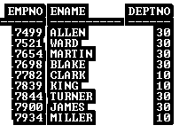
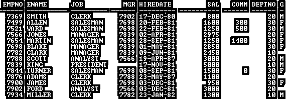
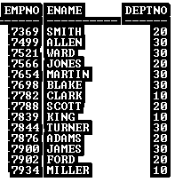
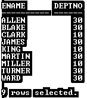
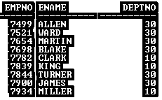

# Oracle 中的 UNION

> 原文：<https://www.educba.com/union-in-oracle/>

## Oracle 中的 UNION 运算符是什么？

oracle 数据库中的 UNION 运算符通过删除 UNION 运算符下的各种 SELECT 语句之间的重复行，将两个或多个 Oracle SELECT 语句返回的结果集组合成一个结果集，并且 UNION 运算符中的 SELECT 语句在 SELECT 语句返回的结果集中也应该具有相同数量的具有相同数据类型的字段。

**集中点:**

<small>Hadoop、数据科学、统计学&其他</small>

*   这些查询都是独立执行的，但是它们的输出是合并的。
*   只有最后一个查询以分号“；”结尾

**语法:**

`SELECT col_1, col_2, ..., col_n FROM TableName WHERE condition(s)
UNION
SELECT col_1, col_2, ..., col_n FROM TableName WHERE condition(s) ;`

**描述:**

*   **Col_1/2/n:** 根据您的要求进行计算的列。
*   **表名:**根据您的要求
*   其中:可有可无，取决于你的要求

**举例:**

`SELECT empno, ename, deptno FROM Emp WHERE deptno=10
UNION
SELECT empno, ename, deptno FROM Emp WHERE deptno=30
ORDER BY 1;`

**输出:**

### Oracle UNION 运算符的规则和限制

在实现 UNION 运算符之前，必须了解 UNION 运算符的一些重要规则和限制，如下所示:

*   查询的结果集必须具有相同的列数。
*   第二个结果集中每一列的数据类型必须与第一个结果集中对应列的数据类型相匹配。
*   这两个 SELECT 语句可能不包含 ORDER BY 子句，但是 UNION 操作的最终结果可以排序。
*   用于排序的列可以通过列号来定义。
*   为了对最终结果集进行排序，SELECT 语句可以包含 ORDER BY 子句，但最后一个 SELECT 语句只能包含 ORDER BY 子句。

### 结合实例实现 UNION 运算符

在这一节中，我们将看到 UNION 操作符的实现及其行为。为此，我们将在整个示例中使用下表(Emp)中的 14 条记录来理解 UNION 操作符的行为。

**查询:**

`SELECT * from Emp;`

**输出:**

#### 1.不带任何条件的 UNION 运算符

**查询:**

`SELECT empno, ename, deptno FROM Emp
UNION
SELECT empno, ename, deptno FROM emp;`

**输出:**

在这个带有 UNION 操作符的 SQL SELECT 语句中，我们得到了包含 EMP 表的相同的 14 条记录，因为每个 SELECT 语句生成一组单独的结果，但是在合并结果集的过程中，UNION 操作符消除了重复的记录。

#### 2.带有 WHERE 子句的 UNION 运算符

**查询:**

`SELECT ename, deptno FROM Emp WHERE deptno = 10
UNION
SELECT ename, deptno FROM Emp WHERE deptno = 30;`

**输出:**

在本例中，两个 SELECT 语句分别基于条件创建了一个单独的结果集，UNION 运算符合并了这两个结果集，并显示了一个最终结果，其中一个结果集中有 9 条记录，属于 deptno 10 & 30。

#### 3.具有不同列数的 UNION 运算符

**查询:**

`SELECT empno, ename, deptno FROM Emp WHERE deptno = 10
UNION
SELECT ename, deptno FROM Emp WHERE deptno = 30;`

**输出:**

因为 UNION 运算符规则和限制规定所有 SELECT 语句的结果集必须具有相同的列数。但是在本例中，第一条 SELECT 语句有三列，而第二条 SELECT 语句有两列。这就是输出显示不正确的结果列数错误的原因。

#### 4.具有无效列名的 UNION 运算符

**查询:**

`SELECT dname, ename, deptno FROM Emp WHERE deptno = 10
UNION
SELECT ename, deptno FROM Emp WHERE deptno = 30;`

**输出:**

因为列名“Dname”在 Emp 表中不存在。这就是得到无效标识符的原因。

**Note:** This example proves that each SELECT statement creates a separate result set.

#### 5.数据类型不匹配的 UNION 运算符

**查询:**

`SELECT ename, hiredate, deptno FROM Emp WHERE deptno = 10
UNION
SELECT ename, job, deptno FROM Emp WHERE deptno = 30;`

**输出:**

UNION 运算符规则和限制规定，第二个结果集中每一列的数据类型必须与第一个结果集中对应列的数据类型相匹配。但是在这个例子中，两个结果集中的列号是相同的，但是数据类型与结果集不匹配。第一个 SELECT 语句结果集包含日期数据类型的列“Hiredate ”,但第二个结果集包含不匹配的 VARCHAR2 数据类型的列“Job”。这就是输出显示数据类型错误的原因。

#### 6.带有 ORDER BY 子句的 UNION 运算符

**查询:**

`SELECT empno, ename, deptno FROM Emp WHERE deptno = 10
ORDER BY   empno
UNION
SELECT empno, ename, deptno FROM Emp WHERE deptno = 30 ;`

**输出:**

在此示例中，即使列号和数据类型条件与两个结果集都匹配，输出也会引发错误。为什么会出错？

在此示例中，第一个 SELECT 语句使用 ORDER BY 子句对结果集进行排序。但是我们只能在最后一个 SELECT 语句中使用 OREDER BY 子句。

**查询:**

`SELECT empno, ename, deptno FROM Emp WHERE deptno = 10
UNION
SELECT empno, ename, deptno FROM Emp WHERE deptno = 30
ORDER BY   empno;`

**输出:**

在此示例中，最后一个 SELECT 语句使用 OREDER BY 子句对结果进行排序，没有任何错误。

**提示:**在 ORDER BY 子句中，还可以用列位置号代替列名。在某些情况下，UNION 操作比其他操作(连接、子查询等)更昂贵。)

#### 7.具有空列的 UNION 运算符

**查询:**

`SELECT Deptno, SUM(Sal) SalSum FROM Emp GROUP BY Deptno
UNION
SELECT NULL, SUM(Sal) FROM Emp;`

**输出:**

**Note:** NULL doesn’t have any data type so ORACLE considered it according to the corresponding column Data type.

### 结论

UNION 运算符执行垂直连接并消除重复记录。如果要查找唯一的记录，请使用 UNION，但列号和数据类型必须相同。

### 推荐文章

这是 Oracle 中 UNION 运算符的指南。这里我们讨论规则和限制，以及各种 UNION 操作符的例子。您也可以阅读以下文章，了解更多信息——

1.  [甲骨文面试问题](https://www.educba.com/oracle-interview-questions/)
2.  [了解 MySQL 模式](https://www.educba.com/what-is-a-mysql-schema/)
3.  [详细使用 SQL](https://www.educba.com/uses-of-sql/)
4.  [顶级道德黑客工具及其特性](https://www.educba.com/ethical-hacking-tools/)
5.  [不同 Oracle 版本指南](https://www.educba.com/oracle-versions/)
6.  [在 Oracle 中实现 GROUP BY](https://www.educba.com/group-by-in-oracle/)

