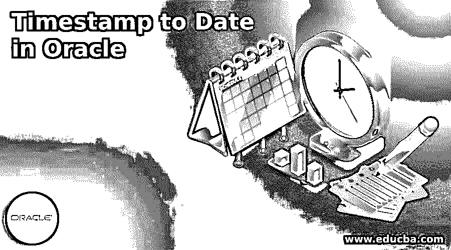

# Oracle 中迄今为止的时间戳

> 原文：<https://www.educba.com/timestamp-to-date-in-oracle/>

## Oracle 中的时间戳简介

oracle 为用户提供了不同的日期和时间戳函数和格式，我们可以根据用户的要求将时间戳转换为日期，在 oracle 中，我们可以使用 alter table 命令或 cast 函数进行转换，Oracle 数据库以一种简单明了的方式处理日期格式，非常容易理解和处理，但许多用户和 PL/SQL 开发人员对时间戳和日期数据类型有困难。时间戳和日期的主要问题是他们不知道如何存储日期和时间戳。但是，到目前为止，时间戳的转换非常容易。

**语法:**

<small>Hadoop、数据科学、统计学&其他</small>

`select specific function (system current timestamp) alias from specified table name;`

**说明:**

*   在上面的语法中，我们选择了一个带有指定函数的子句，这意味着从系统中获取当前时间戳的 cast function 之后，我们对结果使用别名，并从指定的表返回。

### 如何在 Oracle 中将时间戳转换为日期？

下面给出了我们如何在 oracle 中将时间戳转换为日期:

#### 日期数据类型:

当我们考虑寻址日期和时间时，这是我们通常非常熟悉的数据类型之一。它用于存储不同形式的值，如月、日、年、世纪、小时、分钟和秒。当某件事情已经发生或以后应该发生时，它通常用于处理信息。当两个事件发生在彼此的某个时刻内时，当试图决定两个事件之间的时间段时，date 数据类型的问题是它的粒度。

这里我们将时间戳转换为日期数据类型，但是日期存在一些问题，例如，由于日期数据类型的原因，我们无法确定哪个事件先发生，哪个事件后发生，因此我们使用时间戳数据类型来根据需要轻松确定事件时间和日期。

oracle 数据库使用 DD–MON–YY 日期格式，这是 Oracle 的标准格式，由 NLS 日期格式参数控制。当用户需要显示当时的日期值时，oracle 数据库首先将该日期值转换为 oracle 的指定内部格式。这种转换使用 TO_CHAR 函数。Oracle 有一个默认的日期格式，即 DD–MON–YY。

Oracle 数据库根据用户需求使用如下数据函数:

*   **CURRENT_DATE:** 我们可以使用这个函数返回当前时区的当前系统日期和时间。
*   **SYSDATE:** 通过使用这个函数，我们可以获取系统当前的日期。
*   **SYSTIMESTAMP:** 通过使用该函数，我们可以获取当前日期和时间，以系统的小数秒为单位。
*   **MM:** 使用该参数，我们可以用数字格式显示月份，例如 09。
*   **MON:** 该参数用于返回月份名称，例如 APR。
*   **MONTH:** 通过使用该参数，我们显示月份的全名，例如，APRIL。
*   **DD:** 通过使用该参数，我们可以显示日期，例如 12。
*   **DY:** 通过使用这个参数，我们可以显示一天的名称，例如，MON。
*   **YYYY:** 通过使用该参数，我们显示年份，例如 2021 年。
*   **YY:** 通过使用这个参数，我们显示了年份的最后两位数，例如 21。

为了将时间戳转换为日期，我们使用 cast 函数，该函数作用于系统的当前时间戳，基本上时间戳包含关于日期的全部细节，即小时、分钟和秒，但有时我们只需要日期，此时我们需要将时间戳转换为日期数据类型。这是一个非常简单的函数，我们可以在 SQL 语句中直接使用它。

### Oracle 中迄今为止的时间戳示例

下面是 Oracle 中迄今为止的时间戳示例:

但是，首先，我们需要使用如下 SQL 语句创建一个新表。

**代码:**

`create table t_d(timedate timestamp(4));`

**说明:**

*   在上面的例子中，我们使用 create table 语句创建了一个新的表名 t_d，其中 timedate 列和时间戳为 4。

**输出:**

在使用如下语句插入时间戳值之后。

**代码:**

`insert into t_d select systimestamp from dual;`

**说明:**

*   在上面的例子中，我们使用 insert into 语句将时间戳插入到 t_d 表中，这里我们从 dual 表中获取时间戳，该表是系统生成的表，因此我们尝试获取当前时间戳和我们插入到 t_d 表中的时间戳，如上面的语句所示。

**输出:**

现在，我们可以通过使用如下语句来查看时间戳。

**代码:**

`select * from t_d;`

**说明:**

*   在上面的例子中，我们使用 select 子句查看从 dual 表中插入的时间戳。

**输出:**

现在使用 alters table 命令，通过下面的语句从时间戳转换日期，如下所示。

**代码:**

`alter table t_d modify (timedate date);`

**说明:**

*   在上面的例子中，我们使用 alter table 命令从系统时间戳转换日期，如上面的语句所示。

**输出:**

最后，我们可以通过使用下面的语句来查看我们从时间戳转换的日期。

**代码:**

`select * from t_d;`

**说明:**

*   在上面的例子中，我们使用 select 子句查看从时间戳转换的日期。

**输出:**

这样，我们就可以在 oracle 中将时间戳转换为日期，我们还可以进行转换。

### 结论

从上面的文章中，我们看到了迄今为止时间戳的基本语法，还看到了迄今为止时间戳的不同示例。从本文中，我们看到了如何以及何时在 oracle 中使用时间戳。

### 推荐文章

这是一个关于 Oracle 中时间戳的指南。这里我们讨论一下入门，如何在 oracle 中把时间戳转换成日期？还有例子。您也可以看看以下文章，了解更多信息–

1.  [甲骨文编号](https://www.educba.com/oracle-number/)
2.  [甲骨文解码](https://www.educba.com/oracle-decode/)
3.  [甲骨文实用程序](https://www.educba.com/oracle-utilities/)
4.  [甲骨文探路者](https://www.educba.com/oracle-pathfinder/)

