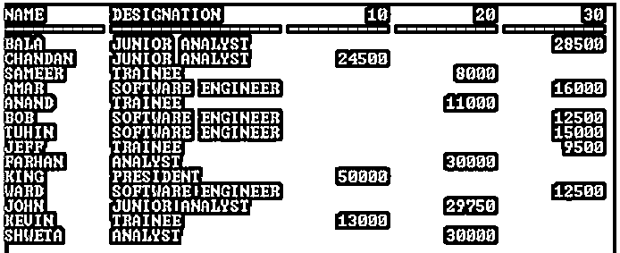
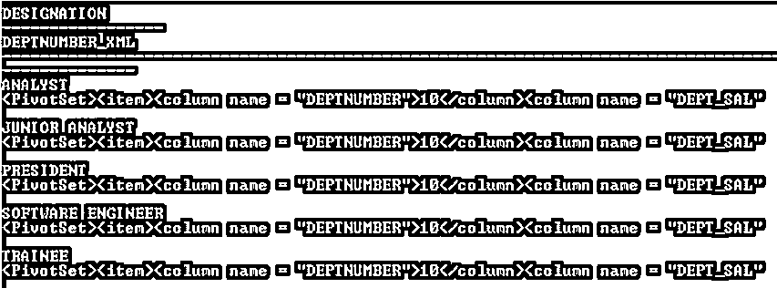

# Oracle 中的透视

> 原文：<https://www.educba.com/pivot-in-oracle/>

## 什么是 Oracle PIVOT 子句？

Oracle PIVOTclauseis 用于获得矩阵形式的结果。它允许我们以交叉列表的形式编写查询。它还使我们能够将行转置成列。它是在 Oracle 11g 版本中引入的，支持 11g 或更高版本。这是一个非常有用的函数，可以将行转置为列，并在此过程中聚合数据。它也称为交叉表查询。PIVOT 子句中可以使用多个列。如果需要将行转换成列来分割出一组特定的数据点，那么可以使用 PIVOT 子句。

### 语法和参数

oracle 中透视的语法:

<small>Hadoop、数据科学、统计学&其他</small>

**语法:**

`SELECT Columns FROM Table_Name
PIVOT [XML] (
Pivot_Clause
Pivot_For_Clause
Pivot_In_Clause
)   WHERE Conditions`

**参数:**

*   **列**:需要显示或提取的列。
*   **Table_Name** :可用于数据的表格。
*   **XML** :用于将透视数据转换成 XML。这是一个可选的关键字。
*   **Pivot_Clause** :对列的数据使用 Oracle 聚合函数，相应地填充透视列。Oracle 聚合函数包括 SUM、COUNT、MIN、MAX 或 AVG。
*   **Pivot_For_Clause** :在该子句中，指定将要分组或透视的列。
*   **Pivot_In_Clause:** 用于定义 Pivot_For_Clause 中指定列的过滤器。
*   **WHERE** :该子句用于过滤数据。这是可选的。

**Note:** Subquery can be used instead of Table_Name. It’s not mandatory but it depends on the requirement. ORDER BY clause can be used for sorting the result but it could be the last clause. Subquery can be used for Pivot_In_Clause to get the column name.

### Oracle 中的 PIVOT 子句是如何工作的？

PIVOTclause 是许多数据仓库应用中的一项关键技术。它的主要功能是将行转置到列中。它将多个输入行转换为列，在循环过程中聚合数据。

### 实现 EXTRACT()函数

在本节中，我们将看到 Oracle PIVOT 子句的实现及其行为。为此，我们将使用下面包含 14 条记录的示例表(Employee)来理解 Oracle PIVOT 子句的行为。

`SELECT * FROM Employee;`

**输出:**

#### 1.Oracle PIVOT 子句

`SELECT * FROM (SELECT Name, Designation, Deptnumber, Salary FROM                  Employee) PIVOT (SUM (Salary) FORDeptnumber IN (10,20,30));`

**输出:**

在上面的示例中，PIVOTclause SUM()函数对使用 Pivot FOR 子句声明的 salary forDeptnumbrwhich 执行求和。在 Pivot IN 子句中，已经声明了指向 FOR 子句 Deptnumbr 列的部门编号，并将 Deptnumbr 列值转换为列名，并按编号显示薪金部门的总和。

#### 2.透视列别名或别名

透视列别名不过是为列或值提供一个临时名称。

*   在 Pivot_Clause 中，一个或多个列可以有别名。
*   在 Pivot_In_Clause 中，一个或多个值可以有别名。
*   最终的列名(别名之后)将是:

`Pivot_In_Clause Alias || ‘_’ || Pivot_Clause Alias
SELECT * FROM (SELECT Designation, Deptnumber, Salary FROM Employee)                       PIVOT (SUM (Salary) Dept_Sal FOR Deptnumber IN (10, 20, 30));`

**输出:**

在上面的示例中，Dept_Sal 是 Pivot_Clause (SUM (Salary))的别名。使用下划线“_”将别名与 Pivot_In_Clause 连接或添加在一起。

#### 3.PIVOT 子句中的多列

在 PIVOT 子句中，可以在 Pivot_Clause 中使用多个列。

`SELECT * FROM (SELECT Designation, Deptnumber, Salary FROM Employee)          PIVOT (SUM (Salary) Dept_Sal, COUNT(DeptNumber) Dept_Count FOR                             Deptnumber IN (10, 20));`

**输出:**

在上述 PIVOTClause 中，Pivot_Clause 中有两列(Salary & DeptNumber)用于聚合。输出显示工资部门的总和以及属于同一部门、具有相同职务的雇员部门数量，并返回结果

#### 4.Oracle PIVOT 中的子查询

`SELECT * FROM (SELECT Designation, Deptnumber, Salary FROM Employee)    PIVOT (SUM(Salary) Dept_Sal, COUNT(DeptNumber) Dept_Count FOR                                   Deptnumber IN (select Deptnumber from employee));`

**输出:**

上面的 PIVOT 子句示例返回一个错误“缺少表达式”。为什么？

因为子查询返回所有部门值意味着重复值，所以不允许或不接受 in Pivot_In_Clause 子查询。如果声明，它将返回一个错误。

但是 Sub Query 可以用在 Pivot_In_Clause 中，参见下面的例子。

`SELECT * FROM (SELECT Designation, Deptnumber, Salary FROM Employee)    PIVOT (SUM(Salary) Dept_SalFOR Deptnumber IN (select Deptno FROMEmp));`

**输出:**

在上面的 Pivot 子句中，使用了一个子查询来填充 Pivot_In_Clause 中的部门编号，它返回一个没有任何错误的输出。因为在上面的示例中使用了 XML 关键字，它将子查询返回值转换为单个 XML 字符串列。

**Note:** Subquery must return a list of unique value(s). In Subquery Group by clause won’t work for unique value instead of XML keyword.

### 结论

Oracle PIVOTclause 是一个非常有用的子句，它在数据分析或交叉表报告领域添加了更多实用的功能。Pivot 子句减少了复杂、不直观或冗长代码的编写。这是一种非常有效的转置数据的方法。

### 推荐文章

这是 Oracle 中的 PIVOT 指南。在这里，我们还将讨论 oracle 中的简介以及 pivot 子句是如何工作的？以及不同的示例及其代码实现。您也可以看看以下文章，了解更多信息–

1.  [Oracle 锁表](https://www.educba.com/oracle-lock-table/)
2.  [IF THEN ELSE in Oracle](https://www.educba.com/if-then-else-in-oracle/)
3.  [Oracle REGEXP_REPLACE](https://www.educba.com/oracle-regexp_replace/)
4.  [Oracle 基数](https://www.educba.com/oracle-cardinality/)

