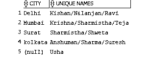

# Oracle GROUP_CONCAT

> 原文：<https://www.educba.com/oracle-group_concat/>

## Oracle GROUP_CONCAT 简介

GROUP_CONCAT 函数可以在 oracle 中定义为一个聚合(GROUP BY)函数，它以给定的顺序连接(意味着链接在一起)一个组中的所有字符串，用给定的分隔符将它们分隔开，并且它返回一个字符串数据类型的结果，其中包含来自一个组的连接的非空值，如果一个组中没有非空值，则该函数在该特定情况下返回空值。

现在，让我们来看看这个函数的语法。

<small>Hadoop、数据科学、统计学&其他</small>

**语法:**

`GROUP_CONCAT ([DISTINCT] expression [, expression ...] [ORDER BY {col_name}
[ASC | DESC] [, col_name ...]] [SEPARATOR str_val])`

**参数**

*   **Distinct:** 它消除了结果集中的重复值。
*   **排序依据:**用于对元素进行升序或降序排序。
*   **表情:**是指表情。
*   **col_name:** 是指列的名称。
*   **分隔符:**分隔符是指用来分隔组值的字符。默认分隔符是逗号(，)。

### 函数 Group_Concat 是如何工作的？

在本文的前面部分，我们讨论了 group_concat 函数的定义。现在让我们来讨论函数功是如何起作用的。group_concat 函数是一个聚合函数，它将多行中的多个数据连接成一个文件。假设我们想从基于雇员所在城市的特定表 employee 中找到所有雇员的名字的数据。这个功能使它变得简单。因此，当我们执行该函数时，该函数将使用 group by 子句根据唯一的城市对所有数据集进行分组。现在，该函数会将每个组中的所有名称连接成一行，该行中的每个元素用逗号分隔(默认)。如果我们提供独特的功能，那么它将只允许在单一领域的唯一值。

现在让我们看看各种场景和一些例子。

### Group_Concat 函数的示例

浏览这些示例对于更好地理解使用 group_concat 函数的不同场景非常重要。

#### 示例 1–使用基本的 Group_Concat 函数

在这个场景中，我们将使用函数来查找雇员表中属于特定城市的雇员的姓名列表。需要注意的一点是，即使城市为空或不存在，它也将被视为一个组。现在让我们看一下同样的查询。

**查询:**

`SELECT city, GROUP_CONCAT (name) as "NAMES"
FROM employee group by city;`

在这个查询中，我们可以看到，我们没有提供任何分隔符，但数据库将默认采用逗号作为分隔符，以防开发人员没有明确提到。

现在让我们执行查询并查看结果。

正如我们在上面的截图中看到的，输出中显示了每个城市的雇员姓名。

#### 示例 2–使用 Group_Concat Distinct

在这种情况下，我们将对 group_concat 函数使用 DISTINCT。使用 DISTINCT 关键字的原因是它将只显示属于每个组的唯一值。不允许重复的值。在本例中，我们将在员工表中只打印属于每个城市的唯一员工名字。这里，表格将按城市分组，这样每个城市就变成了一个组。让我们看看同样的查询。

**查询:**

`SELECT city, GROUP_CONCAT (DISTINCT name) as "UNIQUE NAMES"
FROM employee group by city;`

我们可以看到，在查询中，我们刚刚添加了带有 name 列的 DISTINCT 关键字。因此，与上一个示例相比，这个查询没有太大的变化。

让我们执行查询并检查输出结果。

正如我们在输出截图中看到的，每行都没有重复的名称。

#### 示例# 3–在 Group_Concat 中使用不同的分隔符

在这种情况下，我们将使用不同的分隔符，如“/”。我们知道默认的分隔符是逗号(，)。我们将使用与上面相同的例子。唯一的区别是我们将使用不同的分隔符“/”。让我们看看同样的查询。

**查询:**

`SELECT city, GROUP_CONCAT (DISTINCT name SEPARATOR ‘/’) as "UNIQUE NAMES"
FROM employee group by city;`

我们可以看到，在查询中我们添加了一个不同的分隔符“/”。这将导致“/”被用作员工姓名之间的分隔符。

让我们在 SQL developer 中运行查询并检查结果。

在上面的屏幕截图中，我们可以看到 unique names 列的每一行中的每个雇员姓名都由字符“/”分隔。

#### 示例# 4–在 Group_Concat 中使用 Order by 子句

在这个场景中，我们将在 GROUP_CONCAT 函数中使用 ORDER BY 子句。ORDER BY 子句以特定的顺序对组中的值进行排序，然后连接组中每个排序后的值。在本例中，我们将按降序打印特定城市的每个不同雇员的姓名。该查询将首先根据城市对表进行分组，然后属于每个组的不同名称将按降序排序，然后将所有排序后的值连接起来。让我们看看同样的查询。

**查询:**

`SELECT city, GROUP_CONCAT (DISTINCT name ORDER BY name DESC SEPARATOR ‘/’) as "UNIQUE NAMES"
FROM employee group by city;`

让我们执行查询并检查结果。

正如我们在上面的截图中看到的，这些值是按降序排列的。

### 结论–Oracle GROUP _ CONCAT

在本文中，我们一开始就讨论了 GROUP_CONCAT 函数的定义和语法。稍后，在本文中，我们讨论了 GROUP_CONCAT 函数的工作方式以及不同的场景和示例，以便更好地理解该函数。

### 推荐文章

这是 Oracle GROUP_CONCAT 的指南。在这里，我们将讨论函数 Group_Concat 如何与示例一起工作。您也可以阅读以下文章，了解更多信息——

1.  [甲骨文提交](https://www.educba.com/oracle-commit/)
2.  [甲骨文通配符](https://www.educba.com/oracle-wildcards/)
3.  Oracle 中的[功能](https://www.educba.com/function-in-oracle/)
4.  [Oracle 中的外部连接](https://www.educba.com/outer-join-in-oracle/)

