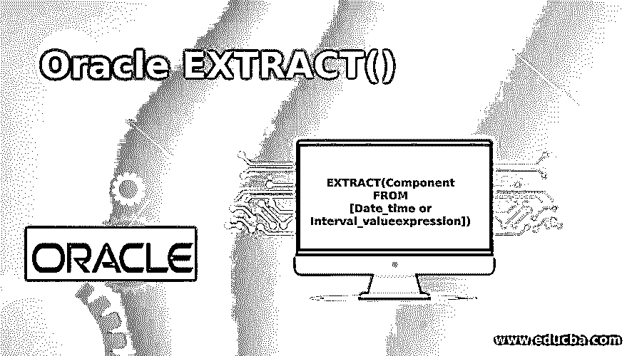
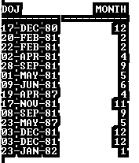

# Oracle EXTRACT()

> 原文：<https://www.educba.com/oracle-extract/>

## 什么是 Oracle EXTRACT()函数？

Oracle EXTRACTFunction 用于从给定的输入中提取组件，正如 EXTRACTFunction 的名称所示。它提取并返回指定的日期时间值或间隔值。

*   如果我们提取它，它将返回一个包含适当时区名称或缩写的字符串。
*   这是一个非常有用的函数，可以在一个大表中操作日期时间。
*   Oracle 9i 或更高版本支持 EXTRACT()函数。
*   它用于提取时间戳、日期。给定输入中的间隔值或 XML 组件。
*   在日期时间字段和间隔值表达式的组合不明确的情况下，Oracle 返回未知结果。

**语法**

<small>Hadoop、数据科学、统计学&其他</small>

`EXTRACT(Component FROM [Date_time or Interval_valueexpression])`

**组件有:**年、月、日、小时、分钟、秒、时区小时、时区分钟、时区区域、时区缩写

**描述**

*   **成分:**上面列出了，要提取。
*   **【Date _ time 或 Interval _ value expression】**:可以是日期或时间戳，也可以是区间值，可以使用组件从中提取字段。

**提取 XML 组件的语法**

`EXTRACT(xml-type-instance, 'xpath', 'namespace')`

**描述**

*   该函数用于选择一个节点或一组节点及其叶节点。这类似于 EXISTNODEfunction
*   该函数接受两个参数。
*   **xml-type-instance** :对象值
*   **'xpath':** 这是函数从中提取节点细节的路径。它可以是绝对或相对类型。
*   **命名空间**:可选参数。

### Oracle 中 EXTRACT()函数是如何工作的？

正如 extract 函数名所示，它是一个从给定的表达式或值中提取一些细节的函数。它接受组件，并基于它从 Date_time 或 Interval_valueexpression 中提取值。

*   如果组件是年/月，则表达式数据类型必须是日期、时间戳、带时区的时间戳、带本地时区的时间戳或年到月的间隔。
*   如果组件是日，则表达式数据类型必须是日期、时间戳、带时区的时间戳、带本地时区的时间戳或日秒间隔。
*   如果组件是小时、分钟或秒，则表达式数据类型必须是时间戳、带时区的时间戳、带本地时区的时间戳或天到秒的间隔。在 Oracle 中，日期数据类型不存储时间或时间字段。
*   如果组件是 TIMEZONE_HOUR、TIMEZONE_MINUTE、TIMEZONE_ABBR、TIMEZONE_REGION 或 TIMEZONE_OFFSETthenexpression，则数据类型必须是带时区的时间戳或带本地时区的时间戳。

### EXTRACT()函数的实现及示例

在本节中，我们将看到 Oracle EXTRACT 函数的实现及其行为。为此，我们将使用下面的示例表(Employee&Msg)和 14 & 4 条记录来理解 Oracle EXTRACT()函数的行为。

`SELECT * FROM Employee;`

**输出:**

`SELECT Dtime FROM Msg;`

**输出:**

#### 提取()函数

`SELECT DOJ, EXTRACT(Month FROM DOJ) MONTH FROM Employee;`

**输出:**

在上面的示例中，EXTRACT 函数采用月份组件，并从给定的表达式(即雇员表中的 DOJ 列)返回月份的数值。

#### 数据类型为日期的 EXTRACT()函数

`SELECT DOJ, EXTRACT(YEAR FROM DOJ) YEAR FROM Employee;`

**输出:**

在上面的示例中，EXTRACT 函数采用 Year 组件，并从给定的表达式(即 Employee 表中的 DOJ 列)返回 YYYY 格式的年份数值。

`SELECT DOJ, EXTRACT(Hour FROM DOJ) HOUR FROM Employee;`

**输出:**

上面的 SQL 语句抛出错误，为什么？

因为在上面的提取函数中，组件是小时，但表达式或列是日期数据类型，不存储时间信息或数据。因此，Extract 函数试图提取小时，但它无法从列数据中找到小时。这就是它抛出错误的原因。

#### 具有时间戳数据类型的 EXTRACT()函数

在 Msg 表中，Dtime 列是一个时间戳数据类型，它包含带有日期和时区的时间详细信息。

`SELECT Dtime, EXTRACT(Hour FROM DTIME) HOUR FROM Msg;`

**输出:**

在上面的示例中，EXTRACT 函数从给定的表达式(即 Employee 表中的 DOJ 列)中获取小时部分并提取 24 小时格式的小时信息。

#### 提取()函数

这对于根据需要将时间或时间戳数据分成多列非常有用。

`SELECT Dtime, EXTRACT(month from dtime) Month,
EXTRACT(day FROMDtime) day,
EXTRACT(year FROMDtime) year,
EXTRACT(Timezone_hourFROM Dtime) T_ZONE_HOUR,
EXTRACT(Timezone_abbr FROM Dtime) T_ZONE_ABB
FROM Msg;`

**输出:**

上面的 EXTRACT 函数示例显示了它对于从日期、时间戳或 Interval_valueexpression 中提取信息是一个非常强大的函数。

**温馨提示:**

*   使用 EXTRACT 函数时，要特别注意日期和时间戳数据类型表达式。

### 结论

Oracle EXTRACT()函数是从日期、时间戳或 Interval_valueexpression 中提取信息的非常有用的函数。这个函数用于使用像月这样的成分将日期或时间戳数据类型分成两部分。日期等。

### 推荐文章

这是 Oracle EXTRACT()的指南。这里我们讨论什么是 Oracle EXTRACT()，使用适当的语法和相应的示例来更好地理解。您也可以浏览我们的其他相关文章，了解更多信息——

1.  [甲骨文 MD5](https://www.educba.com/oracle-md5/)
2.  [SQL INSTR()](https://www.educba.com/sql-instr/)
3.  [MySQL 中的汇总](https://www.educba.com/rollup-in-mysql/)
4.  [Oracle 自联接](https://www.educba.com/oracle-self-join/)

