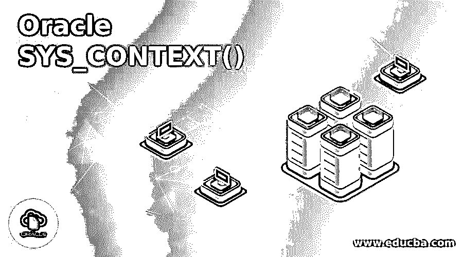

# Oracle SYS_CONTEXT()

> 原文：<https://www.educba.com/oracle-sys_context/>

## Oracle SYS_CONTEXT()简介

SYS_CONTEXT 只是一个 Oracle 函数，它返回当前数据库会话的相关信息。此函数有助于检索有关 Oracle 环境的信息。这是一个基于参数的函数，它接受参数并返回该参数的相应值。

**集中点:**

<small>Hadoop、数据科学、统计学&其他</small>

*   这个函数返回当前时刻的信息。
*   该函数可以在 SQL 或 PL / SQL 语句中使用。
*   它必须在本地执行
*   SYS_CONTEXT 函数在每次 SQL 语句执行时计算一次。
*   该函数以 VARCHAR2 数据类型返回输出。
*   输出的默认长度是 256 字节。

### 句法

Oracle SYS_CONTEXT 函数语法如下

`SYS_CONTEXT (Namespace, Parameter, [, Length])`

**说明:**

*   **名称空间**:是有效的 ORACLE SQL 标识符。它必须已经创建。
*   **参数**:可以是任意字符串。不区分大小写。参数的长度必须小于或等于 30 字节(长度< = 30 字节)。必须已经使用 DBMS_SESSION 设置了此参数的属性或值。SET_CONTEXT 过程。
*   **长度**:可选。它用于使用“长度”参数更改或覆盖长度。长度参数的有效范围是 1 到 4000 字节。Oracle 忽略无效的长度范围，并使用默认范围。返回值的默认范围是 256 字节。

### 与 Oracle SYS_CONTEXT()一起使用的运算符

“USERENV”是 Oracle 的内置命名空间。它是一个 SQL 标识符，用于检索当前数据库会话的信息。与名称空间相关联的参数是信息变量。

下面列出了与名称空间' USERENV '关联的参数，这些参数对于检索数据库中的当前会话信息非常有用:所有列出的参数在 Oracle 11g 版本中都可用。

| **参数** | **描述** | **长度****(字节)** |
| 行为 | 它返回应用程序名称 | Thirty-two |
| AUDITED_CURSORID | 它返回 SQL 的游标 id | 钠 |
| 认证 _ 数据 | 返回用于登录的身份验证数据 | Two hundred and fifty-six |
| 认证类型 | 返回用户身份验证的类型，即数据库、操作系统、网络等。 | Thirty |
| BG _ 工单 _ID | 如果 Oracle 建立后台进程，则返回当前会话的作业 id，否则返回 NULL | Sixty-four |
| 客户端标识符 | 返回客户端标识符由应用程序通过 DBMS_SESSION 设置。SET_IDENTIFIER 过程 | Sixty-four |
| 客户端信息 | 返回使用 DBMS_APPLICATION_INFO 包存储的用户会话信息。 | Sixty-four |
| 当前模式 | 返回当前架构的默认架构的名称 | Thirty |
| 当前 _SCHEMAID | 返回当前会话的默认架构的 ID | Thirty |
| CURRENT_SQL当前 _SQLn | 它返回触发审计的第一个 4k 字节 SQL，n 是从 1 到 7 的整数，返回后续 4k 字节增量。如果 n=2，那么它返回 8k 到 12k 字节。 | Four |
| 当前用户 | 返回当前用户名 | Thirty |
| 当前用户标识 | 返回当前用户标识 | Thirty |
| 数据库域 | 返回 DB_DOMAIN 初始化参数中指定的数据库域名。 | Two hundred and fifty-six |
| 数据库名称 | 返回 DB_NAME 初始化参数中指定的数据库名称。 | Thirty |
| 数据库唯一名称 | 返回 DB_UNIQUE_NAME 初始化参数中指定的数据库名称。 | Thirty |
| ENTRYID | 返回当前审计条目编号 | Thirty |
| 外部名称 | 返回数据库用户的外部名称 | Two hundred and fifty-six |
| FG _ 工单 _ID | 返回由客户端前台进程在当前会话中建立的作业 id，否则为 NULL。 | Thirty |
| 全局 _ 上下文 _ 内存 | 返回系统全局区域中被全局访问的上下文所使用的数字 | 钠 |
| 主机 | 返回客户端的机器名 | Fifty-four |
| 情况 | 返回当前实例标识号 | Thirty |
| IP 地址 | 返回客户端的机器 IP 地址 | Thirty |
| ISDBA | 如果用户是 DBA，则返回 TRUE，否则返回 FALSE | Thirty |
| 语言 | 返回语言的 ISO 缩写 | Sixty-two |
| 语言 | 以以下形式返回当前会话的语言、区域:language _ territory . characters et | Fifty-two |
| 组件 | 返回应用程序名称 | Forty-eight |
| 网络协议 | 返回通信网络协议 | Two hundred and fifty-six |
| NLS _ 日历 | 返回当前会话的日历 | Sixty-two |
| NLS 货币 | 返回当前会话的货币 | Sixty-two |
| NLS 日期格式 | 当前会话的返回日期格式 | Sixty-two |
| NLS _ 日期 _ 语言 | 返回表示日期的语言 | Sixty-two |
| NLS _ 排序 | 返回排序二进制或语言的类型 | Sixty-two |
| NLS 领地 | 返回当前会话的区域名称 | Sixty-two |
| 操作系统用户 | 返回启动数据库会话的操作系统用户名 | Thirty |
| 代理用户 | 返回代表 SESSION_USER 启动数据库会话的用户名 | Thirty |
| 代理 _ 用户标识 | 返回代理用户的 ID | Thirty |
| 服务名称 | 返回在给定会话中连接的服务名 | Sixty-four |
| 会话 _ 用户 | 返回验证当前用户的数据库用户名 | Thirty |
| 会话 _ 用户标识 | 返回会话用户的 ID | Thirty |
| SESSIONID | 返回审核会话的标识符 | Thirty |
| statesmentid | 返回在给定会话中审计的 SQL 语句的数量 | 钠 |
| 末端的 | 返回当前会话客户端的操作系统标识符。 | Ten |

**Note:** CURRENT_USER and CURRENT_USERID attributes are being deprecated.SESSION_USER and SESSION_USERID attributes can be used respectively instead.

### 实现 Oracle SYS_CONTEXT()函数的示例

下面是提到的一些例子:

#### 示例#1

在本节中，我们将看到 Oracle SYS_CONTEXT()函数的实现及其行为。

**代码:**

`SELECT SYS_CONTEXT('USERENV','CURRENT_USER') User_name FROM DUAL;`

**输出:**

**解释:**在上面的示例参数中，‘CURRENT _ USER’返回执行 SQL 语句的会话的用户名。但是这个参数已经被否决了，所以不能使用。请改用 SESSION_USER 参数。

#### 实施例 2

**代码:**

`SELECT SYS_CONTEXT('USERENV','SESSION_USER') User_name FROM DUAL;`

**输出:**

**解释:**在上面的例子中，使用了参数‘SESSION _ USER’而不是‘CURRENT _ USER ’,它返回相同的输出。

#### 实施例 3

**代码:**

`SELECT SYS_CONTEXT('USERENV','DB_NAME') Database_Name FROM DUAL;`

#### **输出:**

**解释:**在上面的示例参数中，“DB_NAME”返回执行 SQL 语句的当前会话的数据库名称。

### 结论

Oracle SYS_CONTEXT()函数是一个非常有用的函数，可以检索当前数据库会话的相关信息。通过使用 Oracle 正则表达式，可以检索关于当前会话的各种有用或重要的信息，这有助于我们找出 SQL 在哪里运行、谁或多少用户登录、会话的状态等。

### 推荐文章

这是 Oracle SYS_CONTEXT()的指南。这里我们讨论 Oracle SYS_CONTEXT()的介绍，语法，操作符，例子。您也可以浏览我们的其他相关文章，了解更多信息——

1.  [Oracle 回滚](https://www.educba.com/oracle-rollback/)
2.  [Oracle While 循环](https://www.educba.com/oracle-while-loop/)
3.  [甲骨文长度()](https://www.educba.com/oracle-length/)
4.  [Oracle 唯一约束](https://www.educba.com/oracle-unique-constraint/)

