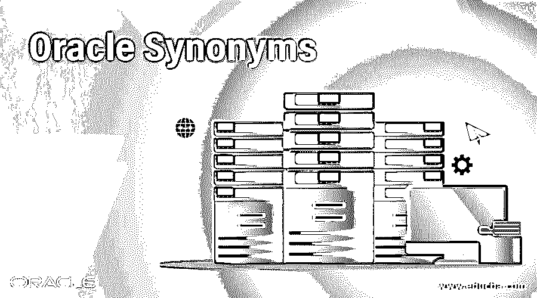
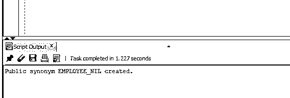
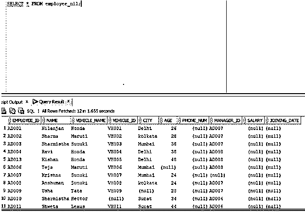
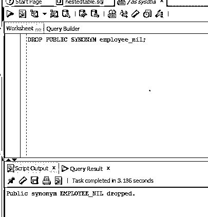

# Oracle Synonyms

> 原文：<https://www.educba.com/oracle-synonyms/>

## Oracle 同义词简介

Oracle Synonym 可以定义为单词本身，字面意思是它实际上是引用数据对象的别名，这些数据对象包括表、序列、存储函数和存储过程以及可以存储在数据库中的许多其他对象，基本上是允许另一个模式的用户访问该模式的数据对象，而用户不必担心访问该数据对象所需的权限。

### 如何在 Oracle 中创建同义词？

正如我们在本文前面讨论什么是 Oracle SYNOBYM 时所讨论的。现在让我们讨论如何创建同义词**。**首先，让我们看看创建同义词的语法。

<small>Hadoop、数据科学、统计学&其他</small>

**语法**

`CREATE [OR REPLACE] [PUBLIC] SYNONYM schema.synonym_name
FOR schema.object_name;`

**参数**

*   **REPLACE:** 该参数用于重新创建已经存在的同一个同义词；用户不需要删除现有的同义词。
*   **PUBLIC:** 顾名思义，这个参数用于创建一个 PUBLIC 的同义词。术语“公共”意味着同义词适用于或可被所有用户访问。需要记住的重要一点是，用户应该已经拥有对象的特权，这样对象才能公开。
*   **模式:**该参数用于给出模式名称。如果我们忽略这个参数，那么 oracle 会认为它是用户自己的模式。
*   **object_name:** 该参数是指我们正在为其创建模式的对象的名称。这些对象可以是表、视图、序列、函数和存储过程。

现在让我们通过一个例子来更好地理解。在我们的例子中，我们将为 employee 表创建一个同义词，它出现在模式‘nil’中，在创建模式之后，我们将尝试从不同的模式中访问它。让我们首先编写一个查询来为 employee 表创建一个模式。

**代码#1**

`CREATE PUBLIC SYNONYM employee_nil
FOR nil.employee;`

在上面的查询中，同义词名称是 employee_nil。创建同义词后，现在我们可以使用 employee_nil 而不是 employee 来访问它，因为它也被创建为 public。让我们编写一个查询，因为现在我们不必用表名作为模式名的前缀。现在让我们在 SQL developer 中执行查询并查看结果。

**输出:**

根据截图，我们可以看到同义词 employee_nil 已经创建。

**代码#2**

`SELECT * FROM employee_nil;`

根据我们在上一节中的讨论，在 SQL developer 中执行该查询时，应该会返回 employee 表的结果集。让我们执行并检查结果。

**输出:**

正如我们在上面的屏幕截图中看到的，该查询返回雇员表的行。

### 如何在 Oracle 中删除同义词？

在本文的上一节中，我们使用 CREATE SYNONYM 语句创建了同义词。现在我们知道，如果我们可以创建一个对象的同义词，那么在适当的时候，我们可能需要删除相同的同义词。在本文的这一部分，我们将讨论如何删除已经创建的同义词。让我们首先检查删除同义词的语法。

**语法**

`DROP [PUBLIC] SYNONYM schema . synonym_name [force];`

**参数**

*   **PUBLIC:** 顾名思义，它允许用户删除任何公共同义词。更重要的一点是，我们不需要使用模式名作为前缀，因为我们已经使用了 PUBLIC。
*   **同义词 _ 名称:**顾名思义是指同义词的名称。
*   **Force:** 如果我们在查询结束时使用该参数，那么 oracle 数据库将强制删除同义词，即使它有依赖关系。我们不应该经常使用它，因为它可能会导致以后的验证问题。

现在让我们通过一个例子来更好地理解这个概念。在本文的前一部分，我们已经创建了一个名为 employee_nil 的公共同义词。我们将在本节中使用 DROP SYNONYM 语句删除同一个公共同义词。让我们看看这个查询。

**代码:**

`DROP PUBLIC SYNONYM employee_nil;`

正如我们可以看到的，我们没有在查询中使用模式名，因为它已经被创建为公共模式，所以它不是必需的。我们也没有在查询中使用 force 参数，因为它不依赖于任何其他数据对象。还建议不要经常使用力参数。现在让我们在 SQL developer 中执行查询并检查结果。

**输出:**

正如我们在上面的截图中看到的，公共同义词 EMPLOYEE_NIL 已经被删除。

### 使用 Oracle 同义词的优势

在上面两节中，我们讨论了如何创建和删除 Oracle 同义词。现在，在这一节中，我们将探讨使用 Oracle Synonym 的优势。

那么，让我们看看下面的几个优点。

*   在本文的前面部分，我们讨论了同义词可以作为别名来调用，因此同义词实际上帮助我们缩短了冗长的表名，特别是来自不同模式的表名，因为我们需要编写整个模式名，而这个名称本身可能又长又复杂。
*   它有助于向后兼容，这意味着如果在遗留应用程序中有一个表，我们重命名该表，但不要妨碍当前的应用程序使用它。在这种情况下，我们可以创建一个与旧表名同名的同义词。

### 结论

在本文中，我们讨论了 Oracle 同义词的定义，稍后我们将通过示例详细讨论如何创建同义词，然后删除同义词。我们还讨论了使用 oracle 同义词可以获得的各种优势。

### 推荐文章

这是一本甲骨文同义词指南。在这里，我们讨论 Oracle 同义词的介绍，如何创建删除同义词，并举例说明，以便更好地理解。您也可以浏览我们的其他相关文章，了解更多信息——

1.  [甲骨文提交](https://www.educba.com/oracle-commit/)
2.  [Oracle 自联接](https://www.educba.com/oracle-self-join/)
3.  [甲骨文通配符](https://www.educba.com/oracle-wildcards/)
4.  Oracle 中的[功能](https://www.educba.com/function-in-oracle/)

