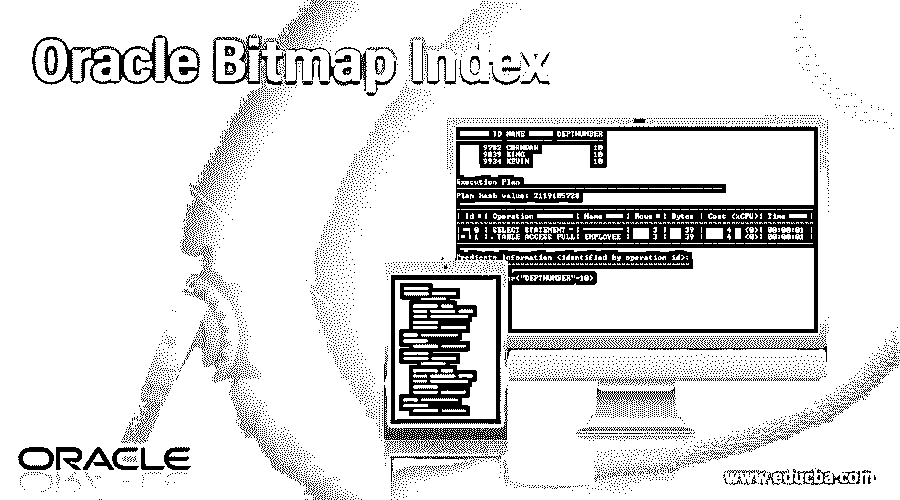
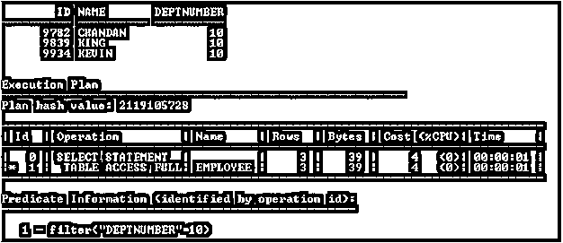

# Oracle 位图索引

> 原文：<https://www.educba.com/oracle-bitmap-index/>

## Oracle 位图索引简介

Oracle Bitmap Index 是一个模式对象，它为表或簇的索引列中出现的每个值包含一个条目。它提供了对行的直接快速访问。

*   索引是一个模式对象。
*   Oracle 服务器使用索引，通过使用指针来加快行的检索。
*   无论在逻辑上还是在物理上，索引都独立于它所索引的表。
*   该索引由 Oracle 服务器自动使用和维护。
*   可以随时创建或删除索引，并且不会影响基表或其他索引。
*   删除表时，相应的索引也会自动删除。
*   在一个表上可以创建多个索引，但这并不意味着更多的索引会带来更快的性能。
*   在带有索引的表上提交的每个 DML 操作都意味着必须更新索引。
*   索引通过使用快速路径访问方法来快速定位数据，从而减少了磁盘 I/O。

### 集中点

*   要索引的表或簇必须在自己的模式中。
*   索引对象特权应该在要索引的表上可用。
*   创建索引系统权限，需要创建索引的用户必须拥有该权限。
*   无限表空间系统权限或表空间空间配额上的空间配额必须可用。
*   位图索引将与键值相关联的 ROWID 存储为位图。
*   位图索引可以是复合位图索引。
*   在一个表的多个列上创建复合位图索引。
*   可以在最多包含 32 列的表上创建复合位图索引。
*   指定 Bitmap 以指示必须使用表中的位图非重复键创建索引。
*   位图中的每一位对应一个可能的 ROWID。
*   这些索引用于优化在其限制条件中使用非选择性列的查询。
*   只有当数据很少更新时，才应该使用位图索引。
*   位图索引增加了针对它们索引的表的所有数据操作事务的成本。
*   Oracle 优化器可以在查询处理过程中动态地将位图索引条目转换为 ROWID。

### 位图索引的限制

*   创建全局分区索引时不能指定位图。
*   不能在按索引组织的表上创建位图辅助索引，该表有一个与之关联的映射表。
*   不能同时指定位图和唯一索引。
*   不能为域索引指定位图索引。
*   位图索引不应用于 OLTP 中涉及的表。
*   位图索引增加了 Oracle 维护它们的内部机制的负载系数。
*   仅限用于批处理事务中涉及的表。

### 句法

**创建索引:**

<small>Hadoop、数据科学、统计学&其他</small>

`CREATE BITMAP INDEX IndexName ON Table (ColumnName) TABLESPACE
TableSpaceName;`

**删除索引:**

`DROP INDEX IndexName;`

### 描述

*   **IndexName** :根据 Oracle 命名约定，它可以是索引对象的任何名称。
*   **表空间名**:这是一个逻辑存储名，索引对象将被存储在这里。

### Oracle 位图索引示例

在本节中，我们将看到 Oracle 位图索引的实现及其行为。为此，我们将使用下面包含 14 条记录的示例表(Employee)来理解 Oracle 位图索引行为。

`SELECT * FROM Employee;`

**输出:**

#### 示例# 1–位图索引

`CREATE BITMAP INDEX EmpBitIndex ON Employee (Deptnumber);`

**输出:**

上面的 create 语句在 Deptnumber 上创建一个位图索引。

`SELECT ID,Name,Deptnumber FROM Employee WHERE Deptnumber=10;`

**输出:**

执行计划清楚地表明，上面的语句不使用索引来访问行，因为 oracle 优化器决定何时使用索引。

位图索引仅将一个位添加到被索引为位图模式大小的表中的每一行。

每个不同的值都会向位图索引添加另一行。

#### 示例 2–如何检查索引

可以从 USER_INDEXES 数据字典中检查索引。

`SELECT Table_Name,Index_Name FROM USER_INDEXES WHERE
TABLE_NAME='EMPLOYEE';`

**输出:**

#### 示例# 3–删除位图索引

可以随时删除该索引，但用户需要具有删除权限。

`DROP INDEX EmpBitIndex;`

**输出:**

在上面的示例中，使用 drop index 语法 index 会被删除。所以现在 Employee 表没有任何索引。

`SELECT Table_Name,Index_Name FROM USER_INDEXES WHERE
TABLE_NAME='EMPLOYEE';`

**输出:**

#### 示例 4–何时使用位图索引

*   低基数列:这意味着任何包含少于 100 个不同值的列。
*   不经常更新的表或只读表:位图索引适用于只读表或不经常更新的表。它在数据仓库中被广泛使用。

**提示:**

*   如果非重复键值增加，那么维护这种索引的成本会很高。
*   如果非重复键值增加，会降低性能。

### 结论

Oracle 位图索引对于静态表或静态列非常有用。它对于物化视图也很有用。需要特别注意不同的键值来创建位图索引。

### 推荐文章

这是 Oracle 位图索引指南。在这里，我们讨论的重点，限制位图索引与查询的例子。您也可以看看以下文章，了解更多信息–

1.  [甲骨文用户](https://www.educba.com/oracle-users/)
2.  [甲骨文摘录()](https://www.educba.com/oracle-extract/)
3.  [Oracle 锁表](https://www.educba.com/oracle-lock-table/)
4.  [Oracle 回滚](https://www.educba.com/oracle-rollback/)

