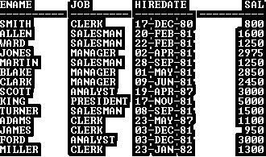
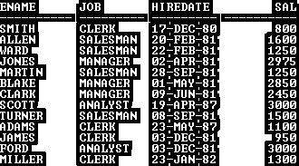
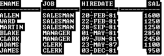
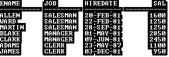
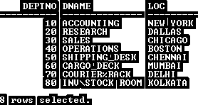
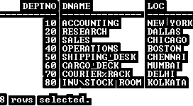

# Oracle LIKE 运算符

> 原文：<https://www.educba.com/oracle-like-operator/>

## Oracle LIKE 运算符简介

Oracle 数据库中的 LIKE 运算符执行模式匹配，因为 LIKE 条件通过搜索第二个指定的模式的第一个值(在 SQL 查询中提供，因为 LIKE 运算符允许将[通配符用于](https://www.educba.com/oracle-wildcards/)SELECT、INSERT、UPDATE 或 DELETE 语句的 WHERE 子句)将一个字符值的一部分与另一个字符值相匹配。同样，它使用输入字符集定义的字符来计算字符串。

Oracle 中可用的通配符有:

<small>Hadoop、数据科学、统计学&其他</small>

*   **% :** 用于表示零个或多个字符的任意序列
*   **_ :** 表示任何单个字符，仅在该位置

**语法:**

`SELECT …….FROM TableName WHERE ColumnName/Expression LIKE character/pattern/literal.`

**举例:**

`SELECT col_1, col_2…..col_n FROM TableName WHERE ColumnName LIKE ‘pat%’;`

### Oracle LIKE 运算符的实现

我们将使用下表中的 14 条记录来理解 LIKE 操作符的行为。

**查询:**

`SELECT ename, job, hiredate, sal from Emp;`

**输出:**

#### 1.WHERE 子句中的 LIKE 运算符

**查询:**

`SELECT ename, job, hiredate, sal FROM emp WHERE ename LIKE ‘KI%’;`

**输出:**

在这个 SQL SELECT 语句中，LIKE 运算符在 ename 列中搜索以字符模式 KI 开头的条目，并获取匹配模式。SQL 语句获取了包含详细信息的“KING”ename，因为在 ename 列中只有 KING 以 KI 字符开头。%表示从零计数到任意数量字符计数的任何字符模式。

#### 2.带有 NOT 关键字的 WHERE 子句中的 LIKE 运算符

**查询:**

`SELECT ename, job, hiredate, sal FROM emp WHERE ename NOT LIKE ‘KI%’;`

**输出:**

在这个输出中，KING 的记录丢失了。因为没有带有 like 运算符的 NOT 关键字，NOT 的行为类似于否定，这意味着该 SQL 语句只选择不以 LIKE 运算符中提供的模式“KI”开头的记录。

#### 3.带下划线(' _ ')通配符搜索的 LIKE 运算符

**查询:**

`SELECT ename, job, hiredate, sal from Emp WHERE ename LIKE ‘_A%’`

**输出:**

在本例中，我们使用下划线(' _ ')通配符搜索，它代表任何单个字符。该语句选择第二个字符为 A 的 ename 中的条目，但是第一个字符可以是任何字符。

#### 4.使用%通配符搜索的 LIKE 运算符

**查询:**

`SELECT ename, job, hiredate, sal from Emp where ename LIKE ‘%A%’;`

**输出:**

在本例中，LIKE 操作符从 ename 列中选择条目，该列在任何位置都包含一个“A”字符，并显示记录。

#### 5.任何数据类型列的 LIKE 运算符

我们可以对任何数据类型列应用 LIKE 运算符，如下所述:

##### 示例#1

我们可以对 ename 列应用 LIKE 运算符，它是 VARCHAR2(字符)数据类型。

**查询:**

`SELECT ename, job, hiredate, sal FROM Emp where ename LIKE ‘%A%’;`

**输出:**

##### 实施例 2

我们可以在 sal 列上应用 LIKE 操作符，它是一个数字数据类型。

**查询:**

`SELECT ename, job, hiredate, sal FROM Emp where sal LIKE ‘30%’;`

**输出:**

##### 实施例 3

我们可以对日期数据类型的 hiredate 列应用 LIKE 运算符。

**查询:**

`SELECT ename, job, hiredate, sal FROM Emp where hiredate LIKE ‘%MAY%’;`

**输出:**

### 带有 ESCAPE 子句的 Oracle LIKE 运算符

我们将使用下表中的 08 记录作为示例的参考，以便更深入地理解带有 ESCAPE 选项的 LIKE 操作符行为。

#### 示例#1

这里我们使用下面给出的 escape 子句选择所有数据。

**查询:**

`SELECT * FROM Dept;`

**输出:**

#### 实施例 2

这里我们使用%_%来访问下面给出的数据。

**查询:**

`SELECT deptno, dname, loc FROM Dept WHERE dname LIKE ‘%_%’;`

**输出:**

#### 实施例 3

这是使用 escape 子句的%\%运算符，下面将对其进行解释。

**查询:**

`SELECT deptno, dname, loc FROM Dept WHERE dname LIKE ‘%\%’;`

**输出:**

如果看到以上两个例子，我们发现了几个需要注意的地方

*   对于示例 1，SQL 语句获取由下划线' _ '组成的 dname 记录，但我们获得了所有记录，而不是特定的搜索记录。
*   但是在示例 2 中，SQL 语句获得了由反斜杠“\”组成的 dname 记录，并获得了正确的结果。

这里出现了两个问题:

**1。为什么当我们使用正确的语法时会出现这个问题？**

**回答:**例 1 中我们用了“LIKE“% _ %”。众所周知，甲骨文中有两个通配符，即“%”&“_”。在该示例中，下划线“_”表现为通配符，而不是字符。这就是问题发生的原因。

**2。如何修复这个问题？**

**答:**为了找到“%”和“_”的精确模式匹配，我们使用 ESCAPE 选项和“\”。这有助于我们找到精确的匹配。下面是一些例子。

### 免责条款的例子

以下是免责条款的一些例子，解释如下:

#### 示例#1

我们可以使用 ESCAPE 使下划线' _ '成为一个字符。

**查询:**

`SELECT deptno, dname, loc FROM Dept WHERE dname LIKE ‘%\_%’ ESCAPE ‘\’;`

**输出:**

**Note**: In this example, we used an ESCAPE to make underscore ‘_’ as a character. And got the exact match.

#### 实施例 2

我们可以使用%作为转义符。

**查询:**

`SELECT deptno, dname, loc FROM Dept WHERE dname LIKE ‘%\%%’ ESCAPE ‘\’;`

**输出:**

**Note:** The above example shows that WILD CARD ‘%’ (second from the left) behaved like a character because of the ESCAPE option.

#### 实施例 3

我们可以使用 Oracle UPPER function 和 LIKE 条件的组合来返回 dname 字段包含单词“%RA”的所有记录，而不管它是存储为%RA、%Ra 还是%ra。

**查询:**

`SELECT deptno, dname, loc FROM Dept WHERE UPPER (dname) LIKE UPPER ('%\%ra%') ESCAPE '\';`

**输出:**

提示:对于区分大小写的搜索，我们可以提供 LOWER 和 INITCAP 函数来代替 UPPER。

#### 实施例 4

我们可以用@、$、&、^、？等等。关键字而不是带有转义选项的“\”来获得精确匹配。下面举几个例子。

**查询 1:**

`SELECT deptno, dname, loc FROM Dept WHERE LOWER (dname) LIKE ('%^%ra%') ESCAPE '^';`

**输出:**

**查询 2:**

`SELECT deptno, dname, loc FROM Dept WHERE LOWER (dname) LIKE ('%@%ra%') ESCAPE '@';`

**输出:**

#### 实施例 5

我们可以使用逻辑运算符在一条 SQL 语句中执行多个 LIKE 条件。

**查询:**

`SQL> SELECT deptno, dname, loc from Dept WHERE LOWER(dname) LIKE ('%^%ra%') ESCAPE '^' OR LOWER(dname) LIKE ('%!_de%') ESCAPE '!';`

**输出:**

### 结论

有时，我们需要查询数据，但我们不知道该列的确切/完整模式/内容，那么 LIKE 运算符是模式搜索的最佳选择。例如，如果我们想要查找以“DECK”结尾或以“cargo”开头的 dname，那么在这些情况下，运算符非常有用。

### 推荐文章

这是一个类似 Oracle 的操作指南。在这里，我们用 Oracle LIKE 操作符及其示例来讨论 escape 子句的实现和概念。您也可以浏览我们推荐的其他文章，了解更多信息——

1.  [在 OLAP 的运营](https://www.educba.com/operations-in-olap/)
2.  [JavaScript 中的比较运算符](https://www.educba.com/comparison-operators-in-javascript/)
3.  [Unix 操作员](https://www.educba.com/unix-operators/)
4.  [C#或运算符](https://www.educba.com/c-sharp-or-operator/)
5.  [甲骨文的顶级版本](https://www.educba.com/oracle-versions/)
6.  [Java 中的比较运算符指南](https://www.educba.com/comparison-operators-in-java/)
7.  [7 大 Oracle 运营商示例](https://www.educba.com/oracle-operators/)

