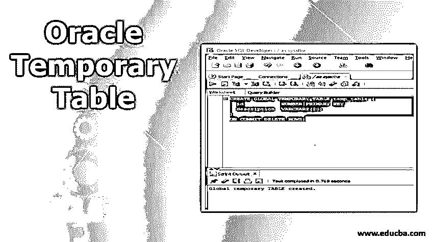
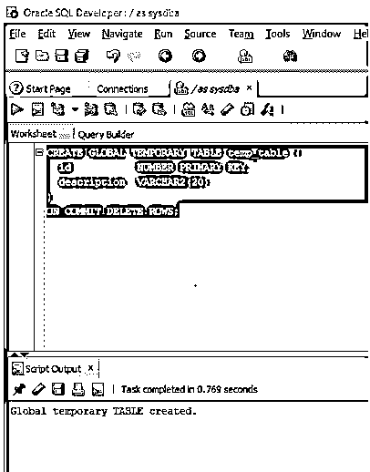
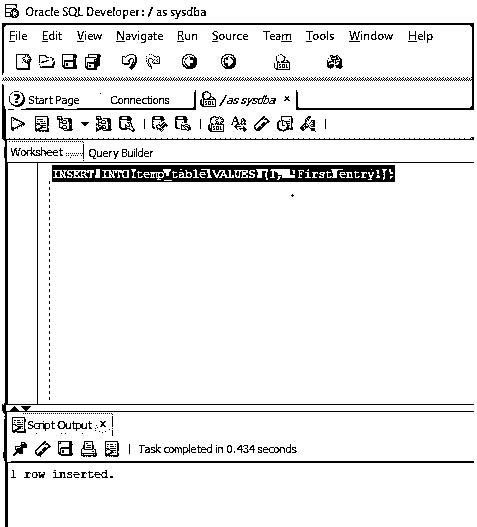
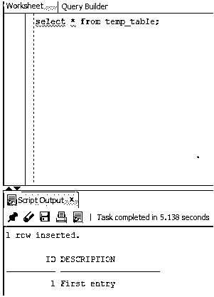
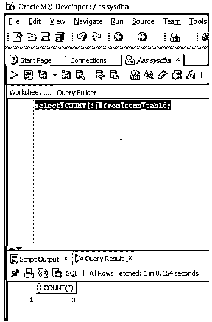
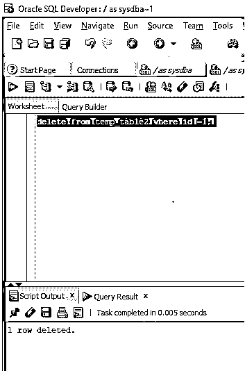
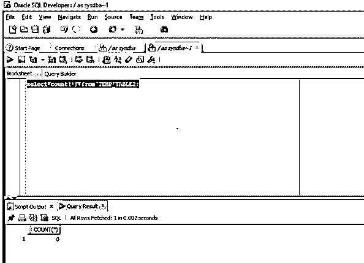

# Oracle 临时表

> 原文：<https://www.educba.com/oracle-temporary-table/>

## Oracle 临时表的定义

Oracle 8i 中引入的 Oracle 临时表可以定义为一个永久对象，其中数据存储在磁盘中，特定的数据在特定的会话或事务结束后会立即删除，对于 Oracle，私有临时表存储在 Oracle 数据库内存中，每个临时表只对创建特定表的会话可见，这些表通常是嵌入在 Oracle 会话中的 SQL 程序。

**语法:**

<small>Hadoop、数据科学、统计学&其他</small>

临时表有两种类型:全局临时表和 Oracle 18c 中引入的私有临时表。当我们在 Oracle 数据库中创建任何临时表时，它都是自动全局的。所以我们需要添加全局关键字。

全局 Oracle 临时表的语法如下所示:

`CREATE GLOBAL TEMPORARY TABLE table_name
(column1 datatype [ constraint ],
column2 datatype [ constraint ],
...);`

**参数:**

*   **table_name:** 用户正在创建的临时表的名称。
*   **Column1，column2:** 列名
*   **约束:**是指我们可以添加也可以不添加的列约束。

### Oracle 中的临时表是如何工作的？

前面定义的 Oracle 中的临时表用于存储某些特定任务的数据，因为一旦事务或会话结束或完成，临时表数据就会被删除。假设我们想要提取一些数据，这些数据没有存储在特定的表中，也不存在于数据库中。在这种情况下，我们可以使用一个过程，首先从不同的表中提取数据，并在会话或事务开始时将这些数据插入到一个临时表中。在会话或事务开始时创建的临时表中的数据可以在整个会话或事务中使用，这取决于创建表时提供的权限。如果我们在提交时删除行，那么表是特定于事务的，但是如果我们在提交时保留行，那么表是特定于会话的。

### 如何创建 Oracle 临时表？

在本文的上一节中，我们已经了解了 Oracle 中临时表的工作方式。在这一节中，我们将看到如何创建一个临时表。临时表就像另一个表一样，但是我们必须在 create table 查询中使用关键字“GLOBAL TEMPORARY”。对于本例，我们将创建一个名为 temp_table 的临时表，其中包含名为 id 和 description 的列。id 列将是主键。现在让我们看看创建临时表的查询。

`CREATE GLOBAL TEMPORARY TABLE temp_table (
id NUMBER PRIMARY KEY,
description VARCHAR2(20)
)
ON COMMIT DELETE ROWS;`

我们可以在上面的查询中看到，create table 语句以 ON COMMIT DELETE ROWS 结束，这意味着表将在每个事务之后被删除。所以它是基于事务的。如果我们希望创建的表是基于会话的，这意味着数据将出现在整个会话的临时表中，而不仅仅是当前事务。然后，我们需要通过在语句末尾添加 ON COMMIT PRESERVE ROWS 子句来修改选择查询。

`CREATE GLOBAL TEMPORARY TABLE temp_table (
id NUMBER PRIMARY KEY,
description VARCHAR2(20)
)
ON COMMIT PRESERVE ROWS;`

现在让我们在 SQL developer 中运行查询。

正如我们在上面的截图中看到的，临时表已经创建好了。

### 如何将数据插入 Oracle 临时表？

由于在前面的部分中我们可以看到临时表 temp_table 已经创建，现在让我们将数据插入临时表中。在本例中，我们将向 temp_table 中的两列插入数据。我们不会提交 insert 语句，因为我们知道表数据内容是特定于事务的，所以一旦我们发送了提交，数据就会被删除。让我们看看同样的查询。

`INSERT INTO temp_table VALUES (1, 'First entry');`

现在让我们在 SQL developer 中运行查询。

正如我们在上面的截图中看到的，该行已经被插入到表中。

现在让我们使用一个选择查询来检查表的内容。需要记住的一点是，因为这个表是特定于事务的，所以一旦提交 insert 语句，我们就会丢失数据。因此，让我们在提交语句之前检查一下数据的内容。

**提交前**

`SELECT * FROM temp_table;`

让我们在 SQL developer 中运行查询。

在上面的截图中，我们可以看到表格的内容。现在让我们提交事务并检查表中的行。

**提交后**

`SELECT COUNT(*) FROM temp_table;`

让我们看看 SQL developer 中的输出。

根据截图，由于计数为零，数据被成功删除。

### 怎么删除？

如果表是用 ON COMMIT DELETE ROWS claws 创建的，那么如果我们简单地提交，数据将被删除，如前一节所示。如果表是用 ON DELETE PRESERVE ROWS 创建的，那么我们将使用 DELETE 语句删除临时表中的行。让我们看看同样的查询。

`DELETE from temp_table2 WHERE id =1;`

让我们在 SQL developer 中运行查询。

正如我们在屏幕截图中看到的，该行已被成功删除。

`SELECT COUNT(*) FROM TEMP_TABLE2;`

正如我们在截图中看到的，当前的计数为零。因此，delete 语句成功地删除了表中的内容。

### 推荐文章

这是一个 Oracle 临时表的指南。这里我们也讨论一下 oracle 中的临时表的介绍和工作原理。以及如何在 oracle 临时表中删除和插入数据。您也可以看看以下文章，了解更多信息–

1.  [Oracle 自联接](https://www.educba.com/oracle-self-join/)
2.  [Oracle While 循环](https://www.educba.com/oracle-while-loop/)
3.  [Oracle 窗口函数](https://www.educba.com/oracle-window-functions/)
4.  [甲骨文 MD5](https://www.educba.com/oracle-md5/)

