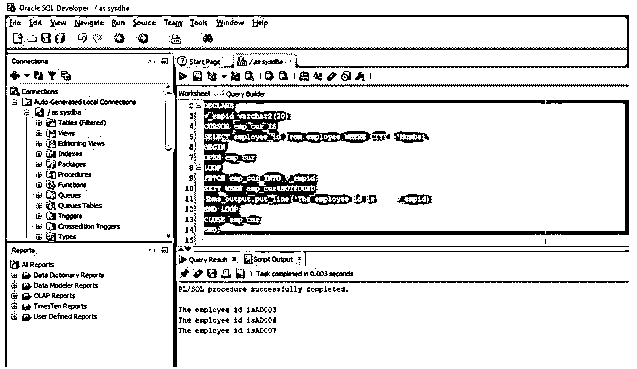

# Oracle 中的光标

> 原文：<https://www.educba.com/cursor-in-oracle/>

## Oracle 中的游标简介

编写 PL/SQL 查询时，游标非常重要。在本文中，我们将讨论 Oracle 中的游标。所以基本上光标是一个指向上下文区域的指针。上下文区域基本上是用于处理 SQL 语句的内存空间。因此，上下文区域包含处理语句所需的所有信息。所以，基本上光标指向这个特定的区域。在执行语句时，游标保存返回的结果集，该结果集可以包含单行或多行。随着我们继续，我们将更详细地了解光标。

### 光标类型和语法

Oracle 中有两种类型的游标。隐式游标和显式游标。

<small>Hadoop、数据科学、统计学&其他</small>

#### 1.隐式光标

顾名思义，隐式游标是由 oracle 创建的。每当执行 SQL 语句时，都会创建隐式游标。像 UPDATE、INSERT 和 DELETE 这样的 DML 语句会自动创建隐式游标。在 UPDATE 和 INSERT DML 语句中，游标保存受影响的行的信息，在 INSERT 语句中，游标保存要插入的数据的信息。

隐式游标的整个执行由 oracle 内部管理，它通过某些属性(如%ROWCOUNT、%ISOPEN、%ISFOUND)显示游标状态。

*   **%ROWCOUNT:** 它告诉游标返回多少行。
*   **%ISOPEN:** 该属性返回布尔值，如果光标处于打开状态，则返回 TRUE，否则返回 FALSE。
*   **%FOUND:** 该属性也返回布尔值。如果已成功执行提取，则为 TRUE 如果提取不成功(不返回任何行)，则为 FALSE。
*   **r%NOTFOUND:** 该属性返回%FOUND 属性的反义词。如果提取了行，则为 FALSE 如果没有提取行，则为 TRUE。

#### 2.显式光标

这些游标由用户在 oracle 数据库中创建。在这种类型的光标中，程序员可以创建自己的上下文区域。在显式游标中，程序员获得他们自己的上下文区域，以获得更多的控制来执行他们的 DML 语句。显式游标在 oracle 数据库的 SELECT 语句中声明。

#### 句法

`CURSOR <cursorname> IS <select_statement>;
<cursorvariable declaration>
BEGIN
OPEN <cursorname>;
FETCH <cursorname> INTO <cursorvariable>;
CLOSE
END;`

**参数:**

*   **cursor_name:** 用于给出光标的名称。
*   **select_statement:** 这里我们给出返回单行或多行的选择查询。

### Oracle 中的光标操作

使用显式游标需要四种操作。

*   **DECLARE:** 在这个部分中，程序员实际上为 Select 语句创建了一个命名的上下文区域。select 语句在 PL/SQL 程序的这一部分中声明。
*   **OPEN:** 在这个区段中 [oracle 实际上为游标分配了](https://www.educba.com/what-is-oracle/)内存。
*   **FETCH:** 在这个部分中，实际执行开始。select 语句从数据库中获取记录，并将其存储在分配的内存中。数据是以记录的方式获取的。这是一项创纪录的活动。因此记录集也称为活动集。
*   **CLOSE:** 该语句用于关闭游标，分配给游标的内存将被释放。

### Oracle 中的游标示例

在本例中，我们将只从 employee 表中获取来自孟买的雇员的 id。在这种情况下，我们将使用光标。让我们看一下显示孟买雇员 id 的 PL/SQL 块。

**代码:**

`PL/SQL BLOCK
SET SERVEROUTPUT ON;
DECLARE
v_empid varchar2(20);
CURSOR emp_cur IS
SELECT employee_id from employee WHERE CITY ='Mumbai';
BEGIN
OPEN emp_cur;
LOOP
FETCH emp_cur INTO v_empid;
EXIT WHEN emp_cur%NOTFOUND;
dbms_output.put_line('The employee id is' || v_empid);
END LOOP;
CLOSE emp_cur;
END;`

设置服务器输出用于允许 DBMS 输出命令在 SQL Developer 中打印[消息。因为我们要用它来执行任务。在上面的 PL/SQL 块中，我们有第一个声明部分，在其中我们声明了游标和游标变量。接下来，我们有执行部分，在这里我们打开光标，这意味着内存空间已经被分配。FETCH 用于执行 SELECT 查询，然后将其存储在我们已经声明的游标变量中。](https://www.educba.com/what-is-sql-developer/)

我们将使用 LOOP 遍历整个表中的记录，并在每次迭代后使用 dbms_output.put_line 语句打印记录。属性%NOTFOUND 用于在没有记录时退出循环。CLOSE cursor 语句用于关闭游标并释放内存。最后使用末尾的 END 语句来结束 PL/SQL 块。需要记住的重要一点是，我们需要在 end 语句之前关闭游标，并且循环应该在关闭游标之前结束。

现在让我们在 SQL developer 中执行 PL/SQL 游标块，下面的屏幕截图显示了成功执行该块后的输出。

输出显示了记录。在这种情况下，只有三个记录来自孟买。

### Oracle 中游标的优缺点

下面给出了优点和缺点:

#### 优势

*   游标按行提取数据，因此可以使用游标进行行验证。
*   它一次检索一行，不像 SQL select 查询一次选择所有行。
*   它比 While 循环更快，但开销更大。
*   它提供了对数据库记录的遍历。

#### 不足之处

*   它们降低了插入、更新和删除的性能。
*   它们还会占用空间，这取决于所用字段的数量。

### 结论

在本文中，我们在引言部分讨论了什么是真正的游标，然后讨论了不同类型的游标及其属性和语法。我们通过例子看到了光标的工作原理以及使用光标的优点和缺点。

### 推荐文章

这是 Oracle 中的游标指南。这里我们讨论 oracle 中游标的介绍、游标类型、优点、缺点和例子。您也可以看看以下文章，了解更多信息–

1.  [甲骨文触发器](https://www.educba.com/oracle-triggers/)
2.  [PL/SQL 中的游标](https://www.educba.com/pl-sql-in-cursors/)
3.  [甲骨文条款](https://www.educba.com/oracle-clauses/)
4.  [甲骨文版本](https://www.educba.com/oracle-versions/)

