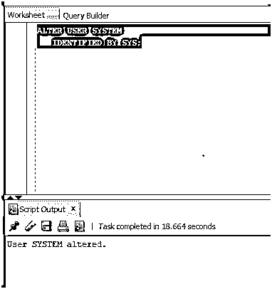
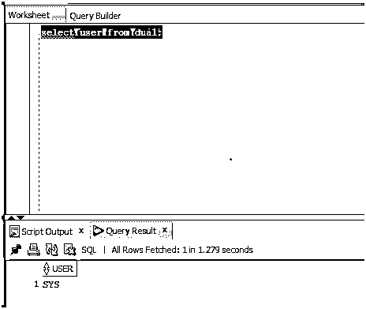

# Oracle 用户

> 原文：<https://www.educba.com/oracle-users/>

## Oracle 用户简介

oracle 用户可以被定义为希望连接到 Oracle 数据库并完成使用或连接到任何版本的任何 Oracle 数据库的操作的人，该人应该在存储在服务器或本地计算机中的 Oracle 数据库中创建一个帐户，并且还应该有一个唯一的口令来实际访问该用户所拥有的帐户或模式(模式是指 Oracle 用户加上特定用户所拥有的数据对象的集合)。

### Oracle 中的用户操作和角色

在本文的前面部分，我们讨论了 Oracle 用户的定义。现在，我们将尝试了解用户的操作和角色。

<small>Hadoop、数据科学、统计学&其他</small>

#### 1.创建用户

首先，我们将创建一个 Oracle 用户。

**语法:**

`create user <user_name> identified by "<password>"`

现在让我们看一个使用 oracle 中的 CREATE USER 语句创建用户的示例。让我们创建一个用户 nil_user own，密码为“India”。需要注意的重要一点是，要在模式中创建用户，我们必须拥有系统特权。系统权限非常重要，因为任何人都不能创建用户，因为它是一个非常强大的权限。通常，在组织中，只有 DBA 和安全管理员拥有创建用户的权限。让我们看看同样的查询。

**查询:**

`create user nil_user identified by "India!";`

在上面的查询中，用户名是 nil_user，密码是' India'。

创建的用户也可以被赋予特殊权限。为了实现这一点，我们使用的语句是 GRANT。例如，我们可以使用 GRANT 语句将 create session 系统特权授予新创建的用户 nil_user。让我们也看看同样的查询。

**查询:**

`GRANT create session TO nil_user;`

#### 2.改变用户

在前面的示例中，我们看到了如何使用 CREATE USER 语句创建新用户，但前提是我们拥有 system 特权。在这一点上，我们将讨论如何改变用户。当我们尝试使用 ALTER USER 语句时，需要记住几个要点。更改用户密码是一种很好的做法，为此，不需要特殊权限，但如果我们需要更改用户安全域下的任何其他选项，那么在这种情况下，我们需要拥有“更改用户系统”权限。一般来说，在大多数组织中，DBA 人员和安全管理员通常有权限允许对任何用户相关的安全系统进行任何修改。更重要的一点是，如果我们在当前会话运行时更改用户安全系统，这些更改将影响未来的用户会话，而不是当前会话。

在本例中，我们将更改名为“SYSTEM”的现有用户，并将密码更改为“SYS”。现在让我们创建一个简单的查询。

**查询:**

`ALTER USER SYSTEM
IDENTIFIED BY SYS;`

**输出:**

正如我们在上面的截图中看到的，脚本输出显示用户系统已经被改变。

#### 3.获取当前用户

在本节中，我们将讨论如何提取我们正在工作的当前用户的用户名。因此，我们将使用 USER 函数从当前运行的会话中获取用户 id。

在本例中，我们将获取当前运行会话的用户 id。让我们为此创建一个选择查询。

**查询:**

`select user from dual;`

**输出:**

正如我们在上面的屏幕截图中看到的，执行中的查询将用户 SYS 显示为结果。

#### 4.删除用户

在本节中，我们将删除一个用户。在本文的前面几节中，我们已经看到我们已经创建、修改了一个用户，同样我们也可以删除一个用户。因此，当我们删除一个用户时，该用户及其关联的模式(模式意味着 oracle 用户加上特定用户拥有的数据对象的集合)将从数据字典中删除，如果我们有任何与用户相关的对象，那么这些对象也将被删除。当我们删除用户时，需要记住许多重要的点。不能删除当前连接到数据库的用户。如果我们想要删除当前用户，那么我们必须终止用户会话，我们可以使用 ALTER SYSTEM 语句来终止用户会话。

另一个要点是，所有用户都不能简单地执行 DROP USER 语句。我们需要有 DROP USER 权限来执行该语句。由于这是一个与安全相关的问题，一般来说，大多数组织的安全管理员都有删除用户的权限。我们不应该删除 SYS 或 SYSTEM 用户，因为这样做实际上会损坏数据库。

在本例中，我们将从数据库中删除用户“nil_user”。

**查询:**

`DROP USER nil_user;`

如果我们有要删除的用户的任何依赖对象，那么我们可以使用 CASCADE 选项删除用户，所有依赖模式对象(包括外键)都将被删除。让我们为此创建一个查询。

**查询:**

`DROP USER nil_user cascade;`

### 结论

在本文中，我们首先讨论了 Oracle 用户的定义。在本文的后面，我们讨论了各种操作和角色或特权，我们需要执行某些操作，如创建、更改和删除用户，以及每个操作的示例。

### 推荐文章

这是 Oracle 用户指南。这里我们讨论 Oracle 用户的定义及其语法。我们还通过示例讨论了 Oracle 中的各种操作和角色。您也可以浏览我们推荐的文章，了解更多信息——

1.  [甲骨文别名简介](https://www.educba.com/oracle-aliases/)
2.  [Oracle 中的 Left Join 是如何工作的？](https://www.educba.com/left-join-in-oracle/)
3.  [什么是 Oracle 数据库|应用](https://www.educba.com/what-is-oracle-database/)
4.  [至 10 个 Oracle 数据库面试问题](https://www.educba.com/oracle-database-interview-questions/)

