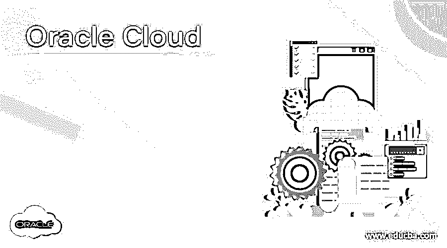

# 甲骨文云

> 原文：<https://www.educba.com/oracle-cloud/>

## Oracle 云的定义

Oracle Cloud 是 Oracle Corporation 为云计算提供的一项服务，通过 Oracle Corporation 已建成的数据中心的全球网络提供存储、服务器、应用程序、服务和网络。该公司允许通过互联网按需提供这些服务。

*   甲骨文云提供平台即服务(PaaS)、基础设施即服务(IaaS)、数据即服务(DaaS)和软件即服务(SaaS)。同样，实施这些服务是为了在云中构建、集成、扩展和部署应用程序。
*   类似地，这个平台提供了几个开放标准，比如 HTML5、SQL、REST 等。、开源应用如 Spark、Kafka、Hadoop、MySQL、Terraform、Kubernetes 等。以及多种编程语言、工具、数据库和框架，包括开源、Oracle 专用以及第三方系统和软件。

### 我们为什么需要 oracle 云？

毫无疑问，将您的 ERP 和其他工作负载转移到任何云基础架构服务都将降低您的资本支出，从而降低维护和可扩展性方面的运营支出，并将公司的能源支出降至最低。

<small>Hadoop、数据科学、统计学&其他</small>

此外，它将允许 it 集中于关键的业务创造，从而帮助组织进行周密的项目，而不是保护数据中心业务的正常运行。

迁移到 Oracle 云的一些实际回报以及我们需要它的原因如下:

*   **降低成本:**由于订阅成本可以节省资金，因此 Oracle 云带来的不仅仅是订阅成本，还可以节省硬件成本，提高业务灵活性，以及更高的长期和短期效率。
*   **流线型性能:**它表示在工作中更少点击按钮，更少手动操作。在这里，Oracle cloud 支持更少的点击和更多的自动执行，从而通过共享基础架构产生真正简化的性能。
*   **面向未来:**由于 Oracle 云易于实施，因此它提供了面向未来的解决方案，有助于在更新的平台上迁移传统工作负载。
*   **简单:**在不过度复杂的情况下，使用 Oracle cloud IaaS 解决方案简单地移动主要工作负载，并确保提高性能和成本。
*   **创新敏捷性:**借助 Oracle 云，任何人的任何活泼响应都可以快速扩展，以控制额外的位置、开发流程、分析项目等，包括在业务或项目放缓或完成时缩减规模。

### Oracle 云是如何工作的？

通常，云计算被定义为计算机技术(即计算)和基于互联网的开发(即云)的组合。因此，云象征着互联网，因为这是云，基本上也在计算机网络图中示出。

Oracle 通过在整个平台上对角排列 Oracle 自治云来确定云平台技术的进步。该平台包含的自动驾驶设施影响着人工智能(AI)和机器学习，以更低的成本使组织受益，降低风险，获得分析见解，并加快创新。

此外，Oracle 名为 PaaS(平台即服务)的服务提供了广泛的工具来改进、集成、保护和观察应用程序，包括实践分析以构建非法、转型见解的资源。

### 优点和缺点

下面是提到的优点和缺点:

#### 优势

优势如下:

*   在短期和长期内节省硬件成本，提高效率，增加业务灵活性。
*   使用共享基础架构提供自动化和简化的工作绩效，使任务能够快速执行，以满足需求。
*   提供面向未来的解决方案，轻松、无障碍地将传统工作负载迁移到现代平台。
*   支持将 ERP、分析软件以及当前架构等应用程序迁移到云的简化流程。
*   它提供可扩展的基础架构、硬件和开发功能，包括为业务提供的软件选项。

#### 不足之处

缺点可以列举如下:

*   Oracle 云的主流基础架构组件不足以执行所有云解决方案。
*   UI 导航需要改进。
*   用户界面由小故障组成，需要补充标签来开发服务。
*   与少数其他工具集成，或者说云解决方案不在前期或不存在。
*   负载平衡能力包括部分功能。
*   在偶尔可能无法访问事件的地方，可靠性不够好。
*   数据库连接存在问题。
*   额外模板的需求。
*   数据保密风险。
*   易受攻击

### 例子

Oracle cloud 支持其多个服务、云服务和来自其他供应商的客户应用程序之间的安全集成，所有这些服务在集成的云环境中共同运行。

例如，Oracle 销售云服务可以嵌入到在 Oracle Java 云服务(即 SaaS 扩展)上执行的用户自己的应用程序中。此外，客户关系管理可以通过定制应用程序来延长。我们可以进一步将具有 Salesforce 等其他站点功能的 Oracle 云服务链接在一起。人们可以实现 Oracle 云类型的服务作为构建自己的应用程序的基础设施。

因此，在云中，应用服务分为以下几类:

*   软件即服务(SaaS)
*   数据即服务(DaaS)

同样，平台服务分为以下几类:

*   平台即服务(PaaS)
*   基础设施即服务(PaaS)

### Oracle 云的使用

*   Oracle 云服务由 Oracle 提供，用于在由有组织的数据中心集组成的全球网络上交付云应用程序、存储、处理和服务器。该网络本身构建在 25Gb 以太网上，在该网络的扁平拓扑中，没有节点通过多跳与另一个节点断开连接。因此，这个网络为 Oracle 提供了处理可靠的服务级别协议(即 SLA)的信心。
*   在这里，平台、软件、基础设施和数据服务(如 PaaS、IaaS、DaaS 和 IaaS)都可以实施，以将公司的应用程序集成或扩展到 Oracle 云中，或者构建和安装新的应用程序。裸机计算和虚拟化多租户部署服务都可以与单个应用程序接口(即 API)相关联。
*   同意甲骨文，他们提前进入云计算，帮助他们从竞争中获益，并很好地规划自己的进入。

### 结论

众所周知，Oracle cloud 是数据库公司提出的公共云服务。为了运行 Oracle 数据库，Oracle 将其云服务作为最佳选择，并对其进行了个性化。

此外，它也是当今市场上著名竞争对手亚马逊的挑战者。因此，Oracle 拥有一个由成功的数据中心组成的全球网络，用于组织他们的云援助。

### 推荐文章

这是 Oracle 云指南。在这里，我们将讨论 Oracle 云的定义、语法和工作原理。，我们为什么需要 oracle 云？以及代码实现的例子。您也可以看看以下文章，了解更多信息–

1.  [甲骨文存在](https://www.educba.com/oracle-exists/)
2.  [Oracle XML 类型](https://www.educba.com/oracle-xmltype/)
3.  [甲骨文日期格式](https://www.educba.com/oracle-date-format/)
4.  [甲骨文 XML](https://www.educba.com/oracle-xml/)

