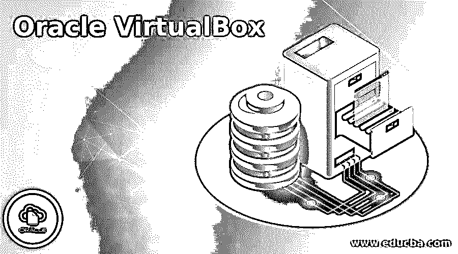
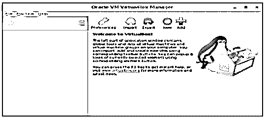
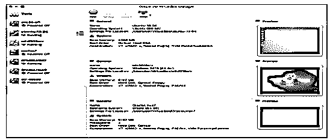
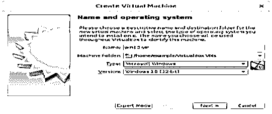
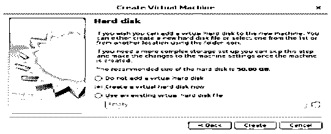
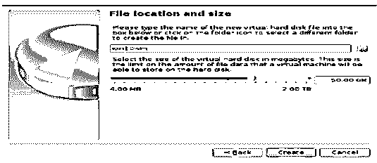
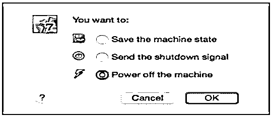

# Oracle VirtualBox

> 原文：<https://www.educba.com/oracle-virtualbox/>

## Oracle 虚拟机箱的定义

Oracle Virtual Box 是一款非常强大的虚拟化工具，适合企业和个人使用。基本上，Oracle VirtualBox 是一个开源工具，它有一些丰富的功能，例如它为企业客户提供了一个高性能的工具，以及任何种类的专业解决方案。Oracle VirtualBox 提供了跨平台，这意味着我们可以在 Linux、Windows、Mac OS X 和 Solaris 计算机上安装虚拟化应用程序，或者我们可以说，该工具允许我们创建和运行虚拟机，并同时在同一台计算机上的不同操作系统上运行它。例如，我们可以在同一台计算机上运行不同的操作系统，也就是说，我们可以在 Windows 上运行 Linux 和 Mac，反之亦然。

### 我们为什么需要 Oracle VirtualBox？

Oracle VirtualBox 允许我们在一台计算机上设置一个或多个虚拟机，我们可以在使用实际计算机的同时使用它们。在这里，每个虚拟机执行自己的操作系统，如 Windows、Linux 和 MS-DOS 等。这意味着我们可以根据自己的需求安装虚拟机并使用它们。

<small>Hadoop、数据科学、统计学&其他</small>

### Oracle 虚拟盒子是如何工作的？

基本上，Oracle VirtualBox 有一个不同的包，这取决于主机操作系统。Oracle VirtualBox 具有以下组件。

*   **基础包:**基础包拥有所有开源组件，并根据通用公共许可证获得许可。
*   **扩展包:** Oracle VirtualBox 提供附加包来扩展 Oracle VirtualBox 基础包的功能。现在，一天的 Oracle 提供了一个扩展包，它提供了如下功能。

现在，让我们看看如何启动 Oracle VirtualBox，如下所示。

*   成功安装 Oracle VirtualBox 后，我们可以在各自的操作系统上启动 VirtualBox，如下所示。
*   对于 Windows 操作系统，在程序菜单下单击 VirtualBox 并搜索 VirtualBox 应用程序。这一过程对于 Windows 操作系统的所有平台都是相同的。
*   对于 Mac OS X 操作系统，双击应用程序文件夹中的 VirtualBox。
*   对于 Linux 和 Oracle Solaris 操作系统，VirtualBox 项目可能会显示应用程序菜单“系统”或“系统工具”组。否则，我们在终端窗口输入 VirtualBox。

我们在 Oracle VirtualBox 中使用的基本术语如下。

*   **主机操作系统:**是指我们安装 Oracle VirtualBox 之后，已经安装在主机上的操作系统。对于不同类型的操作系统，如 Windows、Linux 和 Mac OS X 等，有不同版本的 Oracle VirtualBox。
*   **客户操作系统:**这是一种安装在虚拟机内部的操作系统，这意味着我们可以在 Linux 操作系统上运行 Windows 操作系统。
*   虚拟机:这是一种我们可以运行客户操作系统的环境。在内部，Oracle VirtualBox 将虚拟机视为一些参数显示硬件设置、内存大小和 CPU 性能的虚拟机。它还有其他参数，指示与 VirtualBox 相关的其他信息。

### 优势

以下是下面给出的优点:

*   Oracle VirtualBox 用于减少一台服务器的大小，这意味着服务器的数量。
*   它提供了系统端口的接口。
*   它提供了动态更改存储的功能。
*   它很容易使用。
*   它为教学提供了一个良好的环境。
*   我们很容易更新。
*   它提供不同类型的操作系统。
*   我们可以将不同的操作机作为虚拟机运行，如 Windows 或 Linux。

### 不足之处

以下是下面给出的缺点:

*   VirtualBox 的用户界面不好。
*   对 VM 中的 windows 不好。
*   VM 的错误压垮了虚拟机。
*   有时不支持主机硬件。
*   无法将正在运行的虚拟机移动到另一个驱动器。
*   不支持截图管理系统。
*   有时候会很慢。

### Oracle VirtualBox 示例

现在我们来看看 VirtualBox 的例子如下。单击开始按钮后，Oracle VirtualBox 显示初始启动，如下图所示。

现在，我们可以在 VirtualBox Manager 窗口后创建一个新的虚拟机，如下图所示。

现在，通过插入一些信息(如名称、位置、类型和版本)来创建一个虚拟机，如下图所示。

之后，我们需要选择硬盘大小，或者我们可以在这里说硬盘的类型，我们可以选择创建虚拟硬盘选项，如下图所示。

选择硬盘后，我们需要选择文件的位置和大小，然后点击创建按钮，如下图所示。

现在可以使用新的虚拟机了。假设我们需要关闭一个虚拟机，因此我们需要使用标准方式，如下图所示。

这里我们从官网导入所有截图。

### Oracle VirtualBox 的使用

*   Oracle VirtualBox 提供了在一台机器上运行不同操作系统的解决方案。
*   Oracle VirtualBox 为用户提供社区支持。
*   Oracle VirtualBox 支持所有类型的操作系统，所以存在这样的界限。
*   Oracle VirtualBox 是用于跨平台的用户。
*   它用于加快服务器供应。
*   通过使用 Oracle VirtualBox，我们最大限度地降低了成本。
*   它用于虚拟实验室。
*   Oracle VirtualBox 提供了安全性，因此我们使用 Oracle VirtualBox。

### 结论

我们希望通过这篇文章，您已经了解了 Oracle VirtualBox。从本文中，我们了解了 Oracle VirtualBox 的不同示例。我们也看看 Oracle VirtualBox 的优缺点是什么。从本文中，我们了解了如何以及何时使用 Oracle VirtualBox。

### 推荐文章

这是 Oracle VirtualBox 的指南。在这里，我们还将讨论 oracle VirtualBox 的定义和用法以及优缺点。您也可以看看以下文章，了解更多信息–

1.  [甲骨文存在](https://www.educba.com/oracle-exists/)
2.  [Oracle XML 类型](https://www.educba.com/oracle-xmltype/)
3.  [甲骨文日期格式](https://www.educba.com/oracle-date-format/)
4.  [甲骨文 XML](https://www.educba.com/oracle-xml/)

