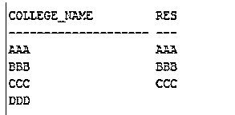

# 甲骨文解码

> 原文：<https://www.educba.com/oracle-decode/>

## Oracle decode 简介

Oracle 为用户提供了解码功能，在该功能中，我们将过程性的 if–then–else 添加到指定的查询中。在解码功能中，它将表达式值与每个搜索值逐一进行比较。如果表达式等于搜索值，则它返回对应于 oracle 数据库的结果。如果表达式值与搜索值不匹配，它将返回默认值。在另一种情况下，如果此时缺省值被忽略，oracle 将返回空值。解码功能适用于 Oracle 12c、Oracle 11g、Oracle 10g 和 Oracle 9i。

**语法:**

<small>Hadoop、数据科学、统计学&其他</small>

`decode (actual expression, search value, search result [, search value, search result]……….[, default])`

**说明:**

*   在上面的语法中，我们使用了解码功能。
*   **实际表达式:**是要比较的值，在比较前会自动转换为用于第一个搜索值的数据类型。
*   **搜索值:**这是我们与实际表情对比的值。同样，在比较之前，所有搜索值都会自动转换为用于第一个搜索值的数据类型。
*   **搜索结果:**用于显示搜索结果，即如果实际表达式等于搜索值，则返回结果。
*   **default:** 这是可选关键字，如果没有找到匹配，解码函数 oracle 返回默认值，如果有时缺省值被省略，则返回空值(如果解码函数没有找到任何匹配值)。

### Oracle 中的解码功能是如何工作的？

现在让我们看看 Oracle 中的解码功能是如何工作的:

基本上，decode 函数用于通过 if–then–else 语句查找任何匹配值。

我们在 Oracle decode 函数中使用的不同类型的参数如下:

#### 1.数字类型

它被用作一个数字，binary_float 或 binary_double。其中，如果第一个搜索对是数字，则 oracle decode 函数会比较所有搜索结果表达式，并在第一个搜索表达式中找到数字优先级最高的值，剩余的参数会转换为该数据类型，decode 函数会返回特定的数据类型。

#### 2.字符类型

如果实际表达式和搜索值是 oracle 解码函数时的字符，则使用非填充比较语义对它们进行比较。If 搜索值、实际表达式和结果可以是 char、varchar2、nchar 或 nvarchar 等任何一种数据类型。此时，oracle decode 函数返回的 string 是 varchar2 数据类型，它是与第一个搜索结果参数相同的字符集。短路评估用于 Oracle 数据库。

它在与实际表达式值进行比较之前评估搜索值，而不是所有搜索值。如果先前的搜索结果等于当时的实际表达式，则评估终止。Oracle decode 函数在比较之前将实际表达式和搜索值转换为第一个搜索值的数据类型，并将返回值转换为第一个搜索结果的数据类型。

### Oracle decode 示例

以下是 Oracle decode 的示例:

**代码:**

`SELECT
DECODE(2, 2, 'Two')
FROM
dual;`

**说明:**

*   这是一个非常简单的 decode 函数示例，其中 Oracle decode 函数将第一个搜索参数值与第二个搜索参数值进行比较。
*   注意，这里两个参数值相等，那么 Oracle 中的 decode 函数返回第二个参数值，即字符串“Two”。当我们执行上述查询时，我们通过使用下面的快照来展示最终输出。

**输出:**

现在让我们使用 create table 语句创建一个新的表名 college，如下所示。

**代码:**

`create table college (college_id int, college_name VARCHAR(20));`

**说明:**

*   在上面的例子中，我们创建了一个具有不同属性的 college 表，如上面的语句所示。
*   当我们执行上述查询时，我们通过使用下面的快照来展示最终输出。

**输出:**

现在，我们可以使用 insert into 语句将一些记录插入学院。

**代码:**

`select college_name, DECODE(college_id, 001, 'AAA', 002, 'BBB', 003, 'CCC', ‘GATEWAY’ ) result from college;`

**说明:**

*   在上面的例子中，在将记录插入学院表后，我们对学院表应用 decode 函数，如上面的语句所示。在这里，我们比较 college_id 和 college_name，并将第一个搜索值与下一个搜索值进行比较。
*   当我们执行上述查询时，我们通过使用下面的快照来展示最终输出。

**输出:**

现在让我们看看它如何等价于 if–then–else 语句，如下所示。

**代码:**

`if college_id = 001 then
result := ‘AAA’;
elsif college_id = 002 then
result := ‘BBB’;
elsif college_id = 003 then
result := ‘CCC’;
else
result := ‘GATEWAY’;
end if;`

**说明:**

*   在上面的语句中，解码函数会逐一比较每个 college_id 值，如上面的语句所示。
*   以类似的方式，我们可以实现解码函数的不同示例，假设用户需要比较两个不同的日期，此时我们可以使用解码函数，例如，如果本示例中的日期 1 >日期 2，解码函数将返回日期 2，否则解码函数将返回日期 1。

### 解码的规章制度

*   Decode 函数返回与列表中第一个搜索结果具有相同数据类型的值。
*   如果第一个搜索结果为 null，那么它的返回值将被转换为 varchar2 数据类型。
*   如果第一个搜索结果数据类型是 char，那么返回值将被转换为 varchar2。
*   如果没有找到匹配，那么它返回默认值。
*   如果省略默认值，并且当时没有找到搜索，oracle decodes 将返回空值。

### 结论

从这篇文章中，我们看到了解码函数的基本语法，我们也看到了解码函数的不同例子。从本文中，我们看到了如何以及何时使用 Oracle decode 函数。

### 推荐文章

这是甲骨文解码指南。这里我们讨论一下入门，Oracle 中的解码功能是如何工作的？例如，解码的规则和规定。您也可以看看以下文章，了解更多信息–

1.  [甲骨文克隆数据库](https://www.educba.com/oracle-clone-database/)
2.  [Oracle SYS_GUID()](https://www.educba.com/oracle-sys_guid/)
3.  [Oracle INSTR()](https://www.educba.com/oracle-instr/)
4.  [甲骨文分组依据有](https://www.educba.com/oracle-group-by-having/)

