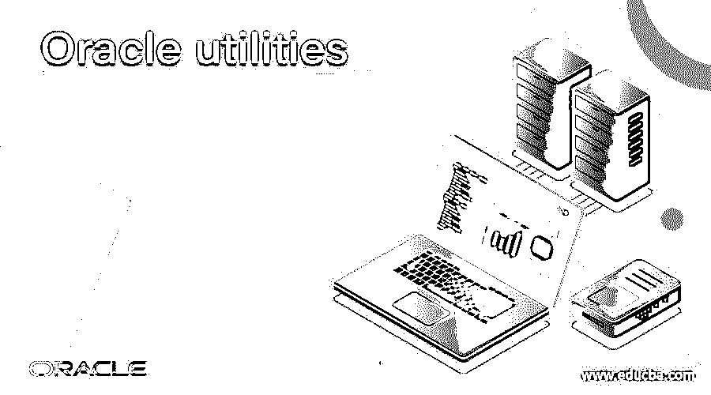

# Oracle 实用程序

> 原文：<https://www.educba.com/oracle-utilities/>

## Oracle 实用程序简介

Oracle 为用户提供了不同的实用程序，我们可以在其中管理数据，例如，我们可以使用数据泵导出和导入功能处理数据和元数据从一个数据库到另一个数据库的高速移动。基本上，Oracle 实用程序提供了一组提取器和模式，这意味着我们可以使用不同的元数据 API 来提取和操作元数据的整体表示。它为用户提供了移动工具，我们可以使用不同的数据泵 API 将数据和元数据从一个站点移动到另一个站点。它还提供了加载数据功能，即我们可以使用 SQL Loader 将数据从不同的操作系统加载到 oracle 表中。

### 所有 Oracle 实用程序

现在让我们来看看不同的 Oracle 实用程序，如下所示。

<small>Hadoop、数据科学、统计学&其他</small>

#### 1.Oracle 数据库实用程序

Oracle database 11g 是 Oracle 上的一种实用程序，它具有处理大量数据、操作数据、提取数据以及从一个站点移动到另一个站点等特性。基本上它包括如下一些功能。

#### 2.数据泵导出和导入实用程序

数据泵用于处理从一个数据库到另一个数据库的高速数据或元数据，该功能基于 oracle 数据库移动实用程序。通过使用数据泵功能，我们可以验证数据移动，这可以通过使用导出和导入参数来实现。

它有如下两种类型。

*   **数据泵导出实用程序**

数据泵导出(为便于阅读，简称为导出)是一个实用程序，用于将数据和元数据转储到一组操作文件中，我们称这些文件为转储文件集。我们可以轻松地将转储文件集从一个系统转移到另一个系统，并通过使用数据泵导入实用程序进行加载。转储文件集意味着它包含表数据、数据库元数据以及控制信息和所有以二进制格式编写的文件，这些文件只能通过使用数据泵导入来读取。

*   **数据泵导入实用程序**

数据泵导入实用程序用于加载元数据并将转储文件集导出到目标系统中。它还包含表数据、数据库对象元数据以及像导出实用程序这样的控制信息。这里所有的文件都是以二进制格式编写的。

#### 3.数据泵 API 实用程序

数据泵 API 提供了一个高速系统，将一个站点的全部或部分信息和元数据从一个数据集移动到下一个数据集。为了利用数据泵 API，Oracle 提供了 DBMS_DATAPUMP PL/SQL 包。数据泵导出和数据泵导入实用程序依赖于数据泵 API。

#### 4.元数据 API 实用程序

它帮助我们检索元数据的 XML 格式，包括 SQL DDL 命令。要使用元数据 API，我们需要使用 PL/SQL 包。对于元数据 API，每个实时实体都是数据库对象。

#### 5.SQL*Loader 实用程序

它用于将外部文件中的数据加载到 Oracle 数据库的 SQL 表中。它具有如下不同的特征。

1.  它从不同的数据文件加载数据
2.  同样，我们可以在同一时间加载不同的表
3.  加载前处理数据。
4.  它使用操作系统文件来访问不同的数据文件。
5.  它能够加载复杂的关系数据。
6.  它使用辅助数据文件进行加载。

通常，SQL* Loader 使用输入作为控制文件来控制 SQL* Loader 的行为，SQL* Loader 的输出是一个数据库，即日志文件。

#### 6.DBVerify 实用程序

DBVERIFY 是一个外部命令行实用程序，它提供完整性检查约束，即我们可以检查物理数据结构。它往往用于离线或在线信息库，也用于加固文件。我们可以使用 DBVERIFY，主要是当您需要在重建之前保证加固数据集(或数据文件)是合法的，或者当您遇到信息降级问题时作为指示性指南。由于 DBVERIFY 可以针对断开的数据集运行，因此垂直度检查会更快。DBVERIFY 检查仅限于保留监督块(即信息块)。由于 DBVERIFY 只用于数据文件，它不会抵消控制文档或重试日志。DBVERIFY 有两个订单行接口。在主界面中，您可以指定一个单独的数据文件的圆形方块进行检查。在随后的接口中，您指出了一个用于检查的片段。

#### 7.DBNEWID 实用程序

DBNEWID 实用程序用于修改内部和唯一的数据库标识符以及数据库名称；通过使用 DBNEWID，我们可以修改其中的任何一个，如下所示。

1.  我们只能修改数据库的 DBID。
2.  我们只能修改数据库的 DBNAME。
3.  在第三种情况下，我们可以修改 DBID 和数据库名称。

#### 8.外部表格实用程序

SQL* Loader 中的外部表实用程序允许我们从外部源访问数据。可以使用 ORACLE_DATAPUMP 访问驱动程序创建外部表，我们无法执行数据操作命令，或者无法在外部表上创建索引。因此，SQL* Loader 是装载数据的最佳选择，但它需要额外的索引。如果我们需要使用外部文件，那么我们必须对您当前执行的平台上的数据文件的文件格式和记录格式有一些基本的了解，我们还需要知道什么是 SQL 以及我们如何在 SQL 上执行查询。

#### 9\. LogMiner

它用于在查询界面的帮助下重做日志文件。

### 结论

我们希望通过这篇文章，您已经了解了 Oracle Utilities。从本文中，我们了解了 Oracle 的不同实用程序。我们还将了解 Oracle 实用程序的优缺点。从本文中，我们了解了如何以及何时使用 Oracle 实用程序。

### 推荐文章

这是 Oracle 实用程序指南。在这里，我们讨论了 Oracle 的不同实用程序及其优缺点，并学习了如何以及何时使用这些实用程序。您也可以看看以下文章，了解更多信息–

1.  [Oracle XML 类型](https://www.educba.com/oracle-xmltype/)
2.  [甲骨文日期格式](https://www.educba.com/oracle-date-format/)
3.  [Oracle 表空间](https://www.educba.com/oracle-tablespace/)
4.  [甲骨文授予](https://www.educba.com/oracle-grant/)

